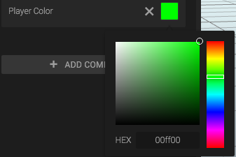
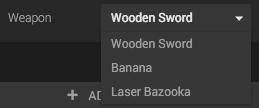
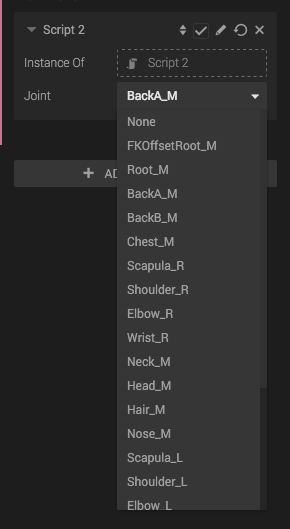

When you create a new script, and open it in the script editor, you get something that looks like this:


'use strict';

/* global goo */

var setup = function (args, ctx) {
    // Will be called when the script is attached to an entity, or you press Play in Create.
};

var cleanup = function (args, ctx) {
    // Will be called when the script component is removed from the entity, or when you press *Stop* in Create.
};

var update = function (args, ctx) {
    // Will be called once per render frame, after the script was set up.
};

// Script parameter definitions
var parameters = [];


The script lets you define three functions and some parameters.

## The ctx object

The context is an object, unique per Script, that you can use to store your script data during the script life time. The context is created upon setup() and cleared on cleanup() and is passed into all of the script functions. It has a few pre-defined properties:

<table class="table">
	<tr>
		<th>Property</th>
		<th>Type</th>
		<th>Description</th>
	</tr>
	<tr>
		<td>entity</td>
		<td>
			<a href="http://code.gooengine.com/latest/docs/index.html?c=Entity">Entity</a>
		</td>
		<td>The entity that the script is attached to.</td>
	</tr>
	<tr>
		<td>entityData</td>
		<td>Object</td>
		<td>Data object, shared between all scripts on the Entity.</td>
	</tr>
	<tr>
		<td>activeCameraComponent</td>
		<td>
			<a href="http://code.gooengine.com/latest/docs/index.html?c=Entity">Entity</a>
		</td>
		<td>The currently active camera entity.</td>
	</tr>
	<tr>
		<td>domElement</td>
		<td>HTMLCanvasElement</td>
		<td>The WebGL canvas element.</td>
	</tr>
	<tr>
		<td>playTime</td>
		<td>number</td>
		<td>The elapsed time since scene start.</td>
	</tr>
	<tr>
		<td>viewportHeight</td>
		<td>number</td>
		<td>Height of the canvas.</td>
	</tr>
	<tr>
		<td>viewportWidth</td>
		<td>number</td>
		<td>Width of the canvas.</td>
	</tr>
	<tr>
		<td>world</td>
		<td>
			<a href="http://code.gooengine.com/latest/docs/index.html?c=World">World</a>
		</td>
		<td>The world</td>
	</tr>
	<tr>
		<td>worldData</td>
		<td>Object</td>
		<td>Data object, shared between all scripts in the World.</td>
	</tr>
</table>

### Data objects and scoping

The **ctx** object unique to each script, and properties we define on it will only be accessible by that script. Some of its properties are shared between scripts. *entityData* is shared by all scripts on the entity and *worldData* is shared by all scripts. They are all initially empty, and can be used to store any kind of data

For example, if we'd like to define a property called *acceleration*, we could make it available on three levels:

// Only accessible to the script that defined the property
ctx.acceleration = 9.82;

// Accessible to all scripts on the entity
ctx.entityData.acceleration = 9.82;

// Accessible to all scripts
ctx.worldData.acceleration = 9.82;

## The global goo object

The **goo** object provides access to classes in the [Goo Engine API](http://code.gooengine.com/latest/docs/).

## Parameters and "args"

var setup = function(args, ctx) {
    console.log(args.velocity); // access the passed argument by key
};

var parameters = [{
    name: "Velocity",
    key: "velocity",
    type: "vec3",
    default: [1, 0, 0]
}];

All parameters that are declared in the *parameters* array can be accessed via the **args** during runtime. The parameters are also displayed the *Script component panel* in Create. The above script will generate the following script component panel:

Below you can read more about what the custom parameters lets you do.

### Parameter Format

Parameters need to be defined on a specific format. It is mentioned in the comments of an empty script too, but here's a walkthrough of the structure.

*Required:*

*   **key [string]** - The property key in the **args** object that should be used for this parameter.
*   **type [string]** - Parameter type (see available types further down).
*   **default** - Default value for the parameter.

*Optional:*

*   **name [string]** - The name that shows up in the script component panel.
*   **control [string enum]** - Type of control in the script component panel. Will be discussed later.
*   **description [string]** - Tooltip for the script component panel.
*   **options [array]** - Used with the *select* control type.
*   **min [number]** - Used with *int* or *float* types.
*   **max [number]** - Used with *int* or *float* types.
*   **precision [number]** - Number of significant digits for *float* values.
*   **scale [number]** - Used with *slider* control type.
*   **exponential [boolean]** - Used with *slider* control type.

### Parameter Types

The type property must be set to one of a few predefined strings, each corresponding to a type of parameter.

*   **int** - Integer number variable (e.g. *5*).
*   **float** - Number variable (e.g. *3.14*).
*   **string** - String (e.g. *"HelloGoo"*).
*   **boolean** - boolean (*true* or *false*).
*   **vec2** - An array of 2 numbers.
*   **vec3** - An array of 3 numbers.
*   **vec4** - An array of 4 numbers.
*   **texture, sound, entity, camera, animation** - Direct references to different types of objects, controlled by drag-and-drop areas in the script panel.

### Parameter Controls

Different types can have different controls which in turn have several different available options:

#### control: "slider"

A slider for numbers. The specific options _scale_ and _exponential_ can be used with it, in addition to the number options _min,_ _max_ and _precision_.

{
    key: "magnitude",
    name: "Magnitude",
    type: "float",
    default: 10,
    min: 5,
    max: 15,
    control: "slider"
}

#### control: "color"

Brings up an RBG color picker for the _vec3_ type.

{
    key: "playerColor",
    name: "Player Color",
    type: "vec3",
    default: [0, 1, 0],
    control: "color"
}

#### control: "select" or *"dropdown"

Used to define a list of options of the selected type.  Use the options array to define the available options.

{
    key: "weapon",
    name: "Weapon",
    type: "string",
    default: "Wooden Sword",
    control: "select",
    options: [
        "Wooden Sword",
        "Banana",
        "Laser Bazooka"
    ]
}

#### control: "jointSelector"

Used together with an int, to get the ID of a joint. Needs to be used on scripts whose parent entities have joints.

{
    key: "joint",
    name: "Joint",
    type: "int",
    default: 0,
    control: "jointSelector"
}

