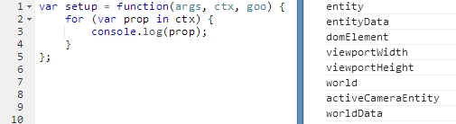

The <strong>ctx</strong> (short for <em>context</em>) object is one of the useful pre-defined objects used in scripting. This tutorial will explain what's already on there, what one might add to it and some of the use cases.
<h2>Context Lifespan</h2>
The context gets cleared when pressing <strong>stop</strong>, and is <em>re-built</em> when pressing <strong>play</strong> (or running a published project). In other words, <em>all variables stored on ctx are lost between plays</em>. Keep that in mind when devloping!
<h2>Pre-defined Properties</h2>
The ctx object has a few pre-defined properties. A quick console printout gives us the following list:

Properties of the ctx object

These properties can (roughly) be divided into <strong>scopes</strong> and<strong> Goo world objects.</strong>

<h2>Scoping</h2>

The <strong>ctx</strong> object is itself <em>unique to each script</em>, and any properties we define ourselves will only be accssebile by that script. However some of its <em>properties are shared</em>.<strong> ctx.entityData</strong> and <strong>ctx.worldData</strong><em> </em>are examples of shared objects . They are both initially empty, and can be used to share any kind of data across<em> all scripts belonging to a certain entity </em>(ctx.entityData)<i>, </i>or<i> all scripts in the world </i>(ctx.worldData). For example, if we'd like to define a property called <em>acceleration, </em>we could make it available on three levels:


// Only accessible to the script which defined it.
ctx.acceleration = 9.82; 

// Accessible to all scripts on the entity which has the script.
ctx.entityData.acceleration = 9.82;

// Accessible to all scripts.
ctx.worldData.acceleration = 9.82;


This mechanism is useful when breaking an application up into several scripts, and to avoid setting properties directly on entites. Of course, using <a href="http://code.gooengine.com/latest/docs/everything.html#setAttribute" target="_blank"><em>setAttribute()</em> </a>or <a href="http://code.gooengine.com/latest/docs/everything.html#setTag" target="_blank"><em>setTag()</em></a> on entities is fine too, and is a matter of taste and design choices.

<h2>Goo World Objects</h2>

The rest of the properties on <strong>ctx</strong> are shortcuts to useful variables in the Goo world.

<h3>ctx.entity</h3>

This property directly accesses the entity on which the script is defined. It can be used in a lot of ways, for example making sure that a picking event touched the correct entity, or for controlling a game entity through a script. It's actually just a shortcut, since <em>all entities in the world</em> are accessible by every script through the <em>world</em>, which we will see next.

<h3>ctx.world</h3>

The world object opens up paths to everything, pretty much. <a href="http://code.gooengine.com/latest/docs/index.html?c=World" target="_blank">The world object</a> is used to select any entity (using <em>by</em>), getting the very useful time per frame (<em>tpf</em>) variable or grabbing hold of the <a href="http://code.gooengine.com/latest/docs/index.html?c=GooRunner" target="_blank"><em>gooRunner </em></a>(and from there the <a href="http://code.gooengine.com/latest/docs/index.html?c=Renderer" target="_blank"><em>renderer</em></a>, and so on). Checking those classes out in the API docs is very useful, and so it the <a title="Goo Engine Architecture Overview" href="/learn/goo-engine-architecture-overview/" target="_blank">architecture overview</a>.


// Select an entity by name
var someEntity = ctx.world.by.name('someEntity').first();
// Use time per frame for frame-rate independent physics
ctx.entityData.velocity += ctx.entityData.acceleration * ctx.world.tpf;


<h3>ctx.domElement</h3>

While the <a href="http://www.w3schools.com/html/html5_canvas.asp" target="_blank"><em>canvas</em></a> element that Goo uses can be accessed via the world, the gooRunner and the renderer, this property is a much faster way to do it. Useful for setting DOM event listeners or attaching HTML elements, for example.


// Add an event listener
ctx.domElement.addEventListener('mouseup', myMouseUpCallback);
// Attach a DOM element
ctx.domElement.attachChild(myDOMElement);


<h3>ctx.viewportWidth and ctx.viewportHeight</h3>
There properties are straightforward and will get the width and height of the current viewport.

<h3>ctx.activeCameraEntity</h3>
A quick way to get a hold of the <a href="http://code.gooengine.com/latest/docs/index.html?c=Camera">camera</a> entity which is currently used.

<h2>Adding Your Own Properties</h2>

<h3>Use Case Examples</h3>
While there are already many useful properties defined on the <strong>ctx </strong>object, it is also very useful for adding custom properties. Thanks to the scoping mechanisms mentioned before, it is very flexible. Script-wide values and objects can be available to every function in the script (just make sure to pass the object around as an argument). Here are some examples on uses:

<a title="Scripting in Create – The Basics" href="/learn/scripting-basics-bouncing-ball/">A simple scripting example</a> which used the ctx object to define some physics properties.
<a title="DOM Event Listeners (Mouse, Keyboard and Touch Input)" href="/learn/dom-event-listeners/" target="_blank">DOM event listener tutorial</a> showing how to use ctx for managing event callbacks.
<a title="Transforms and the Transform Component" href="/learn/transforms-and-the-transform-component/" target="_blank">Transform tutorial</a> using ctx to access an entity and modify its components.

There are many uses, and <strong>ctx</strong> is a fundamental mechanism. There is no "one way" to use it, and there are many styles of usage!

<h3>Performance</h3>

By using the ctx object to define variables, one can gain some performance. For example, it is not advisable to create objects every frame (like in the <em>update</em> function). By using ctx for storing these variables instead of creating new with <em>var, </em>a lot of object creation time can be saved.