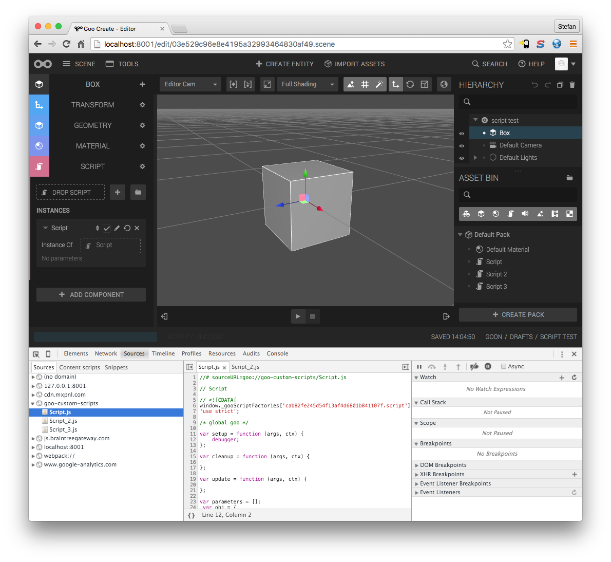
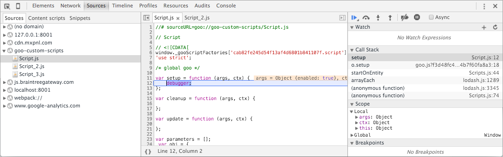

To debug a script in Goo Create, you need to use the built in tools in your browser. Since we are big fans of Google Chrome, we will show you how to debug in this browser.

## Launch Chrome Devtools

Open Developer Tools by pressing ALT-CMD-J on Mac or F12 on Windows. The devtools will open.



## Locating your script in devtools

Open the *Sources* panel at the top of Devtools. To the left you can see all scripts loaded in the browser. If you have a script in your scene, it will be listed in below *goo-custom-scripts*. Click your script to view it.

## Adding a debugger statement

The simplest way to start debugging a script is by adding a ```debugger;``` statement in your Custom Script in Create. If you have Devtools open, and this statement is executed, Devtools will automatically go to the file and line where your statement is.

