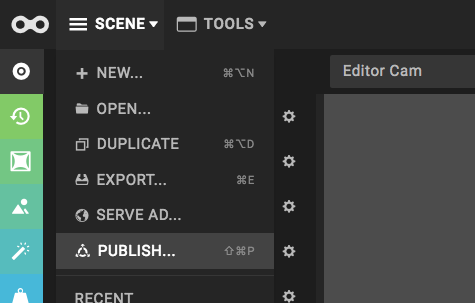
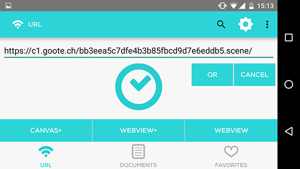
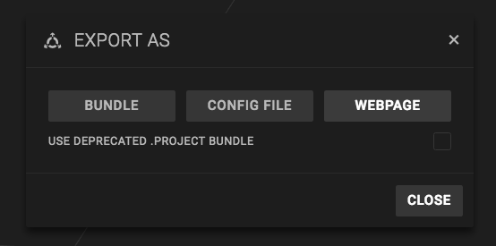
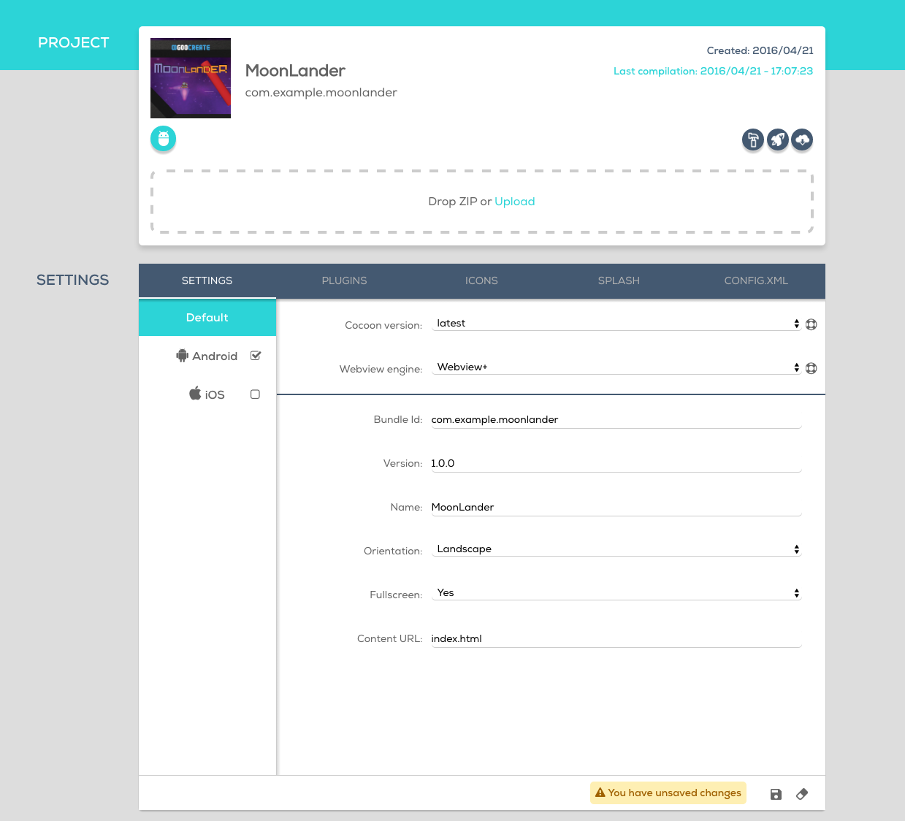
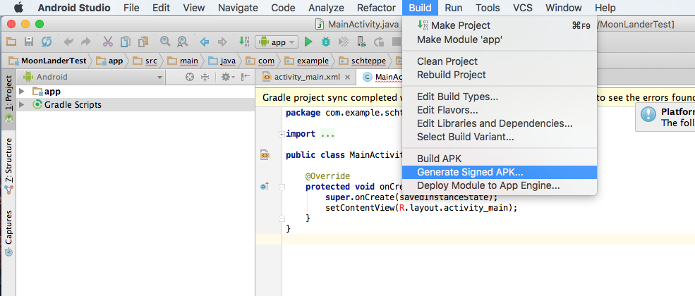
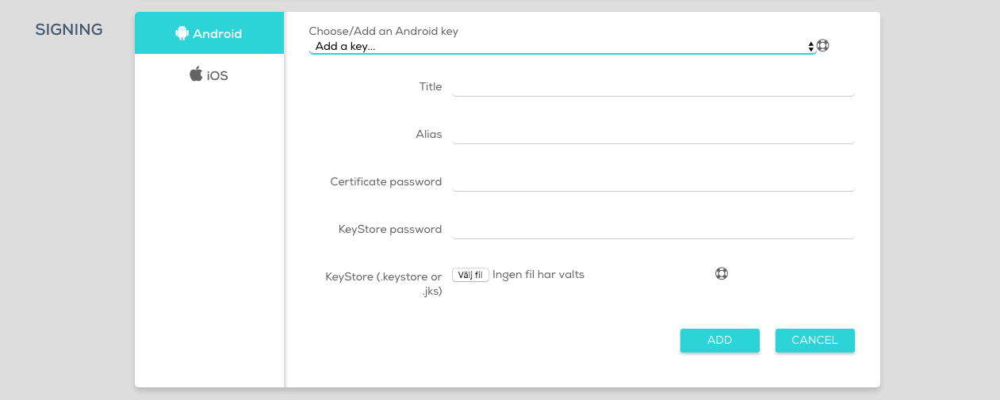

## Step 1: Make an awesome app using Goo Create

* Be creative!
* Look at the other tutorials on this site to get inspiration.
* Note that external links don't work properly from within the app. To make them open in a new window you have to add some code. Read more in the [Cocoon docs](https://cocoonio.github.io/cocoon-canvasplus/dist/doc/js/Cocoon.App.html).
* Publish your Goo Create scene to the web (*Scene... > Publish... > Publish*).

## Step 2: Test the scene in Cocoon Developer app

The Cocoon Developer app lets you test your app quickly before taking the next steps, and saves you a lot of work.

2. [Download the Cocoon Developer app](https://play.google.com/store/apps/details?id=com.ludei.devapp).
3. Open the app and register.
4. Choose *My App*.
5. Click the URL button.
6. Enter the URL to your Goo scene.
7. Click *WebView+* to launch your app.

## Step 2: Export the scene as webpage

When you're done with testing your app, it's time to export it and upload it to Cocoon.

Click *Scene* -> *Export* -> *Webpage*. The browser will start to download a `.zip` file.

## Step 3: Create a project on Cocoon.io

1. Register on [https://cocoon.io](cocoon.io) if you didn't already.
2. Create a new Project by dropping the `.zip` file on the Projects page.
3. Uncheck the iOS checkbox to the left (see screenshot). We only want to target Android in this tutorial.
4. Choose *WebView Engine: WebView+* in the settings, and enter details of your app. The defaults should be good.
5. Click the *Icons* tab, and upload default icons for your app. Do the same in the Splash tab.
6. You should now be able to compile both a *Developer App* and a normal (unsigned) app. Click the *Compile* button at the top.
7. Wait for the app to compile.
8. Download the zip file. Unzip it. Transfer the `.apk` file to your Android device, and test it!

## Step 4: Create a Key Store

Android requires all apps to be digitally signed with a *certificate* before they can be installed. To sign your app, you need a *key*. This sounds scary, but don't worry! It's just a file that you can generate easily using Android Studio.

1. [Install Android Studio](http://developer.android.com/sdk/index.html).
2. Start a new project. Doesn't matter what type or what you name it.
3. Click *Build* and then *Generate Signed APK...* (see screenshot below and/or read more [here](http://developer.android.com/tools/publishing/app-signing.html#studio)).
4. Follow the first steps in the wizard. This will create a *key store* file. Remember where you save it on disk.

## Step 5: Upload the Key Store to your Cocoon project

1. Go back to your project page on Cocoon.io.
2. Add the key store file in the *Signing* section.
3. Press the *Compile* button at the top of the page again.
4. When the compilation is done, you will get a new zip file containing a *signed APK* file back.

## Step 6: Publish your app on Google Play

1. Sign up at [Google Play](http://developer.android.com/distribute/googleplay/start.html).
2. Create a new *App* and upload the signed APK file there.
3. Review the app settings.
4. Publish the app.