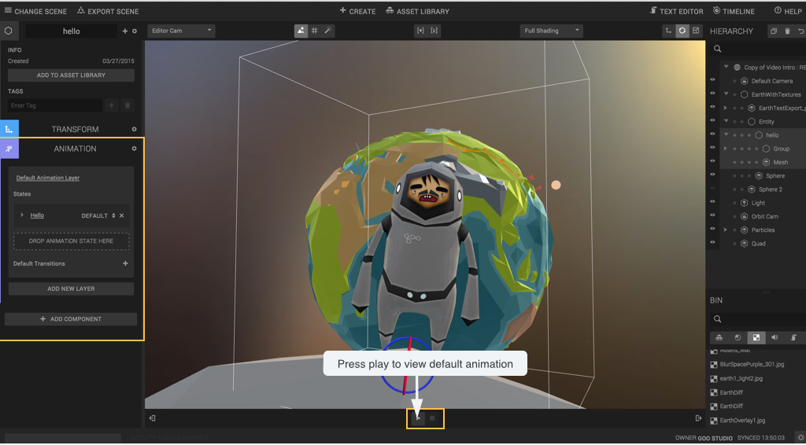
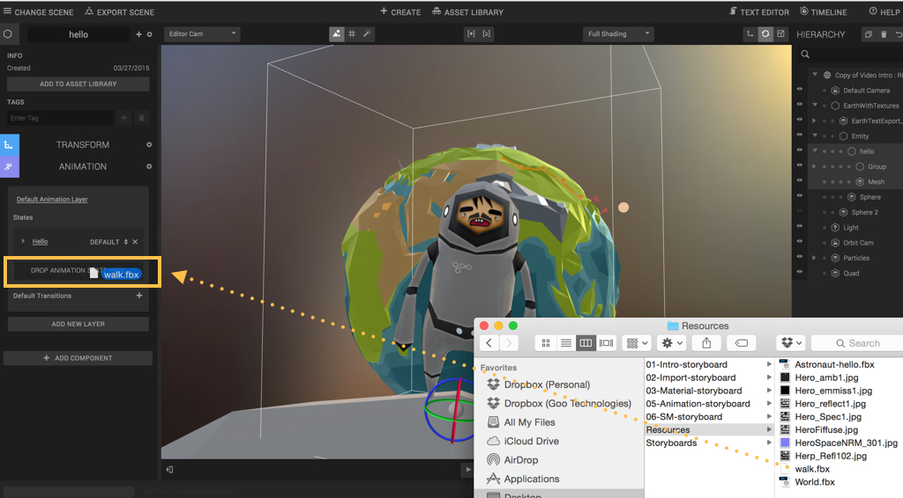
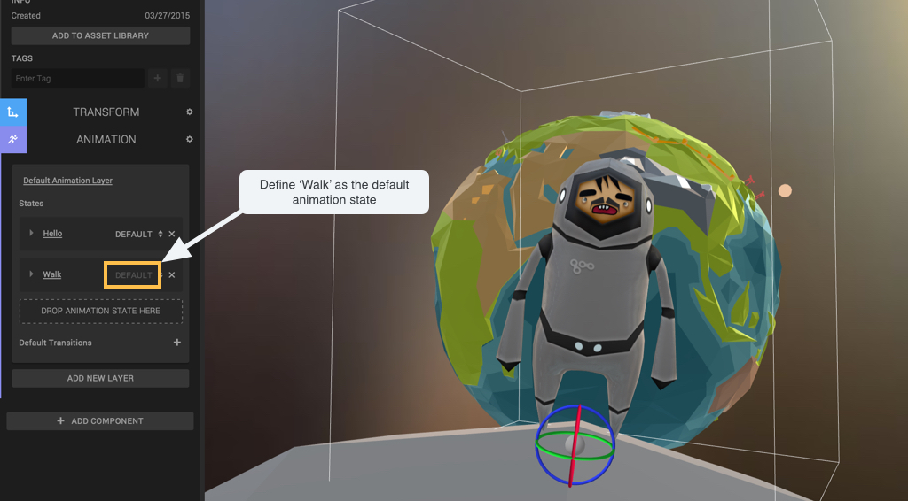
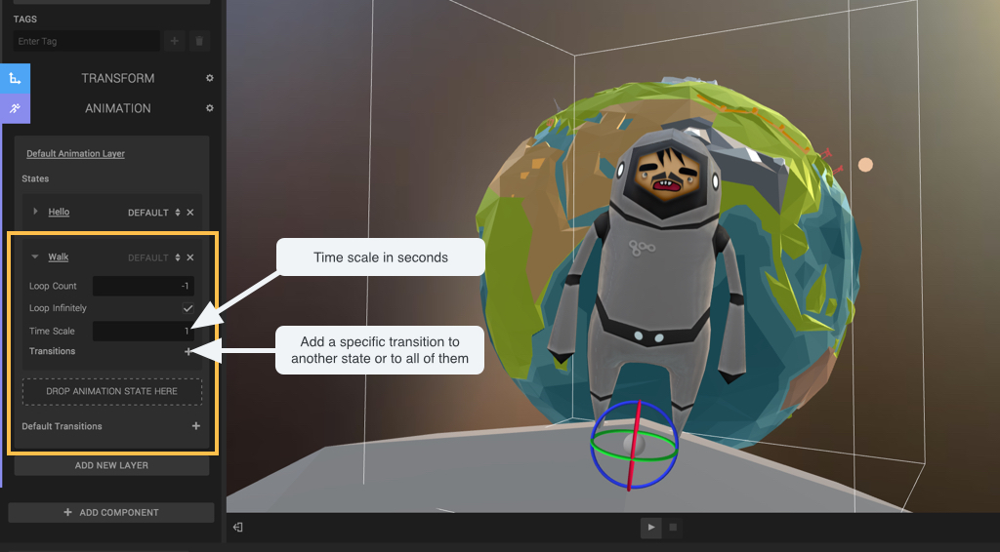
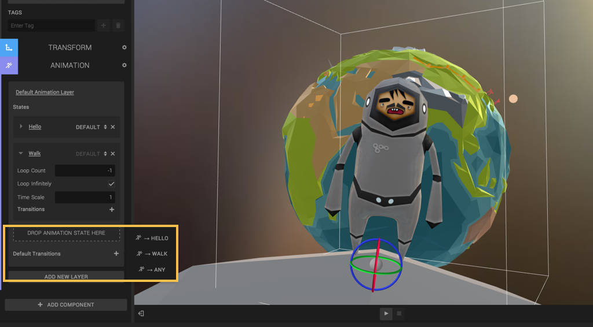
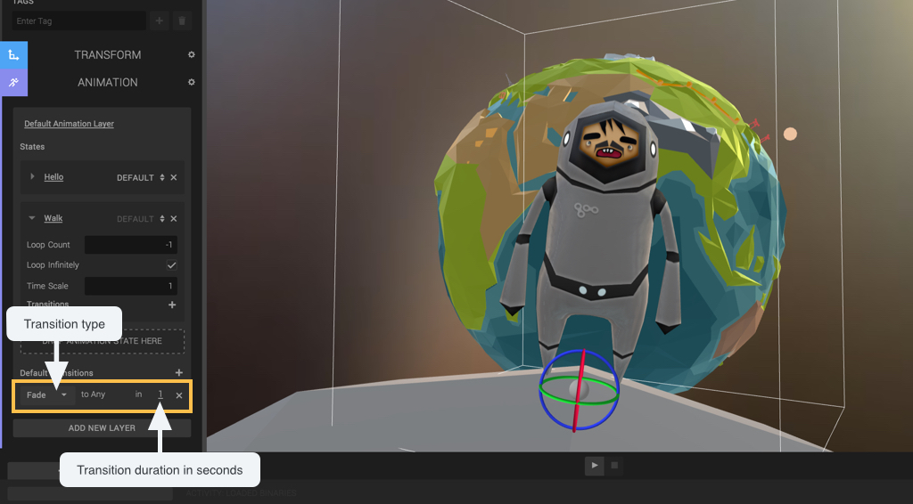

Goo create supports bones animation. To view your animation just press play. To configure different animation states select the root entity of your character and open the animation component.

If you have several animations for your character, just export them as .fbx and drag them to the animation component.

You can then set your new layer as default by checking the default option.

Unfold an animation state to set parameters like loop count, time scale and specific transitions to other layers.

To define general transition rules to other layers click on the add icon.

In this case all state will transit to 'Hello' with a fade transition during 1 second.
