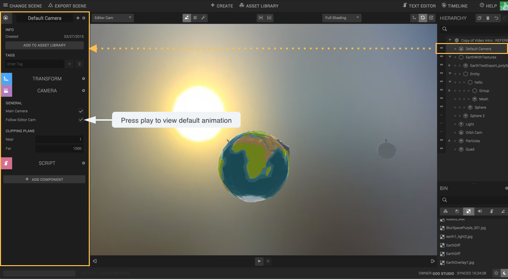
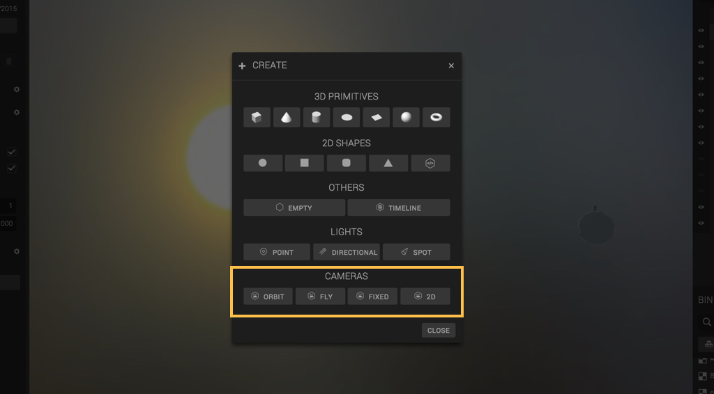
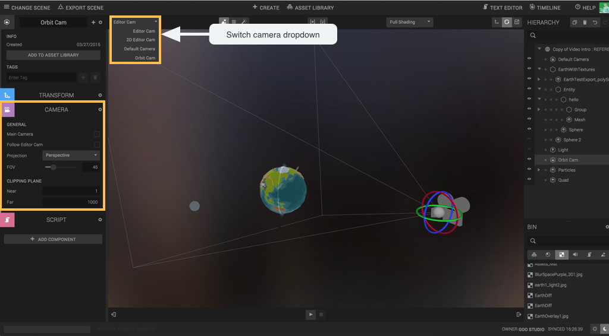
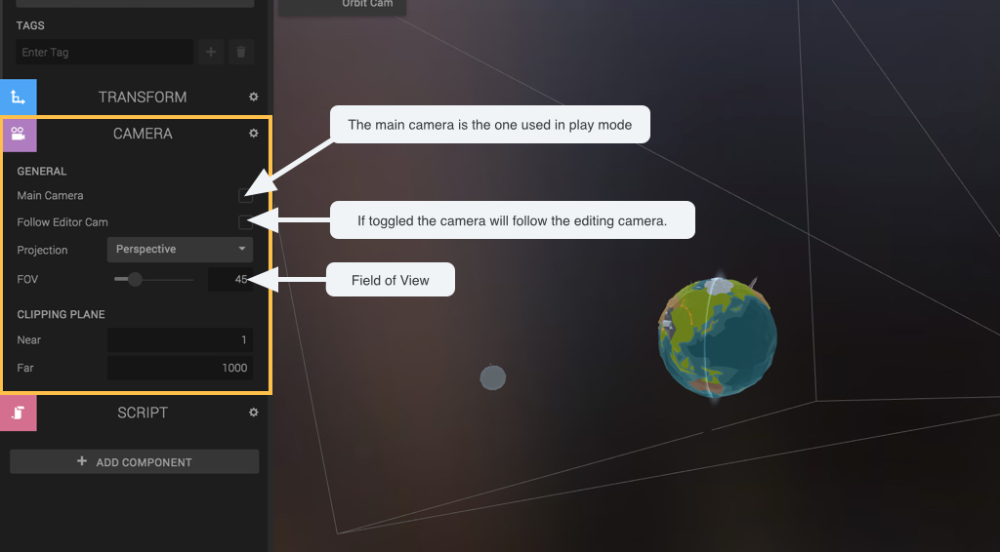
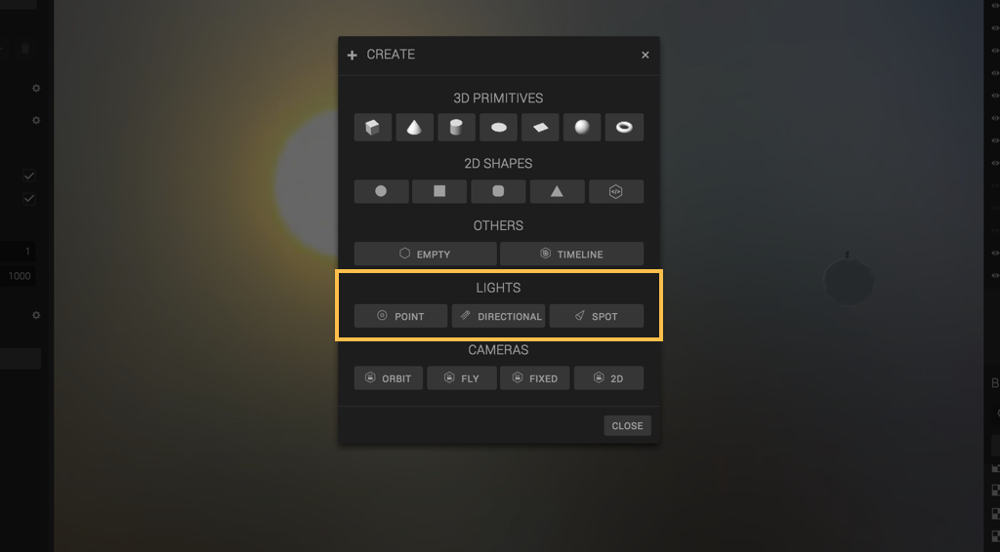
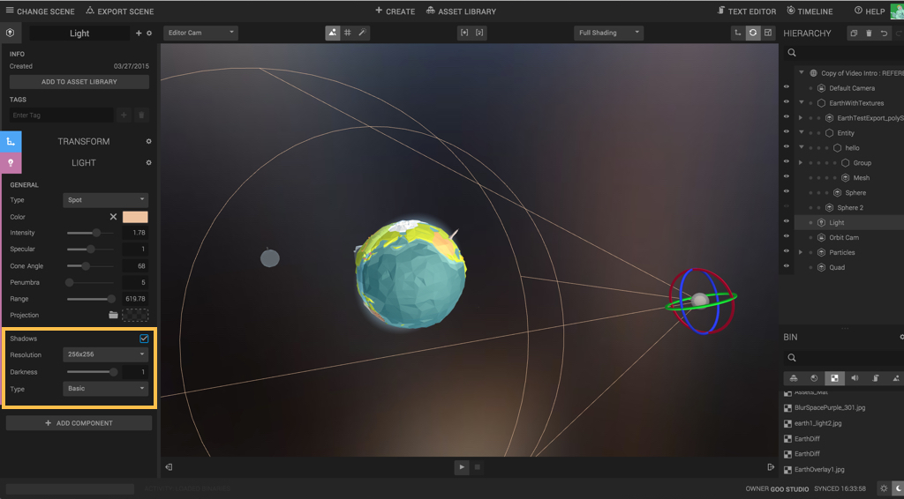
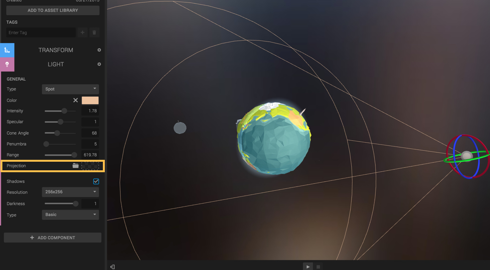

When you create a scene a Default camera is automatically provided.
This camera is set to follow the editor camera (the one you use while editing the scene).

You can create new cameras using the create menu, four setups are available: Orbit, Fly, Fixed and 2d.
The only real difference between those type is the script that has been pre-applied to them. The script influence how the camera is
controlled.

Let’s create a new fixed camera and access its parameters by unfolding the camera component. Remember, you can switch between cameras in the canvas menu.

In here you can define if the camera should follow the editor camera or not, this is an easy way to place your cameras. Now I will set this camera as *default*, which means it will be used during play mode.

In the *Create* dialog three light types are available: Parallel (like sun rays), Spot light and Point light.
You can test the different light types and parameters by unfolding the light component.

Parallel and Spot light can generate shadows. Toggle the checkbox at the bottom of the panel and define resolution, darkness and shadow type.

A light can project a texture to other surface. Just drag and drop an image in the texture placeholder.
