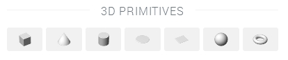
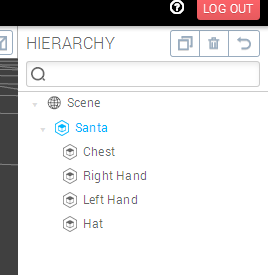
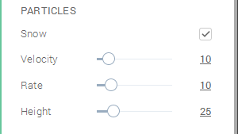

## It’s All About Primitives

This Mozilla and Goo Christmas challenge was a large competition based around the use of simple shapes to build the worlds. To create a *primitive*, click on the *Create* menu at the top of the screen. The following 3d primitives are available:

All the primitives you need!

Click on the sphere icon to create one in the viewport. A sphere is a perfect start for our Santa Claus, we will use it to build his chest. With the sphere selected, in the left panel, click on the *Geometry* category, to view the *Shape Options*:

Use the sliders to increase or decrease the amount of samples in your sphere in both the X and Y direction. The more samples, the smoother the surface.

## Should Santa Be Red or Green?

Below the *Shape Options*, if you click on the *Materials* category, you can see that Goo Create already created an empty material for you. In the Materials, *color (diffuse)* section, click on the colored square. A color picker will appear and you'll be able to change the color of your entity.

Under the color slot you might have noticed a *Drop Texture* placeholder. If you want to add any texture to your entity just drag and drop an image file from your desktop or from your project library.

## Limb by Limb

Once you've created your first primitive, practice some more by going through the following construction map using the other primitive shapes available:

### Grouping

All these limbs can be tiresome to manipulate, and that's when *grouping* becomes very handy. You can create an empty entity object by clicking on the following icon in the Create panel. It's a bit further down from the primitives!

In the project library, drag and drop all the primitives you created on the new entity. You'll then get a complete Santa that can be moved around.

## This jetpack needs some smoke!

*Fire* and *smoke* are actions handled through one of Create's secret weapons: the [_state machine_]({{ "/manual/scene/components/statemachine" | prepend: site.baseurl }}). Click on one entity that should be our smoke emitter (in this case a cylinder located at the bottom of Santa's jetpack). Next, click the **Add Component** button at the top left of the screen. It is located to the right of the entity's name. In the Add Component drop down menu, choose *State Machine*. Click the _State Machine_ panel to see its options. In the default state (called simply _State_), click Add Action, then choose *Smoke FX* in the library.

Now simply press the play button at the bottom of the screen to see smoke coming out of your jetpack.

## So.. Where Is the Snow?

If you select the root 'Scene' in the hierarchy on the right panel, _Post Effects_ and _Environment_ should appear inside the left panel. Expand the _Environment_ panel, and you will see the snow effect we've added for the occasion. You may need to place a check mark in the box next to 'Snow' to access the effects properties.

*Velocity* and *rate* are quite self-explanatory. *Height* refers to the distance from the camera's current position.

Now add some snow to your scene to create that special holiday feeling!
