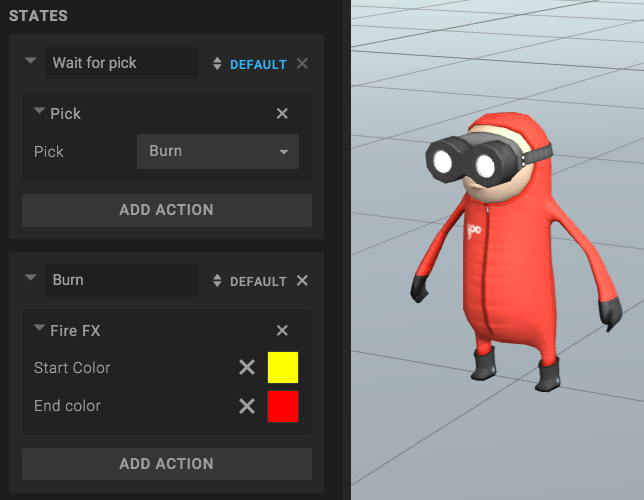
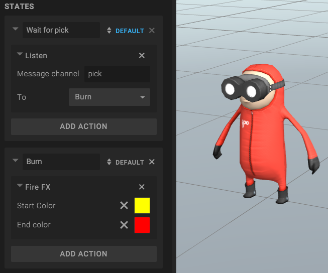
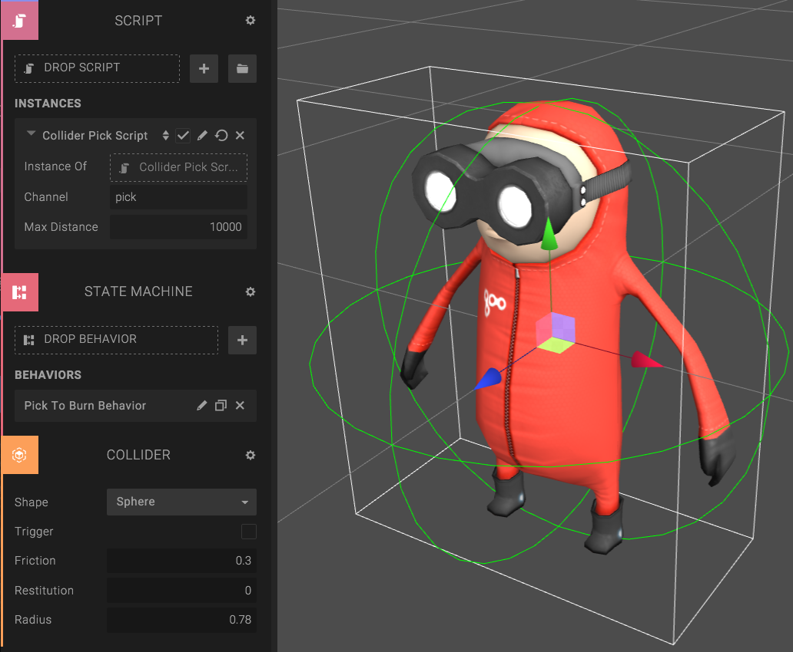

<table class="table table-bordered">
<tbody>
<tr>
    <td></td>
    <td>Precision</td>
    <td>Performance</td>
    <td>Animation support</td>
    <td>Requires physics</td>
</tr>
<tr>
    <td>Hardware picking</td>
    <td>Pixel perfect</td>
    <td>Bad</td>
    <td>Yes</td>
    <td>No</td>
</tr>
<tr>
    <td>Bounds raycasting</td>
    <td>Bounding box</td>
    <td>Good</td>
    <td>No</td>
    <td>No</td>
</tr>
<tr>
    <td>Collider raycasting</td>
    <td>Colliders</td>
    <td>Good</td>
    <td>No</td>
    <td>Yes</td>
</tr>
</tbody>
</table>

## Solution 1: Hardware picking

Hardware picking perfect when you wait for a single click on a visible entity.

The easiest way to implement hardware picking in Goo Create is using the *PickAction* in the state machine. The PickAction will transition when the entity is hardware picked.

1. Add a State Machine Component to the entity you want to click.
2. Add a new Behavior
3. Add a PickAction in the default state.
4. Create a new State, where you define what should happen when you pick the entity.
5. In the Pick Action, select your new State in the dropdown.

Below is an example of a "Click to burn" behavior. The PickAction waits for the pick in the first state, and when it happens it transitions to the "Burn" state. The Burn state adds some Fire Effects to the entity.

If you simply want to open an URL when you pick, consider the *Pick And Exit Action*.

## Solution 2: Bounding box raycasting

Bounding box raycasting is good when you need more performance than hardware picking. Note that this method is not as precise as hardware picking (the can click the bounding box of the entity).

1. Put the following script on the entity you want to detect click on.
2. Now you can listen for a "pick" event in scripts or in the State Machine.


var setup = function(args, ctx) {
    ctx.ray = new goo.Ray();

    ctx.onClick = function(evt){
        var dpr = ctx.world.gooRunner.renderer.devicePixelRatio;
        var x = evt.clientX * dpr;
        var y = evt.clientY * dpr;
        var activeCamera = ctx.activeCameraEntity.cameraComponent.camera;
        activeCamera.getPickRay(x, y, ctx.viewportWidth, ctx.viewportHeight, ctx.ray);
        var isHit = ctx.entity.meshRendererComponent.worldBound.intersectsRay(ctx.ray);
        if(isHit){
            goo.SystemBus.emit(args.channel);
        }
    };

    ctx.domElement.addEventListener('click', ctx.onClick);
};

var cleanup = function(args, ctx) {
    ctx.domElement.removeEventListener('click', ctx.onClick);
};

var parameters = [{
    key: 'channel',
    type: 'string',
    'default': 'pick'
}];


## Solution 3: Collider raycasting

If you need performance, but more precision than the bounding box raycasting, you should use Collider raycasting.

1. Put a ColliderComponent on the entity you want to detect click on.
2. Put the following script on the same entity.
3. Now you can listen for a "pick" event in scripts or in the State Machine.


var setup = function(args, ctx) {
    ctx.ray = new goo.Ray();
    ctx.physicsSystem = ctx.world.getSystem('PhysicsSystem');
    ctx.result = new goo.RaycastResult();

    ctx.onClick = function(evt){
        var dpr = ctx.world.gooRunner.renderer.devicePixelRatio;
        var x = evt.clientX * dpr;
        var y = evt.clientY * dpr;
        var activeCamera = ctx.activeCameraEntity.cameraComponent.camera;

        activeCamera.getPickRay(x, y, ctx.viewportWidth, ctx.viewportHeight, ctx.ray);
        ctx.physicsSystem.raycastClosest(ctx.ray.origin, ctx.ray.direction, args.maxDistance, {}, ctx.result);
        if(ctx.result.entity === ctx.entity){
            goo.SystemBus.emit(args.channel);
        }
        ctx.result.reset();
    };

    ctx.domElement.addEventListener('click', ctx.onClick);
};

var cleanup = function(args, ctx) {
    ctx.domElement.removeEventListener('click', ctx.onClick);
};

var parameters = [{
    key: 'channel',
    type: 'string',
    'default': 'pick'
},{
    key: 'maxDistance',
    type: 'float',
    'default': 10000,
    min: 0
}];

