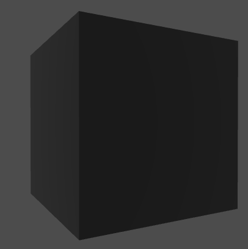
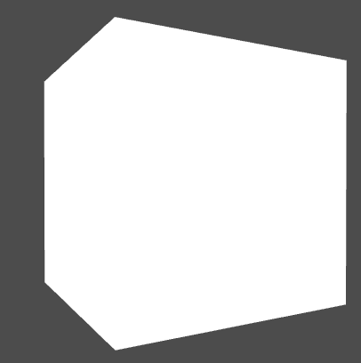
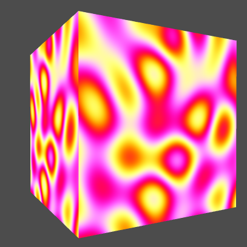
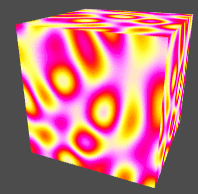

## Step 1: Create a cube

The first thing you need to to is adding an entity to apply the shader on. Let's use a built-in box.

1. Click *Create Entity* in the top menu
2. Click Box

## Step 2: Add a minimal custom shader script

To add a shader to the cube, we need to create a custom script and add it to the cube.

1. Select the box
2. Click "Add component" in the inspector
3. Click Script and then select Custom Script
4. Click the edit button on the new script, to open the Script editor
5. Copy the script below into the editor
6. Click Save

var setup = function (args, ctx) {

    // The vertex shader source as a string
    var vertexShader = [
        'attribute vec3 vertexPosition;',
        'uniform mat4 viewProjectionMatrix;',
        'uniform mat4 worldMatrix;',
        'void main(void) {',
        '    gl_Position = viewProjectionMatrix * (worldMatrix * vec4(vertexPosition, 1.0));',
        '}'
    ].join('\n');

    // The fragment shader source as a string
    var fragmentShader = [
        'void main(void){',
        '    gl_FragColor = vec4(1.0, 1.0, 1.0, 1.0);',
        '}'
    ].join('\n');

    // The shader definition provides fragment and vertex shader source, as
    // well as a list of attributes, defines, uniforms, etc, that the engine
    // needs to use your shader.
    var shaderDefinition = {
        attributes: {
            vertexPosition: goo.MeshData.POSITION
        },
        uniforms: {
            viewProjectionMatrix: goo.Shader.VIEW_PROJECTION_MATRIX,
            worldMatrix: goo.Shader.WORLD_MATRIX
        },
        vshader: vertexShader,
        fshader: fragmentShader
    };

    // Create a Material from the shader definition.
    ctx.material = new goo.Material(shaderDefinition);

    // Save the current material for later.
    ctx.oldMaterial = ctx.entity.meshRendererComponent.materials[0];

    // Put the material on the entity.
    ctx.entity.meshRendererComponent.materials[0] = ctx.material;
};

var update = function (args, ctx) {

};

var cleanup = function (args, ctx) {
    // Put the old material back on the entity
    ctx.entity.meshRendererComponent.materials[0] = ctx.oldMaterial;
};

var parameters = [];

If you now press Play in the editor, the custom shader material will replace the current material on the box. Right now the custom shader isn't very exciting, it's just plain white.

## Step 3: Update the shader to a plasma shader

Now let's make it more interesting. Replace the `vertexShader`, `fragmentShader` and the `shaderDefinition` with the following.

In the vertex shader source we want to add the UV coordinates from the mesh as an *attribute*, and pass it on to the fragment shader via a *varying*.

var vertexShader = [
    'attribute vec2 vertexUV0;',  // <-- add UV coords
    'attribute vec3 vertexPosition;',
    'uniform mat4 viewProjectionMatrix;',
    'uniform mat4 worldMatrix;',
    'varying vec2 texCoord0;',  // <-- add varying
    'void main(void) {',
    '    texCoord0 = vertexUV0;', // <-- assign the vertex UV coordinate to the varying
    '    gl_Position = viewProjectionMatrix * (worldMatrix * vec4(vertexPosition, 1.0));',
    '}'
].join('\n');

In the fragment shader we replace almost everything that we had in the previous shader, and add some magic formulas to get the plasma effect. We add a couple of *uniforms* `time` and `k`. Also note that we assume a *define* called `PI`.

var fragmentShader = [
    'uniform float time;', // <-- add
    'uniform vec2 k;', // <-- add
    'varying vec2 texCoord0;', // <-- add
    'void main(void){',
    '    float v = 0.0;',  // <-- add all of these magic formulas
    '    vec2 c = texCoord0 * k - k/2.0;',
    '    v += sin(c.x + time);',
    '    v += sin((c.y + time)/2.0);',
    '    v += sin((c.x+c.y + time)/2.0);',
    '    c += k/2.0 * vec2(sin(time/3.0), cos(time/2.0));',
    '    v += sin(sqrt(c.x*c.x+c.y*c.y+1.0) + time);',
    '    v = v/2.0;',
    '    vec3 col = vec3(1, sin(PI*v), cos(PI*v));',
    '    gl_FragColor = vec4(col*.5 + .5, 1);',
    '}'
].join('\n');

What we have to do now is to declare our new *define*, *attributes* and *uniforms* in the shader definition.

var shaderDefinition = {
    defines: {
        PI: Math.PI // <-- add define here
    },
    attributes: {
        vertexPosition: goo.MeshData.POSITION,
        vertexUV0: goo.MeshData.TEXCOORD0 // <-- grab the UV coords from the mesh
    },
    uniforms: {
        viewProjectionMatrix: goo.Shader.VIEW_PROJECTION_MATRIX,
        worldMatrix: goo.Shader.WORLD_MATRIX,
        time: 0, // <-- add the time uniform
        k: [20,20] // <-- pass the vec2 value directly, as an array
    },
    vshader: vertexShader,
    fshader: fragmentShader
};

All left to do now is to make the `time` value update. It is always zero right now. What you have to do is pass the updated uniform value via the material into the shader. The `material.uniforms` overrides the values set on the shader.

var update = function (args, ctx) {
    // Pass the current time via uniforms to the shader.
    // This will override the "time" uniform on the shader.
    ctx.material.uniforms.time = ctx.world.time; // <-- add this!
};

## Step 4: Press Play

When you press the Play button in Create, the `setup()` function will be run, and the shader will be added to the cube. Try it!

## Step 5: Done!

You've now made a custom shader. Congrats! What will you use this knowledge for next?

