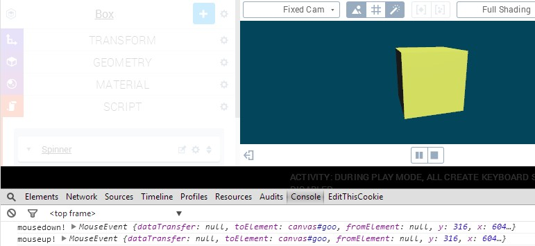

User input (from mouse, keyboard, touch et cetera) is handled through JavaScript-style event listeners. All the available functionality for interacting with the DOM comes for free, since the engine is written in nothing but JavaScript. It is possible to write any JavaScript code in Goo Create scripts, and that includes scripts which manipulates or interacts with the DOM. The tutorial you're currently reading will focus on the standard, unembellished, DOM events.

## The Goal

At the end of this tutorial, we'll have a super simple Create scene with which we can interact by clicking (or touching) and dragging.

<iframe allowfullscreen src="//goote.ch/88bde37c06e6b111432dc6804dbb40846231fd22/"></iframe>

Click and drag!

## JavaScript Event Listeners

Event handlers can be attached to elements (such as **divs** or **canvases**), to the **document** or to the **window** object. Event listeners are added by using certain event names and callback functions which execute when the selected event triggers. For example, adding a simple **mousedown** event listener to the window object might look like this:


window.addEventListener('mousedown', function(evt) {
    console.log('Mouse down event triggered!', evt);
}


The **evt** object will contain properties of the event. For example, the coordinates where the mouse down event occured. Each type of event has its own set of properties and can be attached to a certain set of elements. Refer to the excellent _MDN_ for full details, or use the console like above to print the evt object.

* **mousedown** details: [https://developer.mozilla.org/en-US/docs/Web/Events/mousedown](https://developer.mozilla.org/en-US/docs/Web/Events/mousedown "mousedown on MDN")
* Full event reference: [https://developer.mozilla.org/en-US/docs/Web/Events](https://developer.mozilla.org/en-US/docs/Web/Events "Full event reference")

## Adding and Removing Event Listeners in Scripts

## Spinning Functionality

### Scene Setup

The scene we're going to work with is super simple. Just add any 3D entity of choice and choose a nice camera angle. We'll use a simple **box** for illustration. Next, we need to add a **script component** to the box and add a **custom script** to the script component. Let's call the script _Spinner._

After adding a box, choosing some nice colors and creating a customscript. Red circles indicate buttons for adding a script component and adding a script

### Adding and Removing Event Listeners

Using DOM event listeners in script inside Create is not complicated, but there are some things we need to keep in mind. For example, remember that scripts have a **setup** and a **cleanup** function which run when pressing play or stop, respectively. That makes the setup function is perfect for adding event listeners, but it also means that we need to remove them in cleanup, because otherwise the _added_ _event listeners will persist_ and we'll get another set everytime we press play! When removing event listeners, one needs a stored handle to them. That means that we wouldn't be able to remove the simple mousedown event from the window in the example above, since we used an _anonymous function_ to add it. Luckily, storing handles are easy. Additionality, having a nice structure makes it easy to customize and work with the event listeners. Let's open the _script editor_ and write some code. Since we'll need the script handles in both the setup and in the cleanup functions, the script-wide ctx objects is a good candidate to use for storage. Let's start by adding some event listeners by first storing them as properties on the ctx object, and then using a simple loop to attach them to the **canvas**, and another one to clean them up.


var setup = function(args, ctx, goo) {

    ctx.evtListeners = {
        mousedown: function(evt) {
            console.log('mousedown!', evt);
        },
        mouseup: function(evt) {
            console.log('mouseup!', evt);
        }
    };

    for (var handle in ctx.evtListeners) {
        // The canvas element can be reached through ctx.domElement
        ctx.domElement.addEventListener(handle, ctx.evtListeners[handle]);
    }

};

var cleanup = function(args, ctx, goo) {
    for (var handle in ctx.evtListeners) {
        ctx.domElement.removeEventListener(handle, ctx.evtListeners[handle]);
    }
};


If you add the functions above to the script and run it, you can open up the console and check out the triggered mouse events!

Testing the basic event listener structure using the console

If everything seems to work correctly (testing is <em>important</em>), we can go on with adding some more interesting functionality to the script.
<h3>Spinning with Speed</h3>
We will combine the mousedown, mouseup and mousemove events and their touch counterparts to let the user spin the 3D object with some simple inertia. The idea is to track the x position where the user started to drag, and use the dragging distance to add some rotation speed. For this, we'll need a few variables. Let's add the following lines at the top of the setup function. Their use will become apparent when we use them.


ctx.dragging = false;
ctx.velocity = 0;
ctx.lastX = 0;
ctx.currentX = 0;


We will also need two customizable parameters. The first one, the <em>sensitivity</em>, will control the speed in relation to the dragging distance. The second one, the <em>damping</em>, will make sure that the box does not spin forever. Go ahead and add the parameters:


var parameters = [
{
    key: 'sensitivity',
    name: 'Sensitivity',
    type: 'float',
    control: 'slider',
    min: 0.01,
    max: 1.00,
    default: 0.05
},
{
    key: 'damping',
    name: 'Damping',
    type: 'float',
    control: 'slider',
    min: 0,
    max: 1,
    default: 0.05
}
];


Now, let's write the functions that will do the actual work.


var startDrag = function(ctx, x) {
    ctx.dragging = true;
    ctx.currentX = x;
};

var stopDrag = function(ctx) {
    ctx.dragging = false;
};

var drag = function(ctx, x) {
    if (ctx.dragging) {
        // Record the x position from the last update
        ctx.lastX = ctx.currentX;
        // Update the current x position
        ctx.currentX = x;
        // Use the dragged distance since last update to add velocity
        ctx.velocity += ctx.currentX - ctx.lastX;
    }
};

var update = function(args, ctx, goo) {
    // Use the accumulated velocity to add rotation around the y axis.
    // Make sure to apply the elapsed time to get framerate independent!
    ctx.entity.addRotation(0, args.sensitivity * ctx.velocity * ctx.world.tpf, 0);
    // Apply damping
    ctx.velocity *= (1-args.damping);
};



As you can see, the dragging functions roughly correspond to mousedown, mouseup and mousemove. For good reason! We don't write them directly in the mouse event callbacks because we want to use them for touches later. The only things these functions are concerned with are the ctx object and the event x coordinate. The **update** function is one of the standard, pre-defined script functions and runs once every frame. Here, it does not care about the dragging functionality, but only uses the velocity to rotate the entity.

Now, let's hook up the functions. Since we did write nice functions, it's fairly easy to add touch events (for mobile devices) too! We just need to access the x coordinate in a slightly different way. The event listener object in the setup function will look like this:


ctx.evtListeners = {
    mousedown: function(evt) {
        startDrag(ctx, evt.clientX);
    },
    mouseup: function() {
        stopDrag(ctx);
    },
    mouseout: function() {
        stopDrag(ctx);
    },
    mousemove: function(evt) {
        drag(ctx, evt.clientX);
    },
    touchstart: function(evt) {
        startDrag(ctx, evt.touches[0].clientX);
    },
    touchend: function() {
        stopDrag(ctx);
    },
    touchmove: function(evt) {
        drag(ctx, evt.touches[0].clientX);
    }
};


Note that the loops which add and remove the listeners don't need to be changed. Nice. The touch events have one extra layer before we get to the coordinate. This is because the touches store information for multiple touches. We are going to be happy with one! If you want to test the touch functionality (and you should), check out your browser's emulation capabillities!

## Finish!

That's all the needed code for the app at the beginning of the page. If you have problems with getting things to work or just want to skip to the finish, [here's a link to the scene](https://app.goocreate.com/4768/62995e70005c4f399445382f6bf887cb.scene). Feel free to ducplicate it and play around with it. Here's the simple script in its entireity, with some space-saving skipping of newlines:


var setup = function(args, ctx, goo) {
    ctx.dragging = false;
    ctx.velocity = 0;
    ctx.lastX = 0;
    ctx.currentX = 0;

    ctx.evtListeners = {
        mousedown: function(evt) { startDrag(ctx, evt.clientX);    },
        mouseup: function() { stopDrag(ctx); },
        mouseout: function() { stopDrag(ctx); },
        mousemove: function(evt) { drag(ctx, evt.clientX); },
        touchstart: function(evt) { startDrag(ctx, evt.touches[0].clientX); },
        touchend: function() { stopDrag(ctx); },
        touchmove: function(evt) { drag(ctx, evt.touches[0].clientX);}
    };

    for (var l in ctx.evtListeners) {
        ctx.domElement.addEventListener(l, ctx.evtListeners[l]);
    }
};

var cleanup = function(args, ctx, goo) {
    for (var l in ctx.evtListeners) {
        ctx.domElement.removeEventListener(l, ctx.evtListeners[l]);
    }
};

var startDrag = function(ctx, x) {
    ctx.dragging = true;
    ctx.currentX = x;
};

var stopDrag = function(ctx) {
    ctx.dragging = false;
};

var drag = function(ctx, x) {
    if (ctx.dragging) {
        ctx.lastX = ctx.currentX;
        ctx.currentX = x;
        ctx.velocity += ctx.currentX - ctx.lastX;
    }
};

var update = function(args, ctx, goo) {
    ctx.entity.addRotation(0, args.sensitivity*ctx.velocity*ctx.world.tpf, 0);
    ctx.velocity *= (1-args.damping);
};

var parameters = [
    {key: 'sensitivity', name: 'Sensitivity', type: 'float', control: 'slider',
    min: 0.01, max: 1.00, default: 0.05 },
    {key: 'damping', name: 'Damping', type: 'float', control: 'slider',
    min: 0,max: 1,default: 0.05}
];


## Next Steps

Of course, there are tons of things you can do from here. We recommend to check out the GooRunner Event Listeners tutorial to see how more advanced scene interaction can be achieved. Additionally, here are some ideas for extending the scene we just made:

*   Add functionality for the click or doubleclick events.
*   Add a skybox and try rotating the camera around the object, maybe at a different speed!
*   Implement functionality for the y coordinate too. How about seamlessly changing color of the entity?
*   Add an HTML component which shows the current rotation speed.
*   Create some effect when the speed reaches a certain limit. Try setting the object on fire!