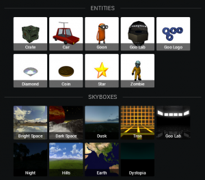
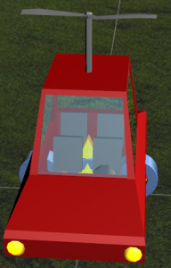
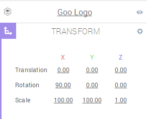
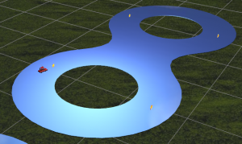
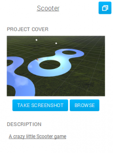
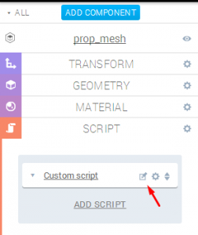

This tutorial will show you how you can use Goo Create with the ScriptComponent to make a little Scooter driving game. The result will allow you to drive around on the Goo logo and push stars off the track.

## What we will do

1.  Create a simple scene with Goo Create
2.  Add ScriptComponents
3.  Publish the project

## Create a simple scene with Goo Create

Start Goo Create here:  [create.goocreate.com](//create.goocreate.com/)

Click on "+NEW PROJECT" top left and select "Default project". After the project has opened, click on the name of the project "Default Goo Project" and rename it to **Scooter.** Then click on "+IMPORT" and select the _Goo_ library in the drop-down menu. Add the **Hills** skybox or any other skybox you like. Then add the **Car**, the **Goo Logo** and the **Star**.

Hint: You can rotate the view with the right mouse button and select entities with the left.You can also move the view with the middle mouse button.

Your scene should look somewhat like this:

Move the entities away from each other by selecting them and clicking and dragging the red arrow.

Now select the Goo logo, scale it and turn it sideways by changing the values in the text fields under the Transform section in the Entity panel. Change the X and Y values for the scale to 100 and change the X value for the rotation to 90.

It should now look like this:

We will use the sideways Goo logo as a track to drive on. If you fall off the track, you lose! We will also place stars over the track to push around. But let's first add a PointLight: Click on "+CREATE" and click on "POINT" under the "LIGHTS" section. Drag it above the scene using the arrows or set the position using the transform panel and set the light's range to 500\. Here are the values we're using;

Hint: We recommend to delete the "Default Lights", this will increase performance on mobile devices.Select the "Default Lights" and click on the little trashcan icon top right.

Move the car over the track and rotate it a bit on it's Y axis. Lift the car up a bit so it's wheels are not stuck inside the logo. Move the star over the track and duplicate it. The duplication icon is top right. Move the new star to a random spots on the track. Repeat this 2 more times so you end up with 4 stars in total. Your scene should look something like this: 

Now is a good time to take a project screen shot so we can find the project again in the project dashboard. Click on the project name "SCOOTER" at the top and then click on "TAKE SCREENSHOT" to the left.

OK, we are ready to take over with JavaScript.

## Add ScriptComponents

Let's start with something easy. Did you notice the little propeller on the car ? We will add a script to make it spin. Click on the little triangle next to the **Car** entity in the hierarchy panel. You should see three child entities and one of them is called **prop_mesh_**. Select the propmesh entity and add a new ScriptComponent using the button ADD COMPONENT in the left entity panel. Then add a new "custom script" and click on the edit symbol.

This should open up a new script editor window. Replace the example script contents with this content:


var setup = function(args, ctx, goo) {};
var cleanup = function(args, ctx, goo) {};
var update = function(args, ctx, goo) {
    ctx.entity.addRotation( 0, -ctx.world.tpf*5, 0);
};
var parameters = [];

As you can see we have a call to **addRotation** on the object **ctx.entity**. **addRotation** is a useful function of the Goo Engine injected into the entity by the [TransformComponent](//code.gooengine.com/latest/docs/index.html?c=TransformComponent).

_ctx_ stands for _context_ and it hosts a couple of cool objects. Mainly the current entity to which this script belongs. If you create a new script you can read the comments for other objects it contains.

As a parameter to the rotation around the Y axis we give it **-ctx.world.tpf*5**. **ctx.world** represents the root of the scene graph. You can use the [world object](//code.gooengine.com/latest/docs/index.html?c=World) to query for any entity. But the world also contains the time it took to render the last frame in a property called **tpf** (time per frame). A typical value is 1/60, or 0.01666… The reason we use the **tpf** as part of our parameter to addRotation is to make the code _frame rate independent_. If we always use tpf as part of our animation code it will run at the same speed regardless of how long it takes to render the scene. So this is a good practice to remember!

 Hint: You can give the script a useful name by clicking on it, I will name it "prop_mesh"

Save the script and click on the play button at the bottom of the Goo Create window. You should see a little spinning car propeller. Press the **stop** button to continue working on the scene. Next, we will make the camera chase the car. Click on the "Default Camera" in the right hierarchy panel. Now open up the SCRIPT panel on the left side and delete the OrbitNPan camera control script:

Instead add a new custom script and replace the example script contents with this content:


var setup = function(args, ctx, goo) {
    ctx.aboveCar = new goo.Vector3();
    ctx.behindCar = new goo.Vector3();
};

var cleanup = function(args, ctx, goo) {};

var update = function(args, ctx, goo) {
    if(ctx.car === undefined){
        ctx.car = ctx.world.by.name('Car').first();
        return;
    }
    var transform = ctx.car.transformComponent.transform;
    var pos = transform.translation;
    ctx.behindCar.setd(0,0,-3);
    transform.rotation.applyPost(ctx.behindCar);
    ctx.behindCar.addv(pos).add_d(0,2.5,0);
    ctx.entity.transformComponent.transform.translation.lerp(ctx.behindCar,0.05);
    ctx.entity.lookAt(ctx.aboveCar.setv(pos).add_d(0,1,0),goo.Vector3.UNIT_Y);
};

var parameters = [];


The code above creates a script that makes the camera follow the car. First we create an aboveCar vector that is later set to a position that is 1 unit above the car and then we create a behindCar vector that is set to a position 3 units behind and 2.5 units above the car. We then use the behindCar vector to linearly interpolate (lerp) and effectively move the camera to that position. Finally we make the camera lookAt the aboveCar position. applyPost is a cool function of the rotation object ([Matrix3](//code.gooengine.com/latest/docs/index.html?c=Matrix3)) which applies it's rotation to the passed in vector object and because we want the vector to point behind the car we pass in a vector with a negative z value. You can imagine that we use applyPost to put the vector into the a local coordinate system of the car.

Hint: Don't worry if you don't understand the code completely but do think about researching and understanding it later.  
Goo Create tries to make creating 3D content as easy as possible but to do the really fancy stuff you will probably not get around learning some 3D math.

Save the script and click on the **play** button at the bottom of the Goo Create window. You should see that the camera rapidly moves behind the car and then stays there. Press the **stop** button to continue working on the scene. Next we will setup the physics world. We will be using [Ammo.js](https://github.com/kripken/ammo.js) which is a JavaScript port of the popular [Bullet physics engine](http://bulletphysics.org/). First we add a new _empty entity_ to host two libraries and then we add the code that makes our car move. Click on "+CREATE" top middle link and then click on "EMPTY" to add a new empty entity and rename it to "Main Game Code". Then add a new ScriptComponent using the "ADD COMPONENT" button just like we did for the propeller and the camera entity before. Select "SCRIPT" and add a new custom script. Change the name also to "Main Game Code" by clicking on the current script name. Click on the little edit script icon to open up the script edit window again. There, in the Text Editor window at the bottom left, add three EXTERNAL RESOURCES:

* [https://labs.gooengine.com/learn/ammo.small.js](https://labs.gooengine.com/learn/ammo.small.js)
* [https://labs.gooengine.com/learn/VehicleHelper2.js](https://labs.gooengine.com/learn/VehicleHelper2.js)
* [https://code.gooengine.com/0.10.3/lib/ammopack.js](https://code.gooengine.com/0.10.3/lib/ammopack.js)

The first file is the Ammo.js physics engine. The second file is a little helper class I wrote to make using the btRaycastVehicle class from Bullet together with Goo easier. The btRaycastVehicle is a class that tries to simulate the behavior of a vehicle using rays towards the ground measuring the distance. Feel free to take a look at the code of the second file to see what it does. OK, now that we got that out of the way we will add the main code to make the Scooter game work. Replace the script code of our "Main Game Code" entity with this:


var setup = function(args, ctx, goo) {
	if( window.ammoSystem)
		window.ammoSystem.passive = false;
};

var cleanup = function(args, ctx, goo) {
	window.ammoSystem.passive = true;
	window.vehicleHelper.resetAtPos(window.pos);
};

var update = function(args, ctx, goo) {
	if(!window.ammoSystem) {
		ctx.world.setSystem(window.ammoSystem = new goo.AmmoSystem());
	}
	if(!window.init1Done) {
		ctx.world.by.name('goo_logo_mesh').first().setComponent( 
			new goo.AmmoComponent({mass:0,useWorldTransform:true})
		);
		window.car = ctx.world.by.name('Car').first();
		window.pos = window.car.getTranslation().clone();
		window.car.setComponent( new goo.AmmoComponent({
			mass:350,
			useWorldBounds:true,
			showBounds:false
		}));
		ctx.world.by.name('Star').each(function( star, i){
			star.setComponent(new goo.AmmoComponent({
				mass:1,
				useWorldBounds:true,
				showBounds:false
			}));
		});
		window.init1Done=true;
	}
	
	if(!window.car.ammoComponent.body) {
		return;
	}
	
	if(!window.init2Done) {
		var vehicleHelper = window.vehicleHelper = new VehicleHelper(window.ammoSystem,
			window.car, 2, 0.6);
		vehicleHelper.setWheelAxle( -1, 0, 0);
		vehicleHelper.addDefaultWheels(goo.EntityUtils.getTotalBoundingBox(window.car));
		window.init2Done=true;
	}
	
	var keys = ctx.worldData.keys;
	if( keys[32]) { // r
		window.vehicleHelper.resetAtPos(window.pos);
	}
	var vh = window.vehicleHelper
	vh.setSteeringValue( (keys[37]-keys[39]) * 0.3 );
	vh.applyEngineForce( (keys[38]-keys[40]) * 200 );
};

var parameters = [];


So what is going on in that big piece of code there? Great question, let's dive in! First, we have the ScriptComponent **setup** function. Here we just set the physics engine to not be passive anymore if it was set to be passive before. Next, we have the ScriptComponent **cleanup** function. Here we set the physics engine to be passive so it doesn't run in the background if we press stop in Goo Create. We also reset the car's physical position so it matches the visual position in Goo Create. Then we have the ScriptComponent **update** function, it contains the most important code. It also contains **three initialization blocks**. The first block initializes the AmmoSystem, a Goo class encapsulating the physics world from Ammo.js, and saves it in a property of the worldData object. The **worldData** object is a place to store global variables so that they survive code changes and the stop button. The second initialization block queries the Goo world for the **goo_logo_mesh** entity and gives it a new AmmoComponent with mass 0. Giving an entity an AmmoComponent registers it with the AmmoSystem and makes the entity behave physically realistic. In this case we pass in two parameters: mass: 0 and useWorldTransform: true. An entity with an AmmoComponent of mass 0 means it will be static and will not be affected by gravity and other forces. Basically it will stay where it is in space but other entities with mass > 0 will be able to collide with it. We also tell it to use the world transform as opposed to the local transform. This is usually the recommended setting for nested entities like the goo_logo_mesh so it inherits the parent transform settings we applied earlier to make the logo so big.

Hint: A user should not need to think about using useWorldTransform and the AmmoComponent will soon be improved to remove this setting!

Next we get the Car entity and clone it's current position vector into the variable **pos** so we can reset the car if we fall off the track.

Hint: If we would not clone the car translation, pos would share the reference to the car translation.  
If we clone the vector returned by getTranslation, pos references it's own independent vector and changes to the car position will not affect the pos vector.

Then we give the car an AmmoComponent as well. We set the mass to 350 kilos and we tell it to use the world bounding box for the collision detection. The benefit of using the world bounding box is that it includes all children (like the propeller) and takes every transform (like scale) into account.

Hint: Again, a user should not need to think about useWorldBounds and the AmmoComponent will soon be improved to remove this setting! If you want to see the bounds used you can set showBounds to true.

Finally we get all entities named "Star" and for each one we assign a new AmmoComponent with mass: 1 and useWorldBounds: true. This concludes this initialization step and we set **init1Done** to true. Next we check for **ctx.car.ammoComponent.body** to make sure the car AmmoComponent was properly processed before we go on.

Hint: Adding and removing entities and components are deferred inside the Goo Engine to improve performance! So sometimes you need to wait a frame or two for these changes to take effect.

Then we enter the third initialization step. In this step we create an instance of the VehicleHelper class. The VehicleHelper class contains methods to accelerate, steer and break a vehicle. The parameters to the constructor are: ammoSystem, vehicle_entity, wheelRadius:2 and suspensionLength:0.6. Next we set the wheel axle. The wheel axle is a vector that describes the orientation of the vehicle axle. Typical choices are the the x (-1,0,0) axis or the z (0,0,1) axis. Try setting the wheel axle to ( 1, 0, 0) and see what happens. Next we add 4 wheels at the corners of the entity bounding box using the helper function **addDefaultWheels**. This concludes the second initialization step and we set **init2Done** to true so this code is not executed again. The next code block in this script will run every frame. You could say that this is the heart of the game. First we get a reference to the keys array that we will create in the next (and last) step of this tutorial. The keys array always contains the value 1 for every pressed key. Then we check if the key 'r' has been pressed, if so we reset the car position. Finally we call the functions that get the car to move around: setSteeringValue turns the front wheels using a single value and applyEngineForce moves the car forward. If you only supply one value the force will be applied to all wheels. If you supply a second boolean parameter you can decide if the force shall be applied only to the front wheels ( true ) or only to the back wheels ( false ). The key codes 38 and 40 are cursor up and cursor down. They key codes 37 and 39 are cursor left and cursor right. The last piece of code we will add is there to detect keyboard input. Add one more custom script to the "Main Game Code" entity and replace the script with this:


var keys = new Array(127).join('0').split('').map(parseFloat);

var keyHandler = function (e) {
    keys[e.keyCode] = e.type === "keydown" ? 1 : 0;
}

var setup = function(args, ctx, goo) {
    document.body.addEventListener('keyup', keyHandler, false);
    document.body.addEventListener('keydown', keyHandler, false);
    ctx.worldData.keys = keys;
};

var cleanup = function(args, ctx, goo) {
    document.body.removeEventListener('keyup', keyHandler, false);
    document.body.removeEventListener('keydown', keyHandler, false);
};

var update = function(args, ctx, goo) {
};

var parameters = [];


The code above initializes an array called **keys** with 127 zeros. Then we have a keyHandler function that sets the values of the **keys** array according to the code of the key that was pressed: If a key is pressed the value in the array of the corresponding key code will be set to 1\. If a key is released the value in the array of the corresponding key code will be set to 0. We add the keyHandler as the event listener for **keyup** and **keydown** events on document.body in the ScriptComponent setup function. Because we can run SriptComponents live inside Goo Create we also need to clean up after our selves. So similarly in the ScriptComponent cleanup function we remove the event listener again, otherwise we would add the same keyHander over and over again each time we press play in Goo Create.

# Done

That's it, you are ready to push some stars of the goo logo with your car! Click on EXPORT and then PUBLISH YOUR PROJECT:

Now try out the game! Remember: If you fall off the track you can press **r** to reset the car.