In this first tutorial of Goo Create you will learn how to make a house on water:
<iframe width="800" height="450" src="https://c1.goote.ch/62a480a03dfd80991c08fbfa4f8023bc9614fcc6" title="Entities and transform tutorial scene finished" allowfullscreen></iframe>

The things you'll learn about in this tutorial:

* Entities
* Transformation
    * Translation
    * Rotation
    * Scale
* Hierarchy

##Part 1: Open the scene
The first thing you'll have to do is to open the scene we will work in for this tutorial:

1. <a href="https://create.goocreate.com/edit/aed83406fcb44bc3ab738c2ee8b4901b.scene" target="_blank">Click here to open the scene</a>
2. If you're not logged in yet, log in with your Goo Create account
2. Click on 'Duplicate scene' in the top left corner
3. Select 'Drafts' and click on 'Duplicate'
 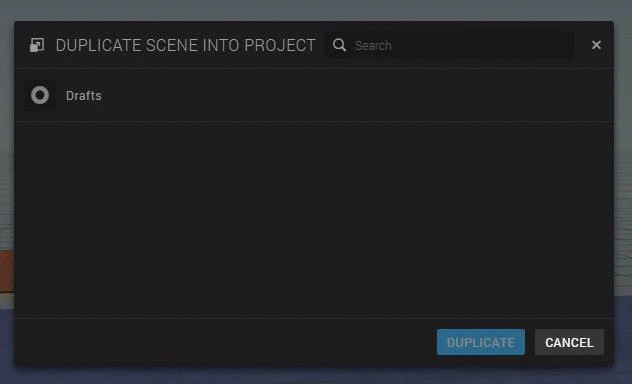

 You are now able to edit the scene. It should look like this:
 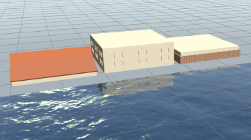

##Part 2: Creating a support post

In this part we will make the support posts for our house on water. The support posts consists of an entity, like every other element in a scene.

###What is an entity?

Entities are the components of a scene, so a scene is basically a group of entities.

There are different kinds of entities in Goo Create. If you open the 'create entity' panel in the top center of the interface, an overview will show up with all the different entities.

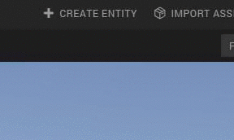

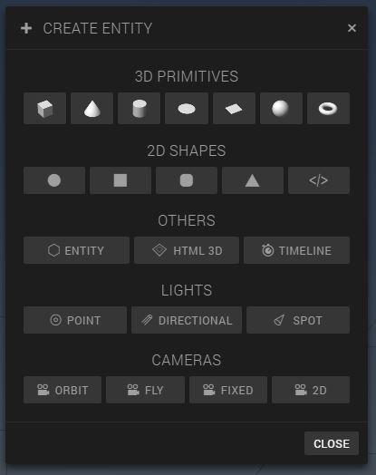

###Adding a cylinder to the scene

 For the posts that will support the house, we're going to use the 3D cylinder entity

 1. Click on the cylinder in the 'Create Entity' pop-up screen
 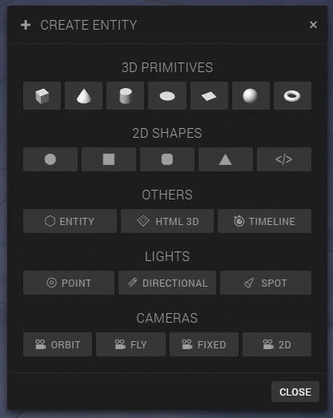

 2. Rename the entity to 'support post' by unfolding the first item in the panel on the left. You can unfold an item by clicking on it.
  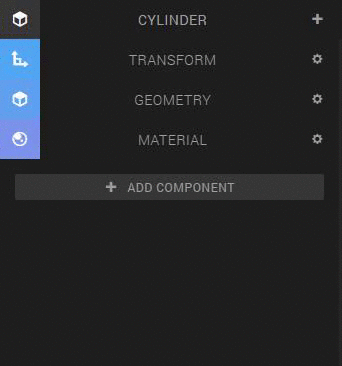

###Change the 'translation' and 'rotation' values of the cylinder entity

Now we have added and renamed the entity, but it doesn't really looks like a support post yet. We have to change the dimensions of the entity, and rotate the entity so it stands straight.

**Hint**: If you click on an entity in the scene or in the hierarchy panel and press 'S', the camera will focus on that entity

1. Unfold the 'Transform' item, which is in the same panel as where we changed the name of entity. Try it out!
  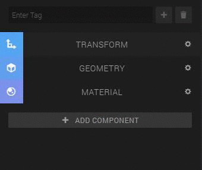

2. Play around with the values to see what happens when you change them. As you probably noticed:
    * The first row of values is for changing the postion of the entity. This is called **translation**.
    * The second row of values is for rotating the the entity. This is called... * drums *... **rotation**.
    * The last row of values is for changing the dimension of the entity. This is called **scale**.
    * The **X, Y and Z** on top represent the coordinates.

3. Adjust the transform values of the entity to the following values to create your first support post
  
    As you can see, the support post is half under water (press the right mouse button in the scene and move your mouse upwards). We can bring the entity more to the surface by dragging the arrow that is pointing up upwards, like this:
    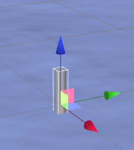

Press the play button at the bottom center of the interface to see what we've made so far!
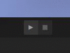
Look pretty nice with the water reflection, don't you think?

We will create the other support posts in part 4 of this tutoral.

##Part 3: Building the house

To put the house together, follow the steps below.

1. Click on 'House' in the hierarchy panel
2. Click on the 'Frame selection' icon at the left top above the canvas, or press 'S'
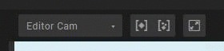

3. Unfold the 'House' entity in the hierarchy by clicking on the little arrow in front of the entity and select the 'floor' entity

4. Drag the 'floor' entity on top of the 'ground' entity with the arrows or  by adjusting the translation values
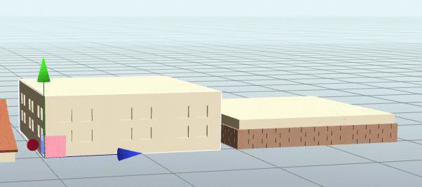
    Zoom in a little and make sure the floor aligns perfectly with the ground
5. Do the same thing with the 'roof' entity, but then on top of the floor

##Part 4: Put the house on the support posts

In this part we will put the house on the water and create the rest of the support posts

1. Select the 'house' entity in the hierarchy panel and drag the house on the support post
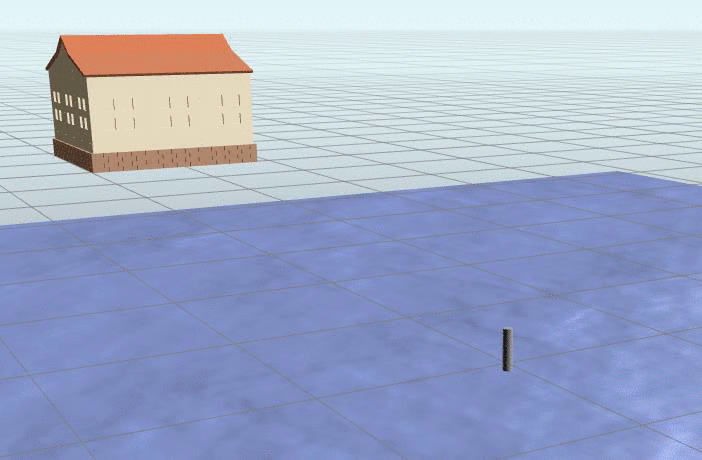
2. Create a new empty entity by clicking on the 'Entity' in the 'Create Entity' panel and rename it to 'Support posts' to keep the hierarchy clear since we are going to add more support posts
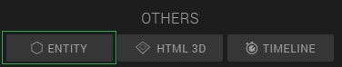
3. Drag the 'Support post' entity in the 'Support posts' entity
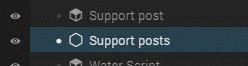
4. Select the 'support post' entity inside of the 'support posts' entity and press on the 'copy' button on top of the hierarchy panel
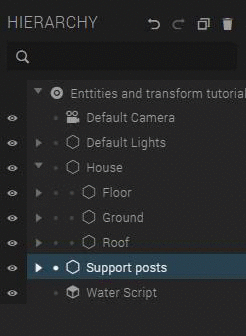
    You can't see the copied support post because it's inside the other support post.
5. Drag the second support post to the correct position
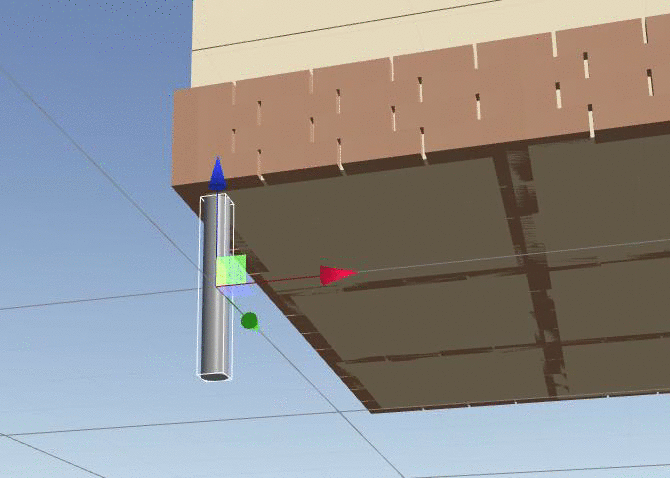
6. Do this for all the support posts

###Well done, You've just made your first Goo Create scene!

## Publish and share the scene

1. Click on 'Scene' > 'Publish' in the top left corner
 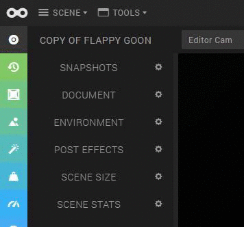
2. Fill in the name and the description of the scene
 
4. Click on 'publish' and then on 'OK'
 
5. After it's done publishing, click on 'Close'. Now you can share your projects by clicking on one of the social media icons.
 
