We made sure that the game uses as little scripting as possible to make it simpler for everyone. If you're a beginner and get stuck, please have a look inside the Create scene, and hopefully you can get past your problems!

Prerequisities: It's assumed you know how to make basic Create scenes, and simple scripts. You should also have some knowledge in how the state machine works.

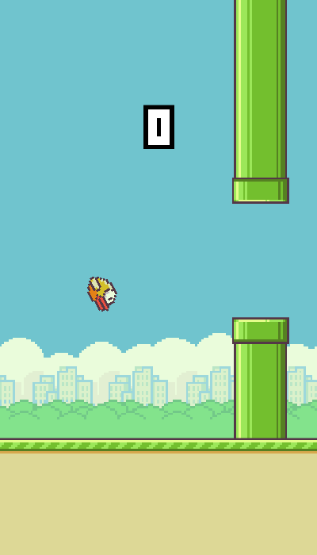

## Scene setup

Start off by creating the scene. Use the *Empty scene* template. We don't need any lighting or skysphere, so this template is perfect.

### Camera and viewport

Create a fixed camera and set it as *Main Camera*. Set the camera projection mode to parallel (2D). Move it to z=10, and make sure it's looking at the origin, where we will create our game stage. You can now delete the *Default camera* entity, since we won't use it.

Set the camera frustum size to 1 (no reason really, but it's easy to remember). The height of the viewport will correspond to 256 pixels in the flappy game world (yes, I counted the pixels from top to bottom in the Flappy Bird game). Given this setup, an object in the scene will have the size of a pixel, if it's size is 1/256.

## Sprites

The flappy bird spritesheet looks like this.

We will create many small sprite textures from this single image. Let's start off with the logotype as an example.

Note that the position of the logotype in the sprite sheet is (146,61) and its size is 96x22 pixels. The total size of the sprite sheet is 453x256. You can use your favorite image viewing/manipulating software to measure this.

1. Create a Quad from the Create menu at top and name it "Logo".
2. Set the scale of the logo entity to 0.375 (96 / 256) in X direction and 0.0859375 (22 / 256) in Y.
3. Open the Material component panel of the entity and drop the spritesheet image in the diffuse channel.
4. Set material diffuse color to white, specular to black, and ambient to white.
5. Open the Material, and set its name to "Logo material".
6. Open the Texture (select it from the asset bin or click its thumbnail on the diffuse channel, where you dropped it).
7. Set the repeat to 0.2119205298013245 (96/453), 0.0859375 (22/256) and texture offset to 0.32229580573951433 (146/453), 0.23828125 (61/256).
8. To get the pixelated effect, we need to set MagFilter to NearestNeighbor and MinFilter to NearestNeighborNoMipMaps. Uncheck "Generate Mipmaps" since these aren't necessary.

You are now done with the logotype sprite entity!

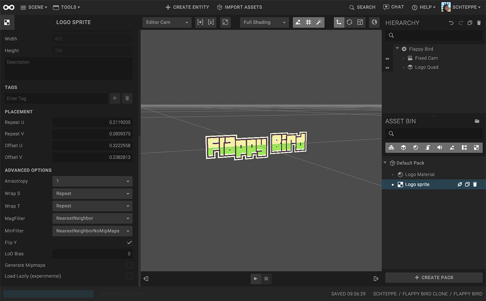

To create another sprite at position (x,y) with size (w,h) in the spritesheet, follow these steps:

1. Duplicate the Logo Material and Logo Texture in the asset bin, and rename them to something clever.
2. Create a Quad and set its scale to w / 256 and h / 256 in X and Y directions.
3. Drop the new material from the asset bin onto the Quad material panel.
4. Drop the new texture from the asset bin into the diffuse slot in the material.
5. Set the texture UV repeat to (w/453, h/256) and offset to (x/453, y/256).

## Physics

The bird has a sphere collider and the rest of the physics-enabled entities have box colliders. In between the pipes, I put a box collider that acts as a trigger, to be able to count points. A state machine on this trigger uses the *TriggerLeave* action to detect when the bird flies through it, and emits a "point" event when this happens.

The only rigid body in the scene is on the bird. The others don't really need dynamics.

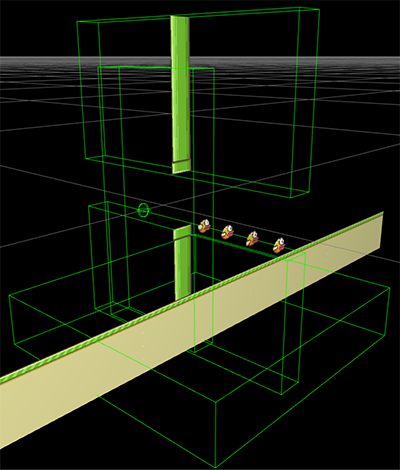

On the bird rigid body entity, there's a script listening for taps in play mode. When this happens, we set the velocity of the bird to 0.6 in the up direction:

function flap(){
  ctx.entity.rigidBodyComponent.setVelocity(new goo.Vector3(0,0.6,0));
}

The reason we *set* the velocity and don't *add an impulse* is because we always want the bird to fly up at the same speed, no matter what velocity it has when tapping.

## Sprite Animation

Since Goo Create dont support sprite animation, we'll do this manually via a script. Let's start with the flapping animation of the bird. Create the 3 sprites needed from the spritesheet. Put all of them as children to an empty entity. Duplicate the first sprite, and so you have 4 child entities. Name them Bird 1-4 in the correct animation order. We will now make a script that only shows one sprite at a time, and switches sprite at a given speed.

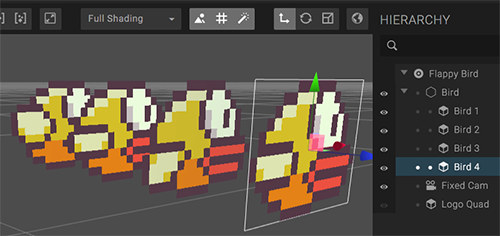

When the script runs on the parent entity, it looks like this in perspective mode versus parallel mode:

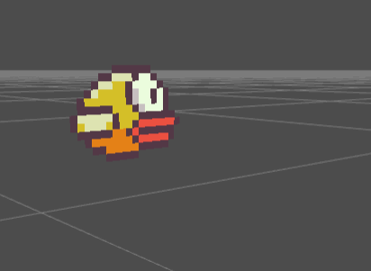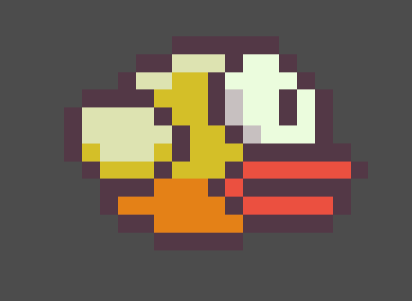

The following script enables this kind of sprite animation.

var setup = function (args, ctx) {
  // Get the child sprites, sorted by name
  ctx.children = ctx.entity.children().toArray().sort(function(a,b){
    return a.name < b.name ? -1 : 1;
  });
};

var update = function (args, ctx) {
  // Get the animation frame number
  var i = Math.floor(ctx.world.time * args.animationSpeed) % ctx.children.length;

  // Show only the current animation frame, hide the rest
  for(var j=0; j<ctx.children.length; j++){
    if(j === i)
      ctx.children[j].show();
    else
      ctx.children[j].hide();
  }
};

var parameters = [{
  key: 'animationSpeed',
  type: 'int',
  'default': 1
}];

## Game state

The game has only 4 major states:

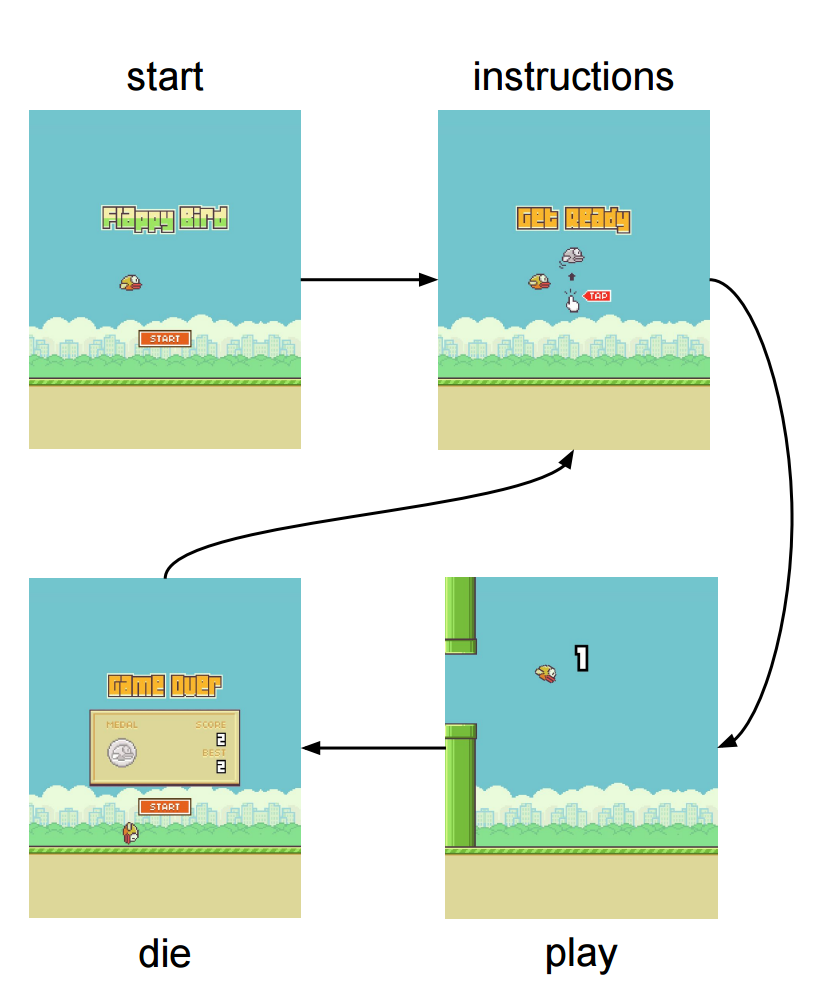

To keep track of them globally, I made a state machine on the Camera entity, and added these states. I made sure that whenever a state is entered (or exited), an event is emitted (using the *Emit Message Action*). For example, when the start screen is entered, a "start" event is emitted. When the start screen is left, a "leave_start" event is emitted.

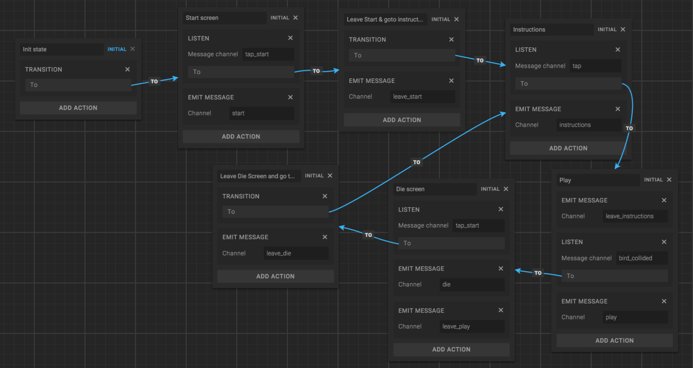

This strategy makes it really simple to create re-usable state machine behaviors. For example, to make the logotype only show on the start screen, we can create this simple Behavior:

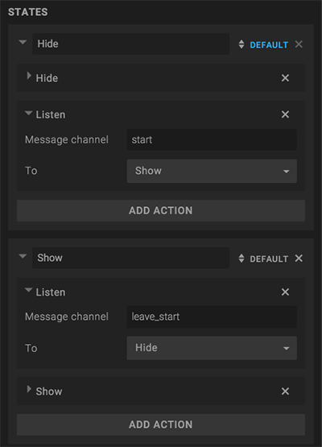

## Sounds

All sounds effects are put in a Sound Component on the camera. Putting them on the camera makes most sense for me (also, the sounds become 2D if you do).

To play the sounds when things happen in the scene, create a state machine that listens for events and plays (fades in) a sound effect when the event happens.

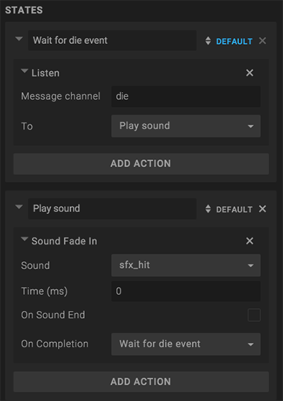

## High score: Local storage

Saving and loading the high score is simply done using localStorage. Just run *localStorage.setItem(name, value)* and *localStorage.getItem(name)*, respectively. Remember to wrap the code in try/catch statements, because some browsers throws errors if local storage is used in private surfing mode.

function saveHighscore(score){
  try {
    localStorage.setItem('highScore', score);
  } catch(err){
    console.error('Cant save high score.');
  }
}
function getHighscore(){
  try {
    return parseInt(localStorage.getItem('highScore'))||0;
  } catch(err){
    console.error('Cant get high score.');
    return 0;
  }
}

In the game, I used this logic on a *Point Counter* entity, which also shows the score while in play mode.

## Loading screen and App icon

If the user added the app to their home screen (iOS, Android), we want to set the app icon, and make sure that the app launches in full screen. To do that, we need to add some custom CSS and JavaScript.

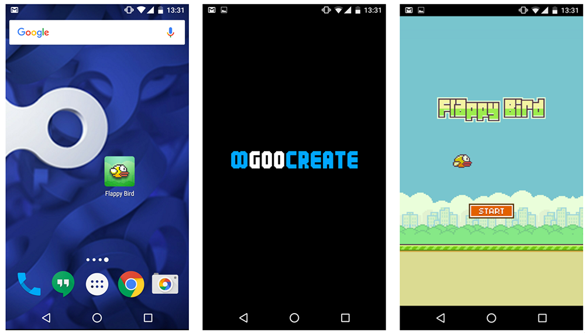

### Custom CSS

Here we set the background color to black, add an app icon, and make the app launch in full screen.


/* Set loading screen background to black */
#loading-screen {
  background-color: black;
}
</style>

<!-- Add app icon -->
<link rel="apple-touch-icon-precomposed" href="res/b10cc7a57bc7f80596692b2076f5073e05c9109a.jpg"/>

<!-- Make the app launch in full screen -->
<meta name="mobile-web-app-capable" content="yes">
<meta name="apple-mobile-web-app-capable" content="yes">
<style>

### Custom JavaScript

This following script replaces the progress bar and Goo logotype in the center with an image in the scene. The styling of this image is set to *image-rendering: pixelated* which gives it a pixelated look instead of blurry.

document.addEventListener("DOMContentLoaded", function() {
  var div = document.querySelector("#loading-screen .content");
  div.innerHTML = '

';
});

## Done

There are a few things that were skipped in this tutorial, to make it more readable and less boring. We suggest that you [open the scene in Create](https://create.goocreate.com/edit/bb3eea5c7dfe4b3b85fbcd9d7e6eddb5.scene) to learn about the details.
