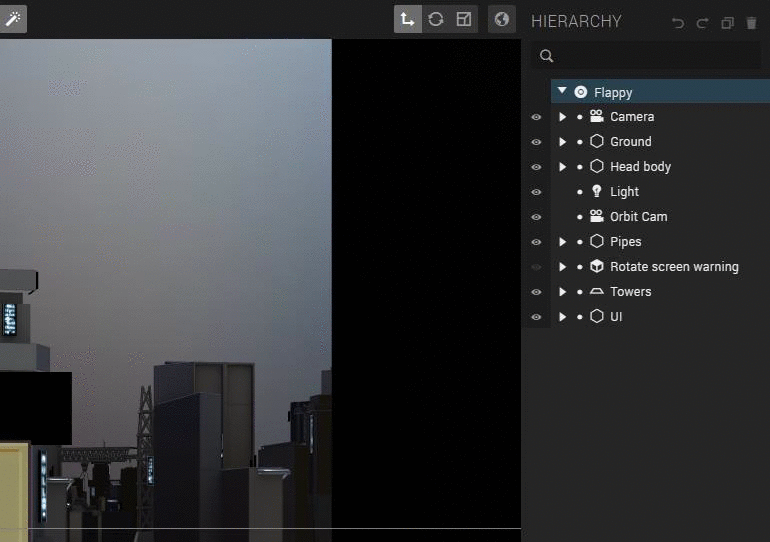
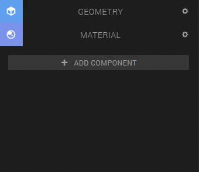
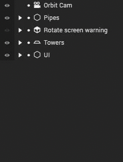
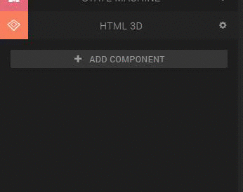
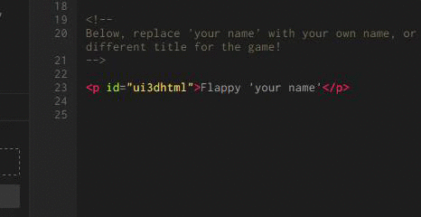
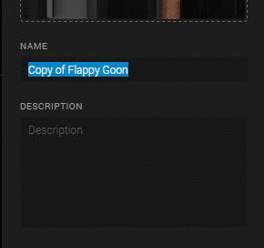
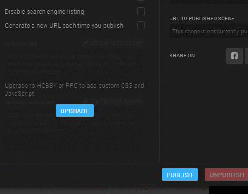

## Step 1: Replace the Goon's head with your own

1. Navigate with your mouse to the hierarchy panel
 
2. Select 'head 1'

3. Go to the left panel and unfold 'Material'.

4. Drag and drop the picture you want to use for the game instead of The Goon's head in the ‘Color (diffuse): texture’ box.

You can now play the game with your own picture by clicking on the 'play' button which is located in the bottom center of the interface.

## Step 2: Rename the game

1. Select 'logo' in the hierarchy panel
 
2. Open the HTML editor in the component panel on the left side of the screen
 
3. Edit the title of the game
 
4. Click on the blue 'Save' button

## Step 3: Publish and share the scene

1. Click on 'Scene' > 'Publish' in the top left corner
 
2. Fill in the name and the description of the scene
 
3. Check 'Enable Alpha' (because we use a so-called 3D HTML entity for the logo)
 
4. Click on 'publish' and then on 'OK'
 
5. After it's done publishing, click on 'Close'. Now you can share your projects by clicking on one of the social media icons.
 
