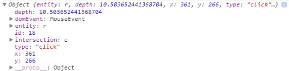
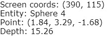

<iframe src="//goote.ch/3140d3c9a48ea9bc3b8897827f690e9243aa9b74/"></iframe>

Click around! The GooRunner event listeners work like regular DOM event listeners (and even contains the standard events), but also add some very useful stuff:

*   The picked entity.
*   The point of intersection in the 3D scene.
*   The depth of the intersection.

	<a href="http://code.gooengine.com/latest/docs/index.html?c=_met_GooRunner_addEventListener">Read about the details and available event types here</a>

## Performance Warning

A very important point - **using GooRunner event listeners is considerably slower than using regular DOM event listeners!** Always use the regular events if you can. For example, it's probably not a good idea to attach a GooRunner _mousemove_ event unless you really have to, since that will fire all the picking and intersection logic as soon as the cursor is moved! again, remember that the GooRunner events do everything that regular events do, plus a lot more.

## A Simple Example

The functionality is obvisously best illustrated with an example.

### Scene Setup

The scene does not really matter. Create any scene with a few entities or use an existing one!

### Adding Listeners to GooRunner

Add an empty entity, attach a script component, and add an empty script. We'll start by adding a simple event listener in the setup function, in the same manner as in the DOM Event Listener tutorial:


var setup = function(args, ctx, goo) {
    console.clear();
    ctx.runnerListeners = {
        click: function(evt) {
        console.log('Click event', evt);
    }
};

for (var l in ctx.runnerListeners) {
    ctx.world.gooRunner.addEventListener(l, ctx.runnerListeners[l]);
}


Also, let's remember to clean up after ourselves:


var cleanup = function(args, ctx, goo) {
	for (var l in ctx.runnerListeners) {
		ctx.world.gooRunner.removeEventListener(l, ctx.runnerListeners[l]);
	}
};


You can pause here, click around in your scene and explore the printed event details using the developer console in your browser. We have all the info we need, but we'll do something a little more visual with it in a minute.

Console printed picking event information

### A Small GUI

We'll create an HTML entity to display the intersection information. Create an HTML entity and uncheck the box _Move with Transform_. Open the editor and enter this simple HTML (we are not breaking exciting web design ground right now):



	Screen coords: (?, ?) 
	Entity: ? 
	Point: ? 
	Depth: ? 



This should give you this little information area in the top left corner:

Now we need to add a simple function to our script in order to display the info we got from the event object.


var displayIntersectionInfo = function(screenCoords, entity, point, depth) {
	var coordsDiv = document.getElementById('intersection-screen');
	var entityDiv = document.getElementById('intersection-entity');
	var pointDiv = document.getElementById('intersection-point');
	var depthDiv = document.getElementById('intersection-depth');
	coordsDiv.innerHTML = '(' + screenCoords[0] + ', ' + screenCoords[1] + ')';
	entityDiv.innerHTML = entity;
	pointDiv.innerHTML = '(' + point[0].toFixed(2) + ', ' +
            point[1].toFixed(2) + ', ' + point[2].toFixed(2) + ')';
	depthDiv.innerHTML = depth.toFixed(2);
};


And then, of course, we add some code to the event listener callback to pass the variables. We also do some checking to handle the case where a pick ray misses all entities, or picks an HTML entity which has no 3D point.


ctx.runnerListeners = {
	click: function(evt) {
		console.log('Click event', evt);
		var name, point, depth;
		if (evt.entity) {
			name = evt.entity.name;
			point = evt.intersection ? evt.intersection.toArray() : [0, 0, 0];
			depth = evt.depth;
		} else {
			name = 'None';
			depth = 0;
			point = [0, 0, 0];
		}
		displayIntersectionInfo([evt.x, evt.y], name, point, depth);
	}
};


Firing this script up and clicking any entity in the scene, we should now have the HTML entity populated:

### An Intersection Marker

Something you might want to do is to manipulate your 3D scene depending on a picking result. For example, you could move the camera to a point of interest, make a game character move or fire a weapon, or maybe setting the point of gravity! One simple thing we can do to visualize the point is to add a simple intersection marker. We'll use a sphere for this.

Start by creating some mesh data and a simple material for the sphere in the setup function:


var setup = function(args, ctx, goo) {
	console.clear();

	ctx.markerMeshData = new goo.Sphere(16, 16, 0.14);
	ctx.markerMaterial = new goo.Material(goo.ShaderLib.uber);
	ctx.markerMaterial.uniforms.materialDiffuse = [1, 0, 0, 1];
	ctx.markerMaterial.uniforms.materialEmissive = [0.7, 0, 0, 1];
	ctx.markerMaterial.uniforms.materialSpecular = [0, 0, 0, 1];

    // ...


Then, write functions to create and/or show the sphere at a certain point, or remove it.


var showMarker = function(ctx, pos) {
	if (!ctx.markerEntity) {
		ctx.markerEntity = ctx.world.createEntity(
			ctx.markerMeshData,
			ctx.markerMaterial,
			'Intersection Marker');
	}
	ctx.markerEntity.addToWorld();
	ctx.markerEntity.setTranslation(pos);
};

var hideMarker = function(ctx) {
	if (ctx.markerEntity) ctx.markerEntity.removeFromWorld();
};


Finally, hook these funcions up in the event callback:


ctx.runnerListeners = {
		click: function(evt) {
			console.log('Click event', evt);
			var name, point, depth;
			if (evt.entity) {
				showMarker(ctx, evt.intersection);   // <----- here
				name = evt.entity.name;
				point = evt.intersection ? evt.intersection.toArray() : [0, 0, 0];
				depth = evt.depth;
			} else {
				hideMarker(ctx);                     // <----- and here
				name = 'None';
				depth = 0;
				point = [0, 0, 0];
			}
			displayIntersectionInfo([evt.x, evt.y], name, point, depth);
		}
	};


When picking entities now, the small red sphere should show up at the picked point, just like in the example project at the top of this page.

## Done!

Sometimes it's useful to see the complete script. Check it out! And as always, <a href="https://app.goocreate.com/4768/236807da94f14e82b50867556e32289f.scene" target="_blank">here's a complete scene</a> in case you want to duplicate it.


var setup = function(args, ctx, goo) {
	console.clear();

	ctx.markerMeshData = new goo.Sphere(16, 16, 0.14);
	ctx.markerMaterial = new goo.Material(goo.ShaderLib.uber);
	ctx.markerMaterial.uniforms.materialDiffuse = [1, 0, 0, 1];
	ctx.markerMaterial.uniforms.materialEmissive = [0.7, 0, 0, 1];
	ctx.markerMaterial.uniforms.materialSpecular = [0, 0, 0, 1];

	ctx.runnerListeners = {
		click: function(evt) {
			console.log('Click event', evt);
			var name, point, depth;
			if (evt.entity) {
				console.log(evt);
				showMarker(ctx, evt.intersection);
				name = evt.entity.name;
				point = evt.intersection ? evt.intersection.toArray() : [0, 0, 0];
				depth = evt.depth;
			} else {
				hideMarker(ctx);
				name = 'None';
				depth = 0;
				point = [0, 0, 0];
			}
			displayIntersectionInfo(
				[evt.x, evt.y], name, point, depth);
		}
	};

	for (var l in ctx.runnerListeners) {
		ctx.world.gooRunner.addEventListener(l, ctx.runnerListeners[l]);
	}
};

var cleanup = function(args, ctx, goo) {
	for (var l in ctx.runnerListeners) {
		ctx.world.gooRunner.removeEventListener(l, ctx.runnerListeners[l]);
	}
	if (ctx.markerEntity) ctx.markerEntity.removeFromWorld();
};

var showMarker = function(ctx, pos) {
	if (!ctx.markerEntity) {
		ctx.markerEntity = ctx.world.createEntity(
			ctx.markerMeshData,
			ctx.markerMaterial,
			'Intersection Marker');
	}
	ctx.markerEntity.addToWorld();
	ctx.markerEntity.setTranslation(pos);
};

var hideMarker = function(ctx) {
	if (ctx.markerEntity) ctx.markerEntity.removeFromWorld();
};

var displayIntersectionInfo = function(screenCoords, entity, point, depth) {
	var coordsDiv = document.getElementById('intersection-screen');
	var entityDiv = document.getElementById('intersection-entity');
	var pointDiv = document.getElementById('intersection-point');
	var depthDiv = document.getElementById('intersection-depth');
	coordsDiv.innerHTML = '(' + screenCoords[0] + ', ' + screenCoords[1] + ')';
	entityDiv.innerHTML = entity;
	pointDiv.innerHTML = '(' + point[0].toFixed(2) + ', ' +
		point[1].toFixed(2) + ', ' + point[2].toFixed(2) + ')';
	depthDiv.innerHTML = depth.toFixed(2);
};

