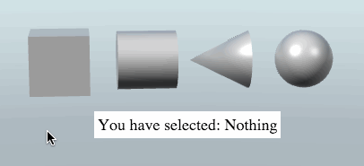

## Step 1: create an HTML entity

The first thing we will do, is creating an HTML entity. Click *Create*, select *HTML entity*. Open the script editor and modify the HTML.


<p style="background: white; font-size: 18px; padding: 4px; margin: 0;">
    You have selected: <span id='selected'>Nothing</span>
</p>

Notice the ```id``` we added for the ```span``` element. This will allow us to retrieve the element later in our script we will make.

## Step 2: Create a Script

Next, we will need to add some entities to click on. I added a sphere, a box, a cone, and a cylinder, all from the *Create Entity* dialog.

There are several ways to get the entity that is clicked. In this tutorial we will use the ```pick``` method from the ```GooRunner``` (which is hardware picking), and we will implement it using a *Script*.

Select the HTML Entity in the hierarchy, and click *Add Component* button in the inspector panel. Select *Script*. Add a new Custom Script to the Script component.

Open the script for editing, clear out the current code, and paste this code in its place:

var setup = function(args, ctx){
    // Get the span element from the HTML Entity
    var spanElement = document.getElementById('selected');

    // Create a click handler function
    ctx.handleClick = function(event){
        var x = event.offsetX;
        var y = event.offsetY;
        ctx.world.gooRunner.pick(x, y, function(index, depth){
            if(index !== -1){
                var entity = ctx.world.entityManager.getEntityByIndex(index);
                spanElement.innerHTML = entity.name;
            } else {
                spanElement.innerHTML = 'Nothing';
            }
        });
    };

    // Attach the click handler
    ctx.domElement.addEventListener('click', ctx.handleClick);
}

var cleanup = function(args, ctx){
    // Remove the click handler
    ctx.domElement.removeEventListener('click', ctx.handleClick);
}

This script does a couple of things. First it grabs the ```selected``` element from the HTML entity. Then it creates a ```handleClick``` function and adds it to the 'click' event in the canvas.

The click handler ```ctx.handleClick``` will be called when there's a click on the canvas. When this happens, we execute the code in it, which does the following:

1. We call the ```ctx.world.gooRunner.pick``` function, passing in the mouse position, as well as a callback function.
2. Inside this callback function, we determine if an entity was a hit or not.
3. If an entity was hit, we change the innerHTML for the ```selected``` element to the name of the entity we clicked. If there is no hit, we change it to 'Nothing'.

## Step 3: Done!


Now when you click one of the shapes in the scene, the window will tell you which entity you clicked. If you click an empty part of the scene, the window will say you clicked 'Nothing'.
