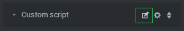

There will be times when you may want to use an HTML Entity to do something inside your scene.  In this example, we will use a button to play a sound on an Entities SoundComponent.

Because this sound won't be positioned in 3d space, lets go ahead and add it to the Default Camera.

First select the Default Camera in the scene Hierarchy on the right side of the screen.

Next add a SoundComponent by clicking on the 'Add Component' button at the bottom of the list of components in the panel on the left side of the screen.

From the drop down menu that appears, choose 'Sound'.

Now that we have our SoundComponent, we will need to drag and drop a sound to play onto the dotted box that says, 'Drop Sound File Here'.

I chose a sound clip I downloaded from FreeSound.org: <a title="Gun Shot Sound" href="http://www.freesound.org/people/pgi/sounds/212600/" target="_blank">http://www.freesound.org/people/pgi/sounds/212600/</a>

To play the sound when the button is clicked, we will need to create a callback function for the button.  For this we will need a Custom script. The Default Camera already has a ScriptComponent, which is how you are able to move around the scene when you press Play.  We will tap into this ScriptComponent, by adding our own Custom script to the one that is already there.

First, expand the Script category.  At the bottom of all the camera settings, you should see a button called 'Add Script'.  If you click this, a list of scripts should appear.  We want to choose the top option: 'Custom'.

Now we need to open and edit this script.  You do this by clicking the icon which looks like a pencil writing inside a square:

Remove all the existing code from the code editor, and then paste this inside it:


var setup = function(args, ctx, goo){
  var sound = {};
  var soundArray = ctx.entity.soundComponent.sounds;
  for(var i = 0, ilen = soundArray.length; i < ilen; i++){
    sound[soundArray[i].name] = soundArray[i];
  }

  ctx.playSound = function(){
    sound['212600__pgi__machine-gun-001-triple-shot'].stop();
    sound['212600__pgi__machine-gun-001-triple-shot'].play();
  }
  var button = document.getElementById('button1');
  button.addEventListener('click', ctx.playSound);
}

var cleanup = function(args, ctx, goo){
  var button = document.getElementById('button1');
  button.removeEventListener('click', ctx.playSound);
}


In the setup() function, we first create a sound map, to map the sound names to the actual sound objects. This isn't so important in this demo, because we only have one single sound, but when you start adding more and more sounds, this becomes a necessary step.

Next we create a callback function: ctx.playSound(). Notice that we used the 'ctx' scope? This is so we can reference it later in the cleanup function. Also notice, we first stop() the sound before playing it again. We do this to interrupt the previous sounds playback, and start it over.

Last, we get a reference to the 'button1' button which we created in the previous example, and add an event listener for the 'click' event. We pass in the ctx.playSound() function as the callback.

The golden rule for using Custom scripts, is that anything you create in the setup, you need to destroy in the cleanup. So in the cleanup() function, we just remove the callback function from the button. This is why we needed to use the ctx scope, so we can reference the same callback function here.

Now when you press Play, you should be able to hear the sound playing every time you click the 'button1' button.
