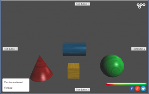

There could be times when you will want to use Images from the scene with an HTML Entity.  In this example, we will create a 'Health Bar', which will shrink or grow in size based on the current 'health' variable.

The first thing we will need to do, is create a new DIV in our HTML Entity to hold the health bars.  Inside this DIV, we will put place holders to store our 'empty' and 'full' images.  We have structured it this way, so we can easily re-position the health bar without having to touch the images themselves.



<button id='button1'>Test Button 1</button>
<button id='button2'>Test Button 2</button>
<button id='button3'>Test Button 3</button>
<button id='button4'>Test Button &</button>

	
You have selected:

	
Nothing

	
	



Notice both the new DIV and IMGs, as well as the CSS associated for them: 'health_bar', 'health_full' and 'health_empty'.

Now that we have our HTML place holders setup, we will need to create a script to store our two health bar images in our project.  One for when the health bar is 'full' the other for when it is 'empty'.

Go ahead and add a new Custom script to the HTML Entity's ScriptComponent.  In this script, we will add two parameters for the two textures:


var parameters = [
 {key:'empty', type:'texture', default:null},
 {key:'full', type:'texture', default:null}];


Here are the two images I am using for this tutorial:

After you save the script, you will need to drag and drop them onto the Empty and Full texture slots which appeared in the Custom script, or else use the browse icon to search for them on your local hard drive.

In addition to these two parameters, we will be using the setup function to set the HTML IMG src values and cleanup to clear them:



var setup = function(args, ctx, goo){
document.getElementById('health_empty').src = args.empty.image.src;
document.getElementById('health_full').src = args.full.image.src;
};

var cleanup = function(args, ctx, goo){
document.getElementById('health_empty').src = '';
document.getElementById('health_full').src = '';
};



All that is left, is implementing a way to detect when the health has changed, and clipping the 'full' health bar with the appropriate values.

Here is the full Health Bar script:

var parameters = [
 {key:'empty', type:'texture', default:null},
 {key:'full', type:'texture', default:null}];

var setup = function(args, ctx, goo){
  document.getElementById('health_empty').src = args.empty.image.src;
  document.getElementById('health_full').src = args.full.image.src;
  console.log(args.full);
  ctx.maxHealth = 100;
  ctx.worldData.health = ctx.maxHealth;
  ctx.health = ctx.maxHealth;
  ctx.healthTic = args.full.image.width / ctx.worldData.health;
  document.getElementById('health_full').style.clip = 'rect(auto,'+
    parseInt(ctx.worldData.health * ctx.healthTic)+'px, auto, auto)';
};

var update = function(args, ctx, goo){
  if(ctx.worldData.health !== ctx.health){
   ctx.worldData.health = Math.min(Math.max(ctx.worldData.health, 0), ctx.maxHealth);
   document.getElementById('health_full').style.clip = 'rect(auto,'+
     parseInt(ctx.worldData.health * ctx.healthTic)+'px, auto, auto)';
   ctx.health = ctx.worldData.health;
 }
}

var cleanup = function(args, ctx, goo){
  document.getElementById('health_empty').src = '';
  document.getElementById('health_full').src = '';
};


In the setup function, we create a local variable for the maxHealth, then a world variable: ctx.worldData.health.  We also create a local variable: ctx.health.  Finally, we calculate a 'healthTic' to multiply the current health by in order to determine the size the health bar.  We also need to set the 'clip' style for the full health bar, so we can modify it later in the update function.

In the update function, we first check to see if the world variable for health is not equal to our local variable.  If they are not the same, we first clamp the value between 0 and ctx.maxHealth, then adjust the clip style of the full health bar to reflect the new size, and update our local health variable.

Now whenever ctx.worldData.maxHealth changes, the health bar will automatically re-size to show the changes.

We can tap into the callback function we created in the second tutorial:  <a href="{{ '/tutorials/html-interact' | prepend: site.baseurl }}">Using HTML Buttons to Affect the Scene</a>

Just change the callback function for the sound button like so:

ctx.playSound = function(){
  sound['212600__pgi__machine-gun-001-triple-shot'].stop();
  sound['212600__pgi__machine-gun-001-triple-shot'].play();
  ctx.worldData.health -= (5 + Math.random() * 10);
  if(ctx.worldData.health < 0){
    ctx.worldData.health += 100;
  }
}


We basically tell it to subtract some random value between 5 and 15 from the current ctx.worldData.health.  We then make sure that if the health falls below 0, we add +100 to it, to keep it from going into the negative.

The final result is that when you click the button, the ctx.worldData.health value is changed, which then causes our health bar to automatically update its clip settings to the new value.