## Step 1: Add a box to the scene

**1.** Click *+ CREATE ENTITY* at the top center

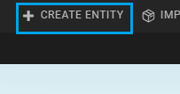

**2.** Click on the box in the popup menu

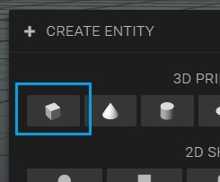

You've now added a box to your scene.

**HINT:** Change your point of view by holding the right mouse button + moving the mouse. Scroll to zoom in/out.

## Step 2: Change the dimension of the box

**1.** Select the box you've just added in the hierarchy panel on the right

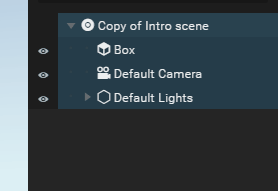

**2.** Unfold *Transform* in the inspector panel on the left

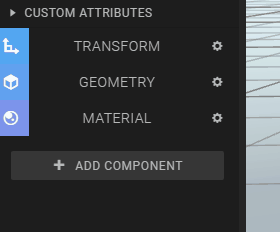

**3.** Add the following values to the *Transform* settings

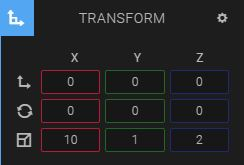

The box should now look like this

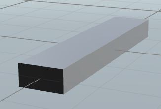

## Step 3: Import the Goon with the helicopter backpack

**1.** Click *IMPORT ASSETS* at the top center of the screen

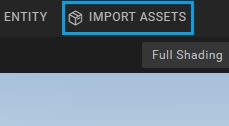

**2.** Type *Helicopter goon* in the search box

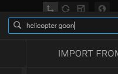

**3.** Add the Helicopter Goon by double-clicking it

It's correct that the Helicopter Goon isn't visible in your scene yet. We will do that in the next step!

## Step 4: Add the Helicopter Goon to the scene

**1.** Drag the Helicopter Goon from the *bin* to the scene. The *bin* is located at the bottom right of the screen.

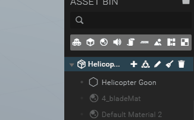

The Helicopter Goon should now be added to the scene

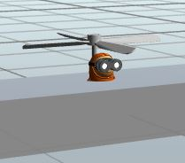

## Step 5: Drag the Goon on top of the box

**1.** Make sure the Helicopter Goon is still selected. If not, select it in the Hierarchy panel on the right

**2.** Click the arrow pointing upwards and hold your mousebutton down.

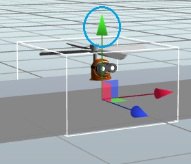

**3.** Move your mouse up until the Goon floats above the box

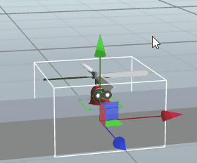

Click the *Play button* at the bottom center to see the Helicopter Goon in action!

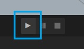

**HINT:** If you want to continue editing, press the *Stop button* next to the *Play button*

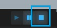

## Step 6:  Add a *rigid body* to the Goon

To expose the Helicopter Goon to gravity, we're going to add a rigid body to the Goon

**1.** Make sure the Goon is still selected, and click *Add component* in the inspector panel on the left

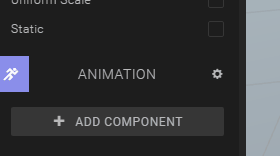

**2.** Click *Rigid body*

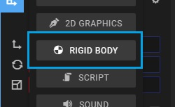

**3.** Check *Freeze Rotation X*, *Freeze Rotation Y*, and *Freeze Rotation Z* to prevent the Goon for rotating in the air

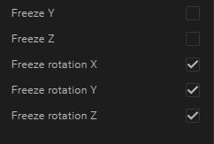

Press the *play button* and see what happens!

As you can see, the Goon falls and moves through the box. In the next step we're going to do something about this!

## Step 7:  Add a *collider* to the box

To prevent that the Goon moves through the box, we're going to add a collider

**1.** Select the box in the *Hierarchy panel* on the right

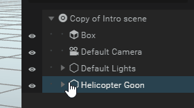

**2.** Click *Add component* in the Inspector panel on the left

**3.** Click *Collider*

**4.** Select the Goon in the Hierarchy panel

**5.** Repeat **2.** and **3.**

You've now added a collider to the box and the Goon! Press the *play button* to see the result

## Step 8:  Adding a state machine

To 'program' the movement of the Goon and connecting it to the W, A and D buttons on the keyboard, we're going to use the State machine component, which enables you to program things in a visual way

**1.** Select the Helicopter Goon in the *Hierarchy panel* on the right

**2.** Click *Add component* in the Inspector panel on the left

**3.** Click *State machine*

**4.** Click the **+** next to *Drop behavior*

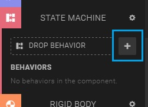

You've now entered the state machine editor

## Step 9:  Creating the the vertical movement p1

**1.** On the left side of the screen, unfold *Details*

**2.** Change the name from 'Behavior' to 'Vertical movement'

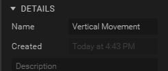

**3.** Unfold *Selected state*

**4.** Rename the state to *No movement*

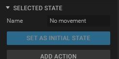

## Step 10:  Creating the the vertical movement p2

**1.** Click *Add action*

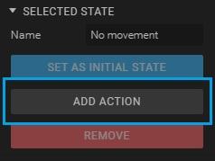

**2.** Type *Key down* in the search box

**3.** Add the *Key down* action by double-clicking it

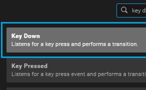

**4.** Change the Key from 'A' to 'W', since we want the Goon to move up when the 'W' button is pressed

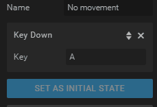

**HINT:** The *Key down* action enables to make a transition to another state when a button is pressed

## Step 11:  Creating the the vertical movement p3

**1.** Click 'Add state'

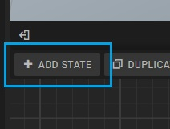

**2.** Rename the state to 'Move up'

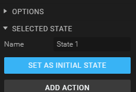

**3.** Click *Add action*

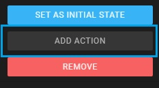

**4.** Type *Key up* in the search box

**5.** Add the *Key up* action by double-clicking it

**6.** Change the key to 'W'

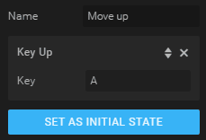

**7.** Connect the states with arrows, like this:

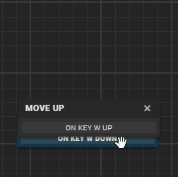

Press the *Play button* and see the transition between the states when you press 'W' on your keyboard

## Step 12:  Creating the the vertical movement p4

We're now going to add a *force* to the 'Move up' state to let the Goon move up when the state is active.

**1.** Select the 'Move up' state by clicking on it

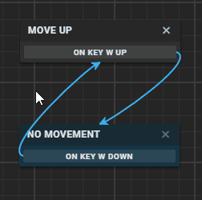

**2.** Click *Add action*

**3.** Type 'Apply force' in the search box

**4.** Double click the *Apply force on rigid body* action

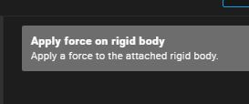

**5.** Change the second *Force* value to '20'

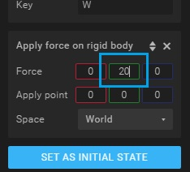

Press the play button and press 'W' to fly with the Goon!

## Step 13:  Creating the horizontal movement p1

The Horizontal movement state machine is going to be very similar to the Vertical movement state machine. That's why we're going to copy the Vertical movement state machine and then edit the copied version.

**1.** Press the state machine logo in the Bin at the bottom right of the screen

**2.** Hover with your mouse over the *Vertical movement* state machine and click the copy icon

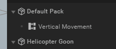

**3.** There should appear a *Vertical movement 2* in the Bin. Hover over it and click on the pencil icon.

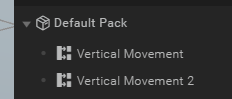

## Step 14:  Creating the horizontal movement p2

**1.** Change the name of the state machine from 'Vertical movement 2' to 'Horizontal movement'

**2.** Select the *Move up* state

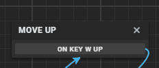

**3.** Change the name to 'move left'

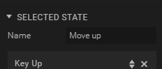

**4.** Set the second force value to '0' and the first to '-8'

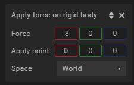

**5.** Change the *Key up* key to 'A'

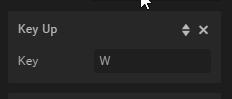

## Step 15:  Creating the horizontal movement p3

**1.** Copy the 'move left' state by clicking *DUPLICATE STATE*, which is located next to the *+ ADD STATE* button

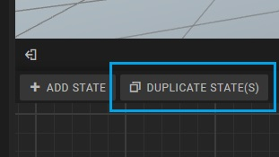

**2.** Change the name of the copied state to 'move right'

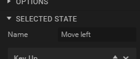

**3.** Set the first *Force* value from '-8' to '8'

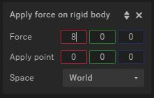

**4.** Change the *Key up* key to 'D'

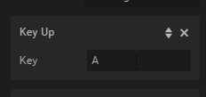

**5.** Drag the 'move right' state down

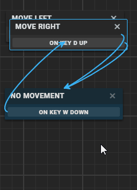

## Step 16:  Creating the horizontal movement p4

**1.** Select the 'No movement' state

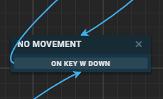

**2.** Click *Add action*

**3.** Type 'Key down' in the search box and add the action

You should now have two *Key down* actions in the 'No movement' state

## Step 17:  Creating the horizontal movement p5

**1.** Change one *Key down* key to 'A', and one to 'D'

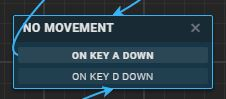

**2.** Connect *On key D down* to the *move right* state

**3.** Connect *On key A down* to the *move left* state

**4.** Connect the *move left* and *move right* states to the *No movement* state

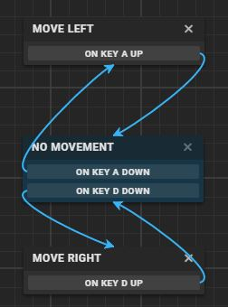

**Congratulations!! You've just made your first (mini)game in Goo Create!**
