This tutorial aims to cover the basics of using lights in your scene.
In order to begin this tutorial, click on the link above this slideshow and duplicate the scene to your personal account by pressing the large blue button labeled Duplicate Scene.

    

        <a class="btn btn-primary btn-lg" target="_blank" href="https://create.goocreate.com/edit/00798aaa4ebb45549ec6765008a394fa.scene">Open scene in Create</a>
    

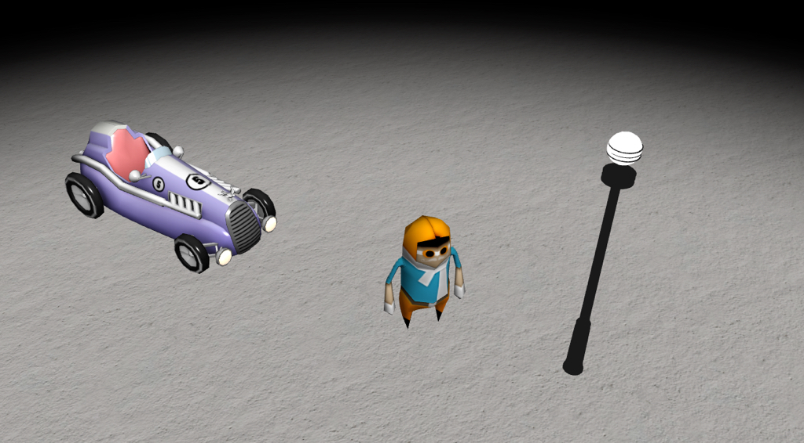

This starting scene is simply rigged with a character, a car, a lamp pole and ground. The scene is also complemented with a simple fog.

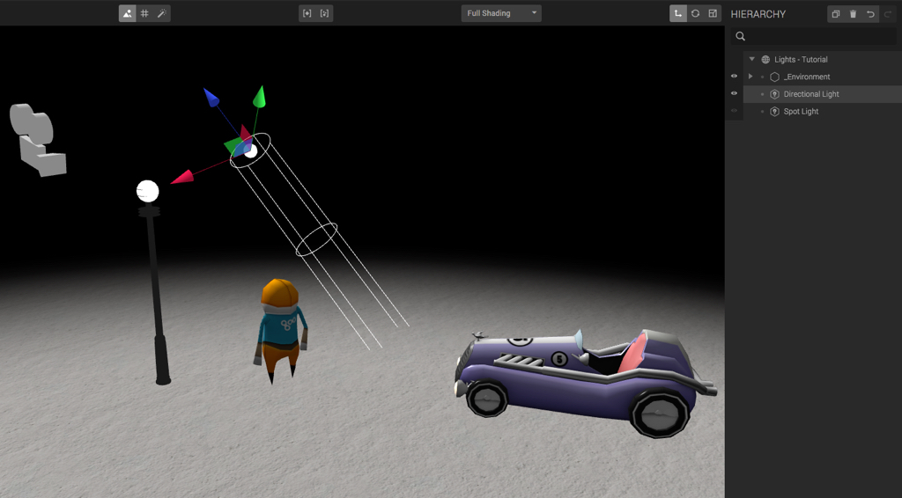 

Every new scene in Goo Create starts of with a couple entities. One of which being a directional light entity. A light entity can be one out of three different types; directional, spot or point.
A light entity in Create does not require a mesh or geometry as source inducing that the source of the light is not visible unless you assign a mesh to it.

A directional light is a source of light that projects light rays in parallel from a set direction. You could think of it like a source of light infinitely far away directing light rays without decreasing intensity towards the entire scene.
A directional light entity project light in similarity to how the sun sheds light on earth.

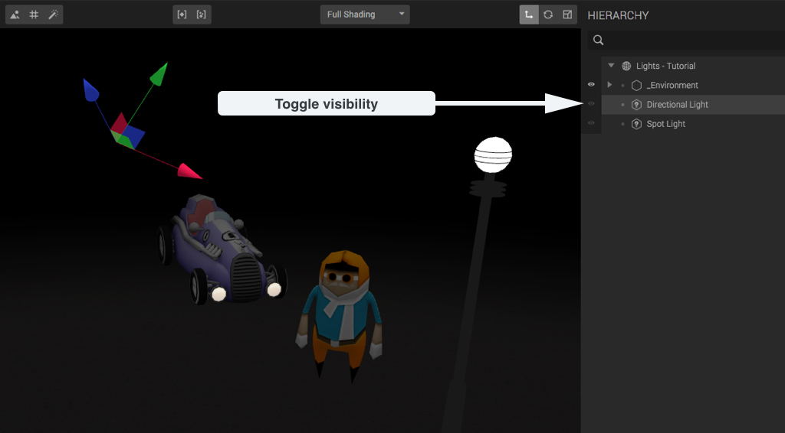

To demonstrate a directional light in action, toggle visibility of the directional light entity by pressing the icon shaped as an eye next to the entity name in the Scene Hierarchy.

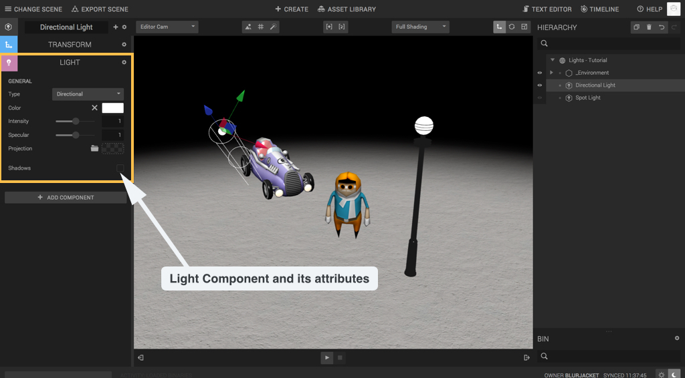

Click on the directional light entity in order to bring up its Component Panel. Expand the Light Component in order to display its light attributes. From here, you can change its type to either Spot or Point (which we will cover shortly) from a dropdown-list. You can also adjust its colour, intensity, specular as well as projection and toggle casting shadows. For now, lets leave those as is and we will return to manipulating these attributes on our next type of light.

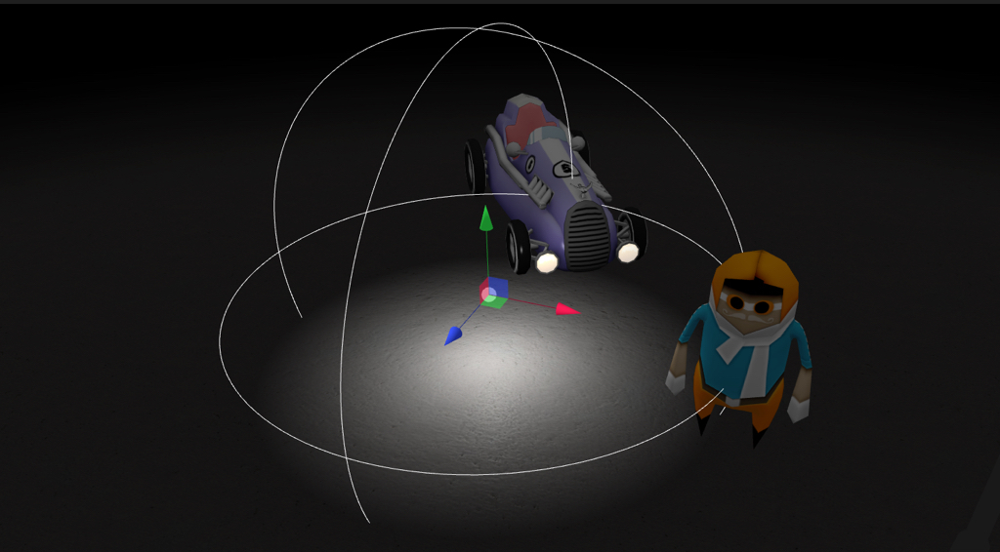

A point light entity is a point in space that emits light in all directions. A point light entity projects light in similarity to an ordinary light bulb.

In order to see it in action, lets place one inside the street light to create an atmospheric light in our scene. But before doing so, lets hide the directional light entity to be able to see the effects of the point light more clearly.

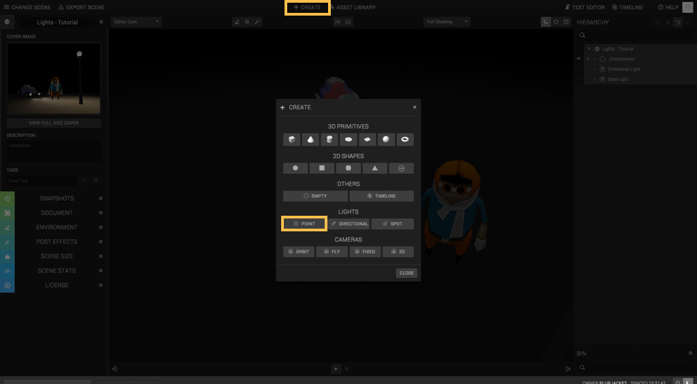

To create a point light entity, click on the entity creation button named Create in the top navigation bar. When the creation menu is open, click on Point Light to create a point light entity.

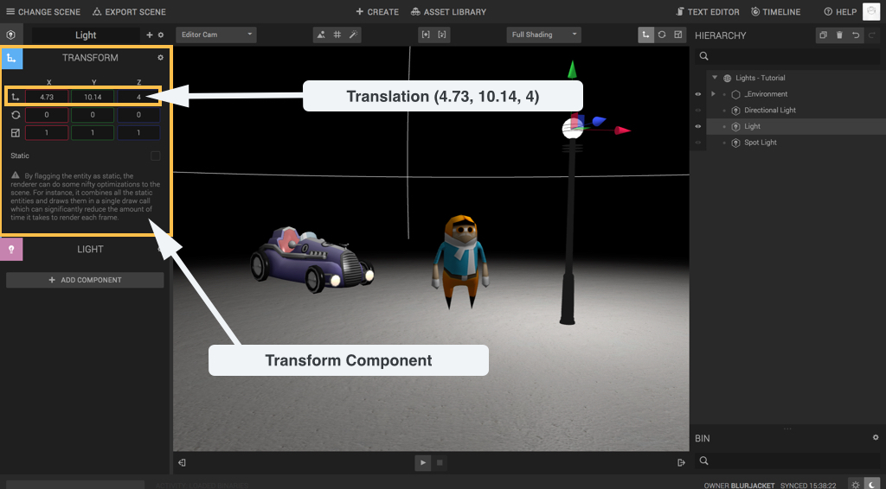

The point light entity has now been created, all that remains is to place it as well as adjust its settings to fit the scene nicely. Select the entity and move it inside the top of the street light. You can move an entity by either moving it with the gizmo or entering the values [4.73, 10.14, 4] as translation in its Transform Component.

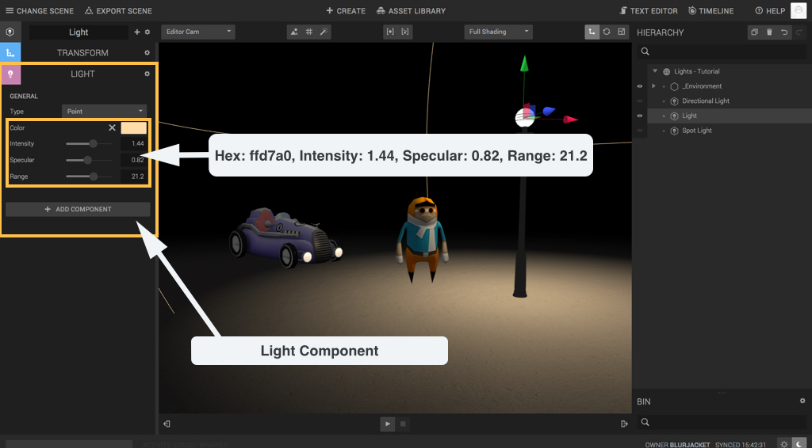

Great! Now lets adjust its settings a bit. In comparison to the light properties in the directional light entity, the type of this light entity is Point. Lets make the light a bit warmer, adjust the colour of the light to a bit more yellow. The colour I used was Hex: ffd7a0. Feel free to mess around with the settings until you find something you like. I chose the following settings: Intensity: 1.44, Specular: 0.82, Range 21.2

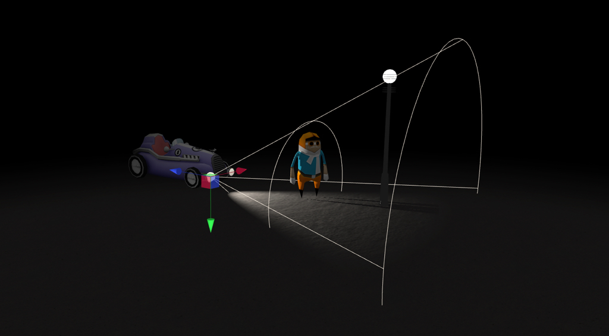

The third and final light entity in Create i a spot light entity. This entity is... well, a spot light. It sheds a cone of light in a given direction.
A spot light entity projects light in similarity to a flashlight.

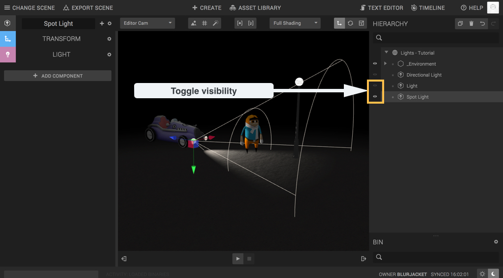

I have already populated this scene with a spot light entity. Hide the point light and show the hidden spot light entity by pressing on the icons shaped as an eye right next to the entity’s name in the Scene Hierarchy.

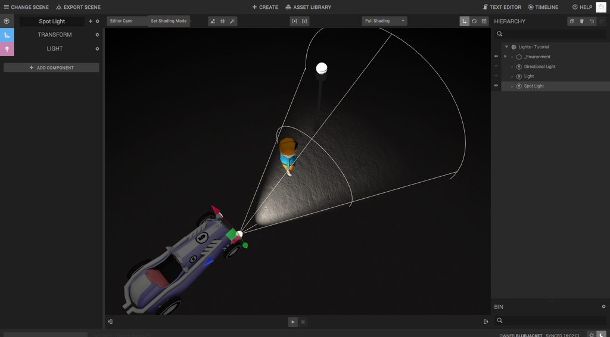

As you noticed, the spot light entity acts as one of the headlights of the race car. You can also see that the character does not project a shadow on its environment. Lets fix that!

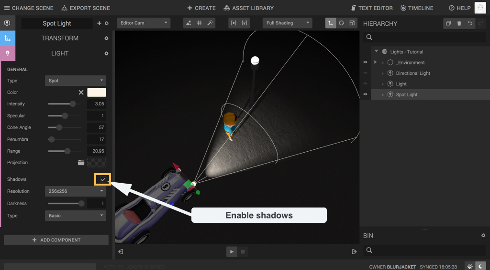

Shadows are quite heavy on the device and can therefore be toggled on and off separately on each light entity. To turn on shadows for a light entity, select the entity and check Shadows in its Light Component. Lets make that happen!

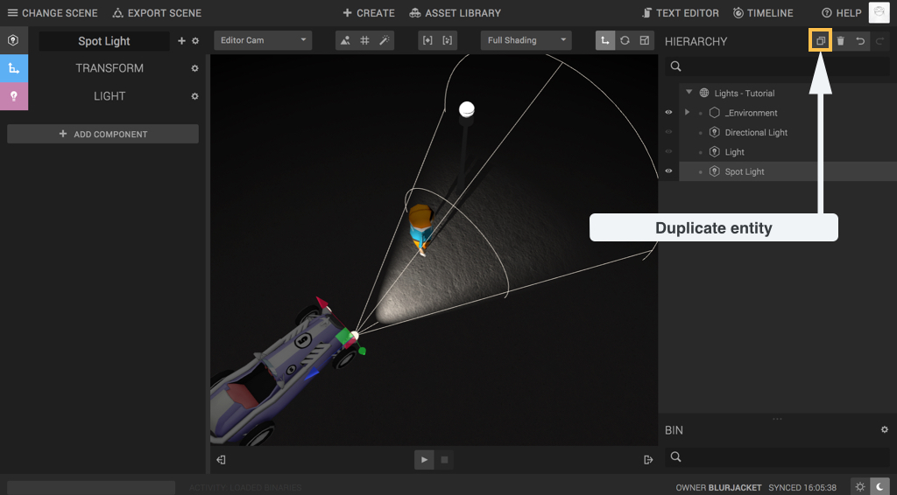

Great, so now we got that dramatic look going down, lets add the other headlight!
In order to create a spot light entity for the second headlight of the race car, you can either create a new spot light entity in similarity to what we did with the point light, or you can duplicate the existing one. Duplicate the spot light entity by selecting it and pressing the duplicate icon at the top of the Scene Hierarchy Panel.

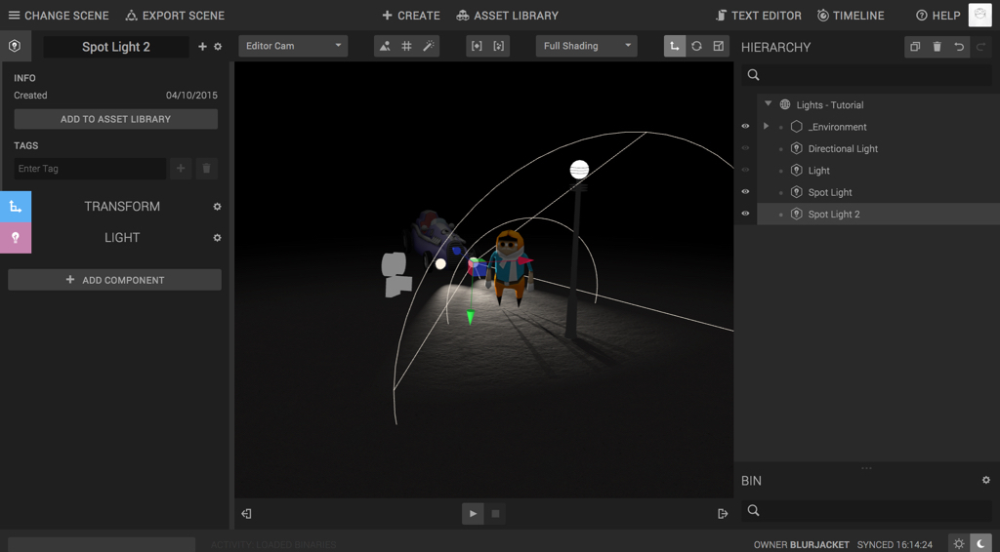

A duplicate of the first spot light entity appears in your Scene Hierarchy. Select it, and change its translation to fit the second headlight.

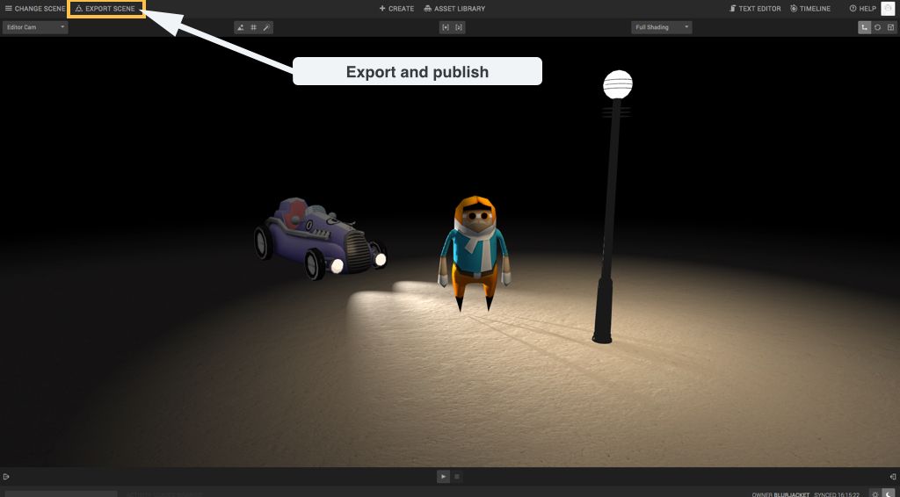

Nice going! Keep in mind that lights are heavy and require a lot of processing power from the device. You should therefore try to keep the amount of lights in a scene to a minimum.
Lets end this tutorial by publishing our dramatically lit scene by clicking on Export Scene in the top navigation bar and then press Publish. In order to share you scene, simply send the link to the published scene .

## You’re done!

Great job, you have mastered the basics of using light in your scene.