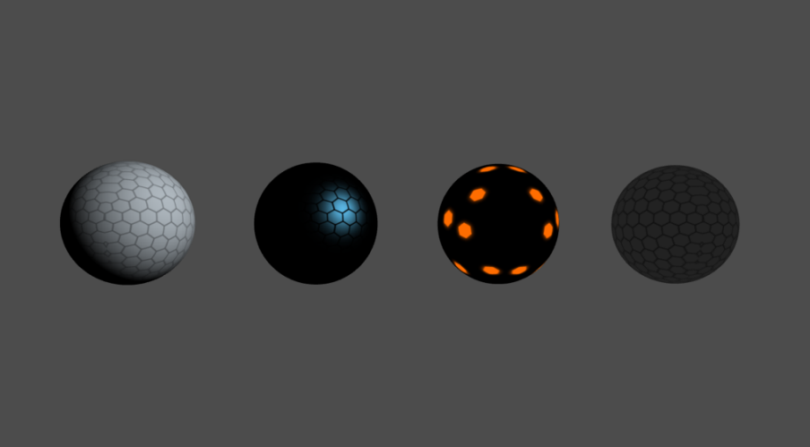
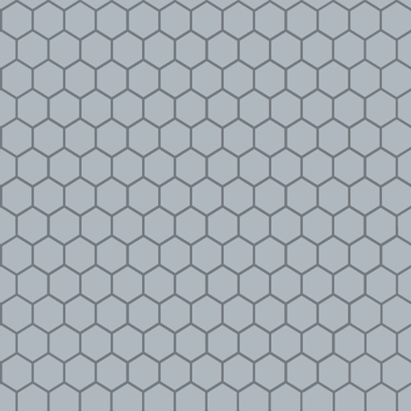
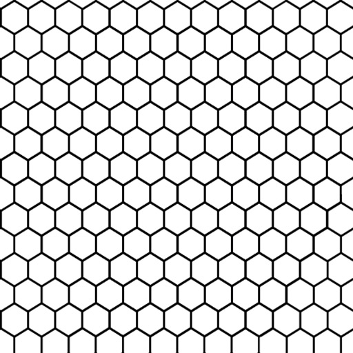
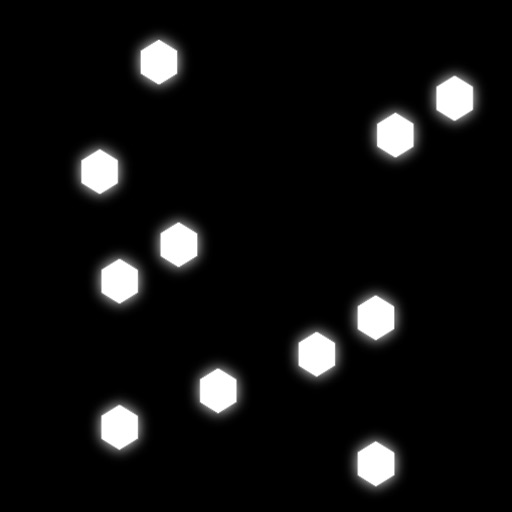
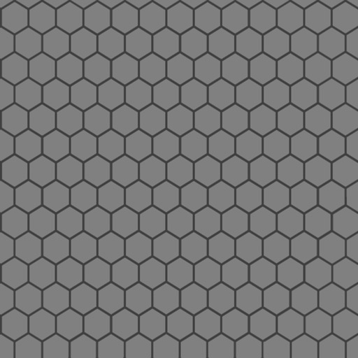
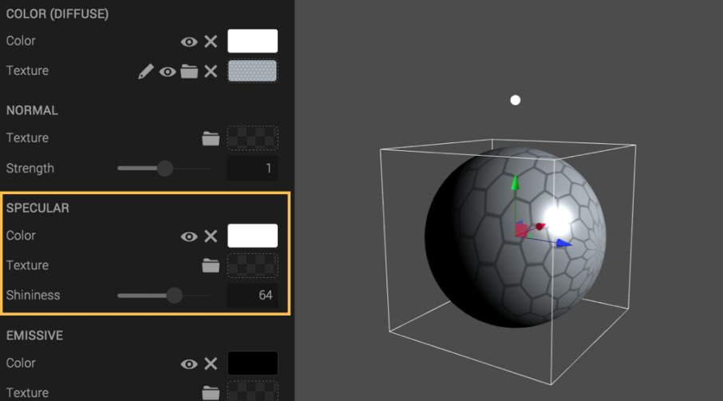
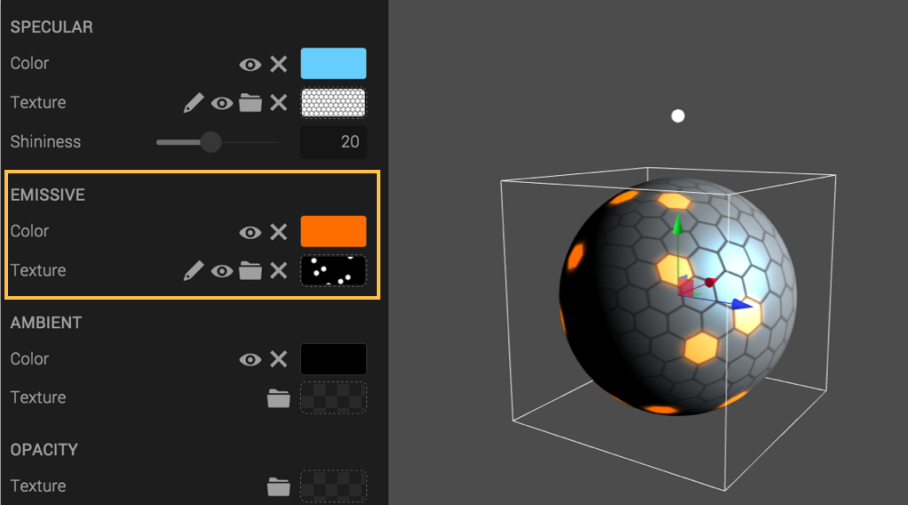
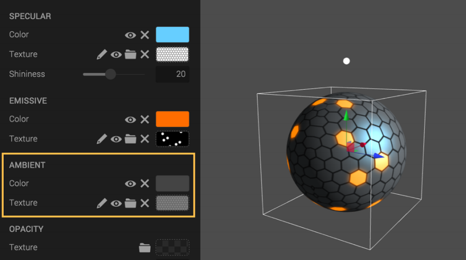
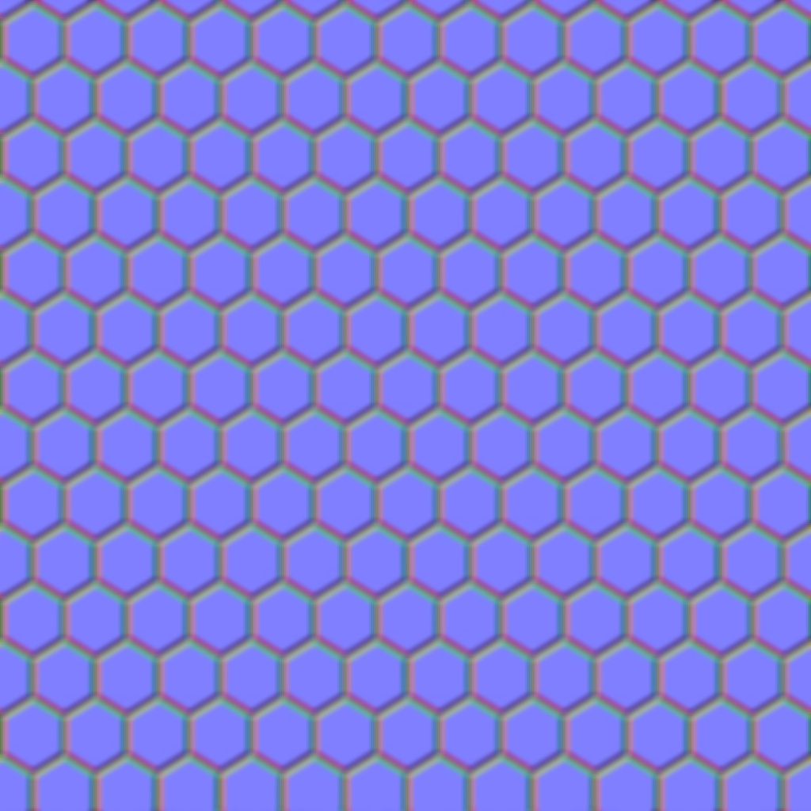

What is a project without colours or textures? Not much, to get more life into your scenes it is important to know the fundamentals of the powerful and essential Material Component.

Let’s get right in to it!

For this tutorial, the focus will be on *Diffuse*, *Specular*, *Emissive* and *Ambient*. A cool Sci-Fi ball will be created. As this is the Material fundamentals a few areas will be left for future tutorials.

The resources used are these 4 images. Save these to disk by right-clicking and choosing "Save image as...".

This is the basic look of the different properties in the *Material Component*. A color channel where you can select the color value of the property and then the texture input where you add 2d images to be placed on the model. Use the eye icon to disable the color. Note that the default color varies between the properties. Also remember that changing the color input will tint the texture with the selected color.

## Start from a clean slate

Start by creating a new scene and delete the “default light” from the hierarchy, this is the default light setup which is not wanted for this exercise.

Then simply create sphere from the *Create dialog* that you can reach from button at top.

Adjust all the properties in the *Material Component* so the color channels are set to black. The sphere should be completely black and without any lights in the scene.

## Add a light

Lights and colors go hand in hand and a lot of the settings in the Material panel react to the lights in your scene. Place a directional light over the sphere and rotate it about -25 degrees in the X axis. Since everything is set to black the light should not affect the sphere and it will still be completely black.

## Diffuse color

Great, let's get stuff happening here. Increase the Diffuse color to white and the sphere will be affected. Color or “Diffuse” is the surface brightness of an object. It’s completely dependent on the lights in your scene and appears where it’s facing the light source, with its strongest value perpendicular to the source. Rotating the light will show you this effect.

## Add a texture

Adding a texture to a channel will wrap the image around the sphere. The part of the texture that is lit by the light will be visible. There are a few different ways to add textures, the most useful and common way to do it is to use the drag and drop feature. Grab an image anywhere of the computer and drop it to the wanted property, the field will light up to indicate that you are in a drop friendly zone.

## Specular color and shininess

Specularity is used for the highlight and the roughness of the material’s surface. It works to some extend in the same way as the diffuse property, both of them are determined by the lights in your scene. The big difference is that specularity is depending on the observer's angle of view. Which results in that the highlight “moves” across surface. The shininess slider controls the highlights concentration, where a high value gives a dense highlight seen in polished surfaces like car paint. A low value gives more spread to the highlight as in brushed metal.

In this example a bit of blue tint is set in the color input of the Specular. A lower shininess value is used to get a bigger highlight. With a texture you can further define where and how the highlight should be and look. The black parts of the map don't allow any specularity to go through and the white parts let everything pass. Experiment further with different maps to get other results.

## Texture mode (UV mapping)

To be able to manipulate how the image is wrapped on the sphere go to the the Geometry Component, it’s right above the Material Component and change the Texture mode to Polar. This will give you a better result in this exercise. The primitives in Create all have different Texture modes to achieve the wanted result. This is similar to UV maps for custom meshes, which is a big subject on its own.

## Emissive color

The Emissive property is associated with strong light, glow, high temperature etc. Use it for faking a light source or something that is emitting light. This property can be used regardless of having a light or not in your scene, but it is still affected by other properties as it gets screened on top of the rest of the layers. For this example let’s put a strong orange color together with a texture of glowing hexagons.

## Ambient

Next up, the Ambient property, used mainly for the base lighting of an object, also light bakes and occlusion maps are inserted here. The hexagons facing away from the light have been pitch black until now as no light hits that side, connecting a map to the Ambient gives the illusion that some reflected light is bouncing of the backside of the sphere. With a mid grey in the color channel the effect is subtle but effective.

## You’re done!

Great job, you have mastered the Material fundamentals.

    

        <a class="btn btn-primary btn-lg" target="_blank" href="https://create.goocreate.com/edit/b9379f3a4b6947b19ca1d5c397cbd0ab.scene">Open scene in Create</a>
    

## Extra, for the curious reader

Here's a normal map! See if you can find the right place for it, in your material panel!

