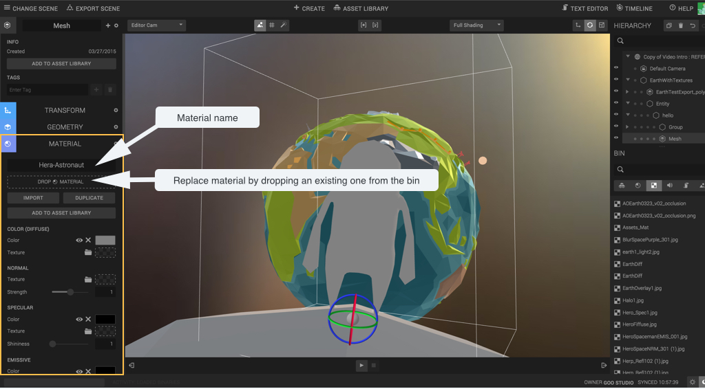
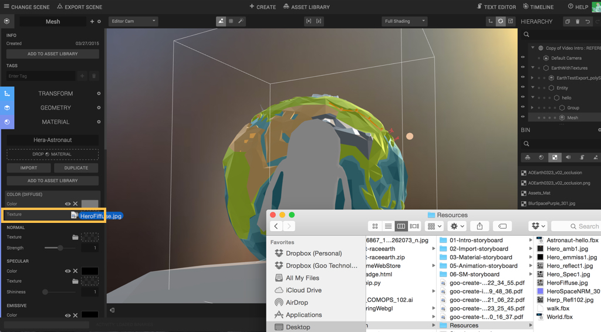
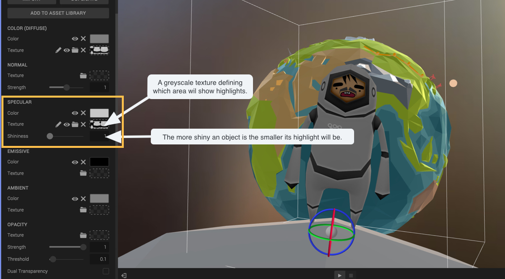
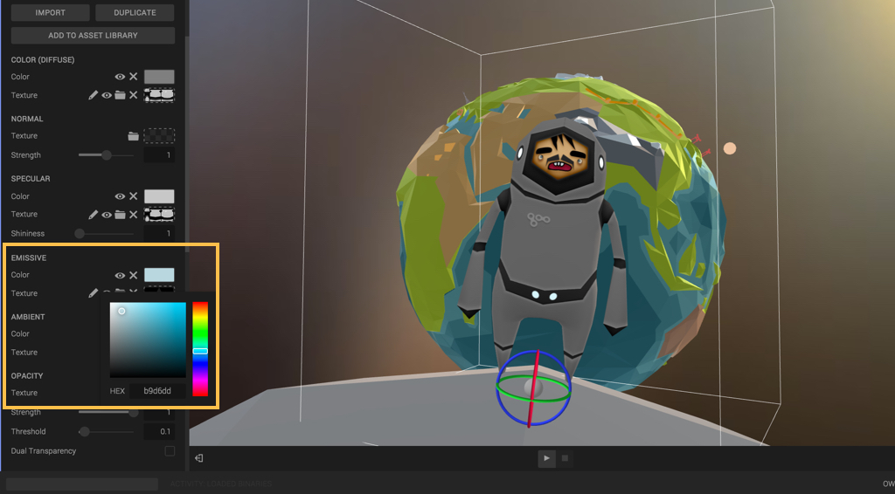
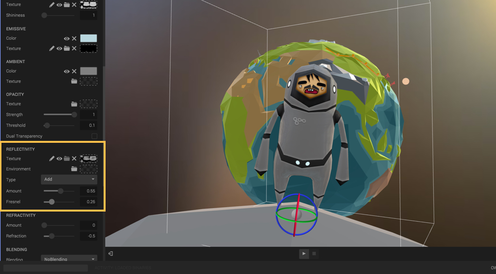
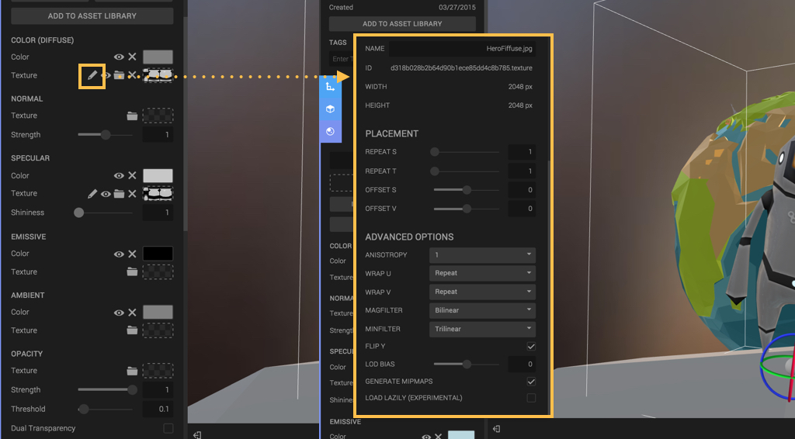

Most of the time texture are not embedded in the file you’ll import. To change that head to the material component.

As for models, simply drag and drop textures to the correct channel. In this example the diffuse channel represent the general colour of your object.

Specularity defines the highlights your object will get. You can drop a grayscale texture which will define which areas of your object should show highlights. The shininess parameter represent how spread your highlights are.

The emissive channel defines the colour that your object will emit as well as the areas that should emit light (in this example the astronauts as a couple of light in his belt and helmet).

Your object can reflect the current skybox/background color or a specific environment if you drop a texture. By adjusting the fresnel parameter you will 'limit' the reflection to the edge of the model (great for backlighting).

If you need more control over your texture click on the edit button located near each texture slots. Note that the diffuse channel control the repetition and offset of all textures channels.
