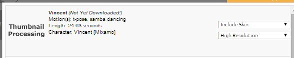
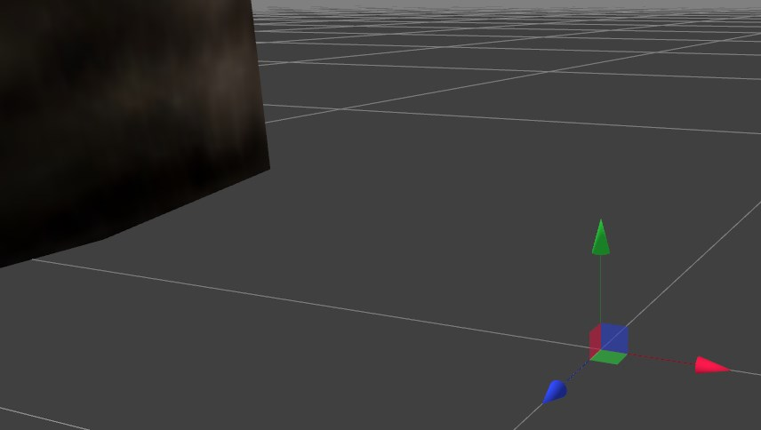
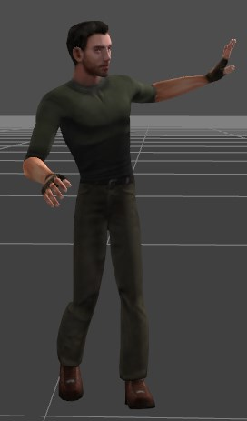

Mixamo is an online platform to buy or easily create your own animated human-like models. With Mixamo you can mix and match existing or new models with a plethora of ready to use animations.  

Goo Create has outstanding support for animated FBX models so it comes to no surprise that it works great with the models from [Mixamo](http://www.mixamo.com). This tutorial will show you how easy it is to import and use such a model.  

## Step 1

Create an account with Mixamo and log in. Go the the [character shop](https://www.mixamo.com/3d-characters) and filter the list of characters using the "**free**" option.  

  

We will use **Vincent**. After selecting a model it will be opened in the Mixamo character editor:  

  

We will call our sequence _Vincent_. Now it's time to choose one or more animation clips. Click on the PLAY SEQUENCE on the bottom left and enter **free** into the filter text field. You can choose any animation, we will choose the **samba dancing** one:  

  

This will create a new clip with the dance animation. Try it out by clicking on the play button and you should see Vincent samba dancing! You can add more animations if you want but it is important to understand that **all clips will be merged into one animation** when downloading the final sequence. Also, if you don't want the model to start with the initial T pose, you can safely delete the first clip.  

OK, the sequence is ready to be downloaded and imported into Goo Create. Click on DOWNLOAD. If you have selected non-free models or animations you will now be asked for your payment information. Next you should see a download popup with all your download history. You can always go back here and change a sequence and download it again.  

  

Select the entry with the new sequence. On the bottom you now need to select the download format. Select FBX (.fbx) and click on DOWNLOAD and it should download an FBX file with a size of around 8 MB.  

## Step 2

You can close the Mixamo website now if you like and move over to Goo Create. Login and launch Goo Create. Start a new default project and drag and drop the Mixamo FBX file into Goo Create. After the upload is complete you will probably see two big feet (he reason the model is so big is because the Mixamo model units are in centimeters while Goo Create uses meters):  
  

Click on one of the feet and you should have selected the Vincent model and with it you can modify the transform settings to drastically shrink the model. Set the scaling values for X,Y and Z to 0.02.  

  

After you've changed the scale you can press **F** to center and position the camera on the scene.  

Now press the play button on the bottom  and you should see Vincent dancing !  

  

And that's how easy it is to import an animated model from Mixamo into Goo Create.