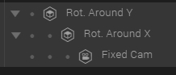

Here's a quick example of a script using either the position of the mouse or the orientation of a device to move the camera. To make things simple, the camera is attached to two root entities. Rotating these entities around X and Y, respectively, moves the camera in an orbiting fashion.

<iframe src="https://goote.ch/b7be03dbf7e741a9814b080ea3c61d5e.scene/"></iframe>

<a href="https://goote.ch/b7be03dbf7e741a9814b080ea3c61d5e.scene/">Open in a New Window</a>

<a href="https://create.goocreate.com/22307/a5b7c39669b04e5cb1e243f9a2d8454d.scene">Scene to Duplicate</a>

Setup: Create two entities, place them both where the camera should look. In the example scene, I've picked (0, 0, 0). Create a camera and arrange the entities like this:

Entity hierarchy

Why don't we do this with code? That'd be cleaner, perhaps, but wouldn't let us position the camera before pressing play as easily. If you're interested in how to do this without the helper entities, check out the source of the standard orbit-and-pan camera scripts, for example!

The camera radius (distance from the middle) is the adjusted by translating the camera in the Z direction, and the position is manipulated by rotating the parent entities around the axes they are named after.

On the root entity, <em>Rot. Around Y</em> in our case, create a custom script. You can copy/paste the whole code below, set the camera as <strong>Main Camera</strong> and you're good to go!


var setup = function(args, ctx) {
	
	ctx.dir = args.invert ? 1 : -1;
	
	// Entities onto which the camera is attached
	ctx.cameraY = ctx.entity;
	ctx.cameraX = ctx.entity.transformComponent.children[0].entity;

	if (!(ctx.cameraX && ctx.cameraY)) {
		console.error('Camera X and/or Y entities missing');
		return;
	}
	
	ctx.startXRotation = ctx.cameraX.getRotation().x;
	ctx.startYRotation = ctx.cameraY.getRotation().y;
	
	// Bounds
	ctx.rect = ctx.domElement.getBoundingClientRect();
	goo.SystemBus.addListener('goo.viewportResize', function() {
		ctx.rect = ctx.domElement.getBoundingClientRect();
	});
	
	// Rotation constants for mouse
	ctx.smoothFactor = args.smoothFactor;
	ctx.moveFactor = args.moveFactor/50000.0;
	
	// Values for nice gyro orientation speed
	ctx.xOrientationMid = args.xOrientationMid;
	ctx.xOrientationFactor = -args.orientationFactor/800.0;
	ctx.yOrientationFactor = -args.orientationFactor/800.0;
	
	// Relative to center (mouse) or neutral angles (gyro)
	ctx.relative = [0, 0];
	ctx.relativeSmooth = [0, 0];

	ctx.windowListeners = {
		mousemove: function(evt) {
			mouseMove(ctx, evt.clientX, evt.clientY);
		},
		deviceorientation: function(evt) {
			if (evt.beta && evt.gamma) {
				deviceOrientation(ctx, evt.beta, evt.gamma);
			}
		}
	};
	Object.keys(ctx.windowListeners).forEach(function(v) {
		window.addEventListener(v, ctx.windowListeners[v]);
	});
};

var mouseMove = function(ctx, x, y) {
	ctx.relative[0] = (x - ctx.rect.width/2.0)*ctx.moveFactor;
	ctx.relative[1] = (y - ctx.rect.height/2.0)*ctx.moveFactor;
};

var deviceOrientation = function(ctx, x, y) {
	if (window.orientation === 0) {
		// upright
		ctx.relative[0] = y*ctx.xOrientationFactor;
		ctx.relative[1] = (x - ctx.xOrientationMid)*ctx.yOrientationFactor;
	} else if (window.orientation === 90) {
		// flip CCW
		ctx.relative[0] = x*ctx.xOrientationFactor;
		ctx.relative[1] = -(y + ctx.xOrientationMid)*ctx.yOrientationFactor;
	} else if (window.orientation === -90) {
		// flip CW
		ctx.relative[0] = -x*ctx.xOrientationFactor;
		ctx.relative[1] = (y - ctx.xOrientationMid)*ctx.yOrientationFactor;
	}
};

var cleanup = function(args, ctx) {
	Object.keys(ctx.windowListeners).forEach(function(v) {
		window.removeEventListener(v, ctx.windowListeners[v]);
	});
};

var smoothMove = function(ctx) {
	ctx.relative.forEach(function(v, i) {
		ctx.delta = Math.abs(ctx.relative[i] - ctx.relativeSmooth[i]);
		if (ctx.delta < 1*ctx.moveFactor) {
			ctx.relativeSmooth[i] = ctx.relative[i];
		} else {
			ctx.speed = ctx.delta/ctx.smoothFactor;
			ctx.relativeSmooth[i] = (ctx.relative[i] > ctx.relativeSmooth[i]) ?
				ctx.relativeSmooth[i]+ctx.speed : ctx.relativeSmooth[i]-ctx.speed;
		}
	});
};

var updateRotation = function(ctx) {
	ctx.cameraY.setRotation(0, ctx.startYRotation+ctx.dir*ctx.relativeSmooth[0], 0);
	ctx.cameraX.setRotation(ctx.startXRotation+ctx.dir*ctx.relativeSmooth[1], 0, 0);
};

var update = function(args, ctx) {
	smoothMove(ctx);
	updateRotation(ctx);
};

var parameters = [
{
	key: 'invert',
	name: 'Invert',
	type: 'boolean',
	default: false
},
{
	key: 'smoothFactor',
	name: 'Smoothing',
	type: 'float',
	min: 0,
	max: 50,
	default: 10,
	control: 'slider'
	
},
{
	key: 'moveFactor',
	name: 'Mouse Force',
	type: 'float',
	min: 0,
	max: 200,
	default: 50,
	control: 'slider'
},
{
	key: 'orientationFactor',
	name: 'Gyro Force',
	type: 'float',
	min: 0,
	max: 200,
	default: 20,
	control: 'slider'
},
{
	key: 'xOrientationMid',
	name: 'Neutral X Orientation',
	type: 'float',
	min: -180,
	max: 180,
	default: 45.0,
	control: 'slider'
}
];


