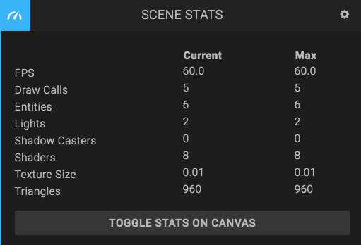

## Scripts

* Using 'new' to allocate JavaScript objects represents a dynamic allocation and can be expensive. Therefore you should, where possible, **preallocate objects** in script `setup` and reuse them in the `update` function. Creating too many new objects can lead to excessive [Garbage Collection](https://en.wikipedia.org/wiki/Garbage_collection_(computer_science)) which can cause periodical freezes.

## Textures

* Try to **keep down the image size**. We recommend as small as texture size as possible, and [max 2048x2048 pixels](http://codeflow.org/entries/2013/feb/22/how-to-write-portable-webgl/#what-are-safe-texture-sizes) to work on all platforms.
* Always use texture sizes that are a power of 2 (for example: 128, 256, 512, 1024 etc). If your texture is not a power of 2, it will be resized when the scene loads, and this delays app start.
* If you increase [anisotropy](https://en.wikipedia.org/wiki/Anisotropic_filtering), visuals improve but performance decreases.
* Look for opportunities to **pack multiple textures into single images**. This results in lower memory usage. For example, you can use one texture for many objects using a [texture atlas](https://en.wikipedia.org/wiki/Texture_atlas).
* If [mip-mapping](https://en.wikipedia.org/wiki/Mipmap) is enabled, 2x as much graphics memory is used for the texture. However, it does make textures look better at a distance.
* Compress your textures! Use JPG if you don't need an alpha channel, and PNG if you do. If you want to take it one step further, have a look at the [.crn file format](https://code.google.com/archive/p/crunch/), which is supported in the Goo Engine.

## Lights

* Keep the **number of lights** to a minimum.
* Enabling **shadow casting** on lights is expensive.

## Models / meshes

* A mesh instance is a **draw call** (a command to draw an individual graphical primitive). Each draw call requires some effort on the CPU to dispatch to WebGL. Therefore, keeping the number of draw calls low is advisable, particularly on mobile. 100-200 draw calls is a rough target for low end mobile devices. High end desktop machines on the other hand can process thousands every frame and still maintain 60fps.
* Check the **static** checkbox in the Transform panel if you know that the object will not move. If you do, it enables the engine to combine several static meshes into one, reducing the number of draw calls. Note that the meshes have to use the same material to be combined. Also note that many engine features don't work when the meshes are combined: animations, picking, timeline animation, etc.

## Materials

* Keep the number of **blended materials** in your scene to a minimum. Meshes rendered with blending enabled are rendered after all opaque meshes, in back to front camera depth order. This results in pixels being filled multiple times.
* Try to keep the **number of shaders** as low as possible. Shaders have to be compiled and linked, and since this operation is expensive it causes delay in app startup and glitches in framerate. The simplest way to reduce the number of shaders is re-using materials as much as you can, but you can also make two materials share the same shader by making the materials as similar as possible. Experiment with this and see the number of shaders using the Stats panel.
* Enable **backface culling**. Generally speaking, backface culling reduces the number of pixels that the GPU has to fill.

## Post effects

* **Post effects** can be expensive so think carefully before you enable them. They can cost a lot in terms of pixel fill.

## Physics

* Keep the number of dynamic **rigid bodies** in your scene to a minimum, particularly on mobile.
* It's recommended that you use **few simple primitives** to build your physics objects.

## Resolution, embedding and other tricks

* Be careful when enabling **'Use Device Pixel Ratio'** in your publish settings. This will cause your app to use the native resolution of a device. The image will look more high-res but many more pixels will be filled, which can cause a significant drop in framerate.
* In a similar manner, **'antialiasing'** can also be expensive, especially on mobile. Enabling antialiasing will make the image look less "jagged" and pixelated, but more fragments have to be sampled, so it can make the framerate drop.
* If you embed your scene on a desktop website, it can be good to know that using full screen rendering costs more than non-fullscreen.
* If you know that the canvas don't need to re-render, you can turn on/off rendering in a script with `ctx.world.gooRunner.doRender = false;`.

