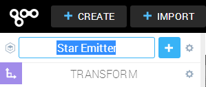
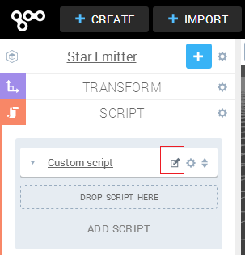
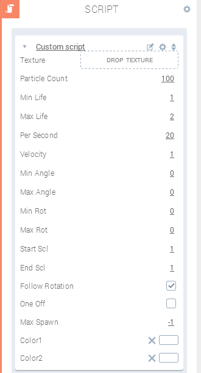
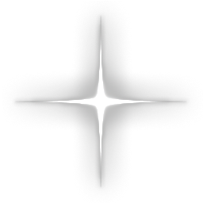
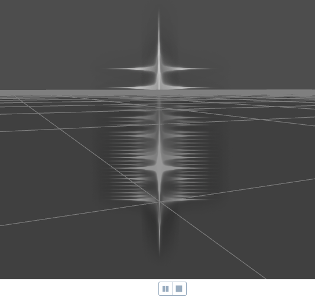
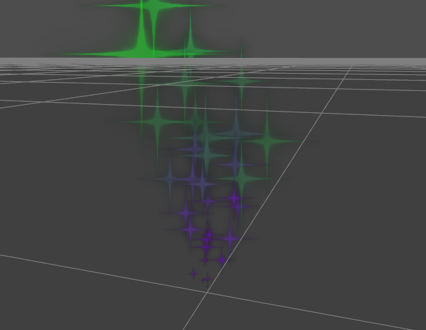
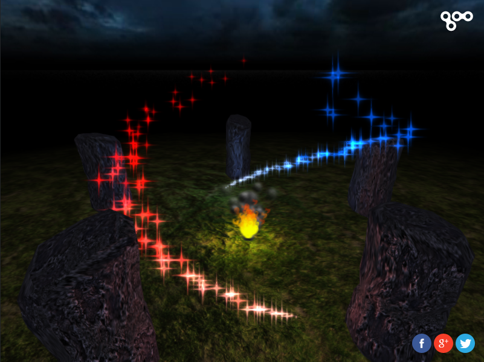

This article will discuss how to use Particles inside Goo Create. For general information about Particles, please refer to the <a title="Particles in Goo Engine" href="{{ '/tutorials/engine/particles-in-engine' || prepend: site.baseurl }}">Particle Tutorial</a>!

<iframe src="//goote.ch/4648b5ed45266a6cba5cc1dbd8fec0bdd9520226/"></iframe>

<a href="//goote.ch/4648b5ed45266a6cba5cc1dbd8fec0bdd9520226/" target="_blank">Link to the result</a>

The first thing we will need to do, is add an empty Entity to the scene. You can do this by clicking on the button '+ Create' on the top-left of the screen, and then clicking on the hexagon icon with the word EMPTY next to it:

Once the empty Entity has been created, change the name to something meaningful, so we can distinguish this entity from any others we have already created, or plan to create. For the purposes of this demo, we will name the empty Entity to 'Star Emitter'.

To change the Entity name, click it at the top of the left panel, then change it to what you want:

Currently, there is no access to the ParticleCompnent inside Goo Create, but we can overcome this by creating our own through a Custom Script.

Make sure you have the 'Star Emitter' Entity selected in the scene, and then add a new ScriptComponent to the entity, by clicking on the blue plus ‘+’ icon to the right of the Entity name in the left panel, and then choosing ‘Script’ in the menu which appears.

This will add a ‘Script’ category to the Entity in the left panel. First, click on this new ‘Script’ category to open the options available to us. Second, click the text ‘Add Script’ at the bottom of these options. Third, choose ‘Custom’ in the menu which appears.

Now we will need to open the ‘Custom script’ for editing, by clicking on the little icon which looks like a square with a pen inside of it. This is to the right of the words ‘Custom Script’:

This should open up the ‘Custom script’ for editing inside the Script Editor window. It should have all the default code and comments, which we are going to remove and replace with our own code.

Right click the code inside the Script Editor and choose ‘Select All’. Next press the Backspace or Delete key on your keyboard to remove all the default code, and then click the blue ‘Save’ button on the bottom left of the Script Editor window.

Now we will need to copy and paste the following code into the Script Editor, and then save it again by clicking the Save button:


var parameters = [
    {key:'texture', type:'texture', default:null},
    {key:'particleCount', 'type':'int', default:100},
    {key:'minLife', type:'float', default:1.0},
    {key:'maxLife', type:'float', default:2.0},
    {key:'perSecond', type:'int', default:20},
    {key:'velocity', type:'float', default:1.0},
    {key:'minAngle', type:'float', default:0.0},
    {key:'maxAngle', type:'float', default:0.0},
    {key:'minRot', type:'float', default:0.0},
    {key:'maxRot', type:'float', default:0.0},
    {key:'startScl', type:'float', default:1.0},
    {key:'endScl', type:'float', default:1.0},
    {key:'followRotation', type:'boolean', default:true},
    {key:'oneOff', type:'boolean', default:false},
    {key:'maxSpawn', type:'int', default:-1},
    {key:'color1', type:'vec3', control:'color', default:[1, 1, 1]},
    {key:'color2', type:'vec3', control:'color', default:[1, 1, 1]}];

function setup(args, ctx, goo){
    // Copy args values to local 'ctx' scope
    // in case we want to change these through code
    // for example the 'minAngle'
    ctx.particleCount = args.particleCount;
    ctx.minLife = args.minLife;
    ctx.maxLife = args.maxLife;
    ctx.perSecond = args.perSecond;
    ctx.velocity = args.velocity;
    ctx.minAngle = args.minAngle * (Math.PI/180);
    ctx.maxAngle = args.maxAngle * (Math.PI/180);
    ctx.minRot = args.minRot * (Math.PI/180);
    ctx.maxRot = args.maxRot * (Math.PI/180);
    ctx.startScl = args.startScl;
    ctx.endScl = args.endScl;
    ctx.followRotation = args.followRotation;
    ctx.oneOff = args.oneOff;
    ctx.maxSpawn = args.maxSpawn;
    ctx.color1 = args.color1.slice();
    ctx.color2 = args.color2.slice();

    // Create a particle entity to house the meshData, renderer, etc
    ctx.pEnt = ctx.world.createEntity();
    // Attach the particle entity to the current ctx.entity
    ctx.entity.transformComponent.attachChild(ctx.pEnt.transformComponent, false);

    // Create a new Particle material
    var material = new goo.Material(goo.ShaderLib.particles);

    // set texture values
    args.texture.wrapS = 'EdgeClamp';
    args.texture.wrapT = 'EdgeClamp';
    args.texture.generateMipmaps = true;

    // add texture to the material
    material.setTexture("DIFFUSE_MAP",args.texture);
    material.blendState.blending = 'AlphaBlending';
    material.cullState.enabled = false;
    material.depthState.write = false;
    material.renderQueue = goo.RenderQueue.TRANSPARENT+5;

    // create a particle component with timeline, emitter, etc.
    var particleComponent = new goo.ParticleComponent({
        particleCount:ctx.particleCount,
        timeline : [{
                timeOffset : 0.0,
                spin : ctx.minRot,
                size : ctx.startScl,
                color : [ctx.color1[0], ctx.color1[1], ctx.color1[2], 1]
            },{
                timeOffset:0.33,
                color : [ctx.color1[0], ctx.color1[1], ctx.color1[2], 1]
            },{
                timeOffset: 0.8,
                color : [ctx.color2[0], ctx.color2[1], ctx.color2[2], 0.5]
            },{
                timeOffset : 1.0,
                spin : ctx.maxRot,
                size : ctx.endScl,
                color : [ctx.color2[0], ctx.color2[1], ctx.color2[2], 0.0]
            }],
            emitters : [{
                totalParticlesToSpawn : ctx.oneOff ? ctx.maxSpawn : -1,
                releaseRatePerSecond : ctx.perSecond,
                minLifetime : ctx.minLife,
                maxLifetime : ctx.maxLife,
                getEmissionPoint : function (particle, particleEntity) {
                    var vec3 = particle.position;
                    return goo.ParticleUtils.applyEntityTransformPoint(vec3.set(0, 0, 0), particleEntity);
                },
                getEmissionVelocity : function (particle, particleEntity) {
                    var vec3 = particle.velocity;
                    if(ctx.followRotation){
                        vec3 = goo.ParticleUtils.getRandomVelocityOffY(vec3, ctx.minAngle, ctx.maxAngle, ctx.velocity, ctx.pEnt);
                    }
                    else{
                        vec3 = goo.ParticleUtils.getRandomVelocityOffY(vec3, ctx.minAngle, ctx.maxAngle, ctx.velocity);
                    }
                },
                getParticleBillboardVectors : function (particle, particleEntity) {
                    particle.bbX.setv(ctx.activeCameraEntity.cameraComponent.camera._left);
                    particle.bbY.setv(ctx.activeCameraEntity.cameraComponent.camera._up);
                }
            }],
        });

    // Add the particleComponent to the particle entity
    ctx.pEnt.setComponent(particleComponent);
    // Create meshData component using particle data
    var meshDataComponent = new goo.MeshDataComponent(particleComponent.meshData);
    ctx.pEnt.setComponent(meshDataComponent);

    // Create meshRenderer component with material and shader
    var meshRendererComponent = new goo.MeshRendererComponent();
    meshRendererComponent.materials.push(material);
    ctx.pEnt.setComponent(meshRendererComponent);

    // function for scale issue
    function setScale(ent){
        if(ent !== ctx.pEnt){
            ctx.pEnt.transformComponent.transform.scale.x /= ent.transformComponent.transform.scale.x;
            ctx.pEnt.transformComponent.transform.scale.y /= ent.transformComponent.transform.scale.y;
            ctx.pEnt.transformComponent.transform.scale.z /= ent.transformComponent.transform.scale.z;
        }
    }
    //fix scaleing issues for all parents
    ctx.pEnt.traverseUp(setScale);

    ctx.pEnt.addToWorld();
}

function cleanup(args, ctx, goo){
    if(ctx.pEnt !== undefined){
        ctx.entity.transformComponent.detachChild(ctx.pEnt.transformComponent);
        ctx.pEnt.removeFromWorld();
        delete ctx.pEnt;
    }
}


After you have saved the code, and go back to Goo Create, you will see several options for our Custom script:

It is important to drag and drop a texture to the ‘Texture’ parameter, otherwise you will get the error:

Cannot set property 'wrapS' of null

Here is a star image you can use (right click and save):

Once this has been dragged and dropped onto the Texture parameter, you can press ‘Play’ and see the Particle in action:

To make things more interesting, try setting the ‘Max Angle’ to 30 degrees and the Start Scl to 0.0. Also, feel free to change Color1 or Color2 to something else other than white.

The ‘Follow Rotation’ option will allow the emitter to emit outward, based on the rotation of the Star Emitter, instead of only up.

The ‘One Off’ option will make it so the emitter will only emit one time, and then stop.

<h3>Conclusion</h3>

This tutorial and script is only the beginning. There are many other ways to fine tune or tailor this script based on your needs. Feel free to test out various settings, and change the code to see what happens.

<a href="//goote.ch/4648b5ed45266a6cba5cc1dbd8fec0bdd9520226/" target="_blank">Link to the result</a>