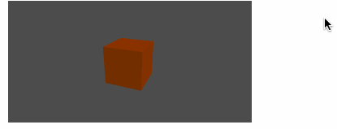

The goal of this tututorial is to embed a Goo scene in an iframe, but make the Goo scene react to mouse movements outside the iframe.

To track the mouse movement on a page, traditionally we use an event listener on the `window` object.

var setup = function(args, ctx) {
  ctx.listener = function(evt) {
    console.log(evt.clientX, evt.clientY);
  };
  window.addEventListener('mousemove', ctx.listener);
}

var cleanup = function(args, ctx) {
  window.removeEventListener('mousemove', ctx.listener);
}

If you try this approach, and embed your Goo scene in an iframe, you will notice that the mousemovement is not working when your mouse goes outside the iframe:

This is because the iframe has a different *Window* object than the webpage.

We can attach the listener on the correct *Window* object, by using `window.parent`. The code now looks like this:

var setup = function(args, ctx) {
  ctx.listener = function(evt) {
    console.log(evt.clientX, evt.clientY);
  };
  window.parent.addEventListener('mousemove', ctx.listener);
}

var cleanup = function(args, ctx) {
  window.parent.removeEventListener('mousemove', ctx.listener);
}

Unfortunately, we now get the following error message:

`Uncaught DOMException: Blocked a frame with origin "https://goote.ch" from accessing a cross-origin frame.`.

The browser automatically blocks the iframe from reaching out of its frame, because of security concerns. So how can we get around this? One option is to download the scene as a webpage, and put it on the same domain as the main webpage. If you do it this way, the browser will allow the iframe to "reach out".

Let's say we would like to include a published Create scene in an `iframe`, without having to put it in our own server. A solution we can use here is called `postMessage`.

<iframe id="goo-scene" src="..."></iframe>


Now, in our script we can listen to the `message` event on the iframe window:

var setup = function(args, ctx) {
  ctx.listener = function(evt) {
    console.log(evt.data.clientX, evt.data.clientY);
  };
  window.addEventListener('message', ctx.listener);
}

var cleanup = function(args, ctx) {
  window.removeEventListener('message', ctx.listener);
}

You will notice that this approach works! Let's modify our `console.log` script so it does something useful instead.

## A full example

<iframe id="goo-scene" src="..."></iframe>


Then, we need to make some changes to the Create script too. We want to set the diffuse color of the cube depending on the mouse position:

var setup = function(args, ctx) {
  ctx.listener = function(evt) {
    if(evt.myEvent){
      var color = [evt.data.clientX / evt.data.innerWidth, evt.data.clientY / evt.data.innerHeight, 0, 1];
      ctx.entity.meshRendererComponent.materials[0].uniforms.materialDiffuse = color;
    }
  };
  window.addEventListener('message', ctx.listener);
}

var cleanup = function(args, ctx) {
  window.removeEventListener('message', ctx.listener);
}