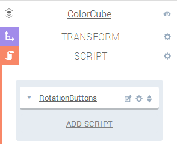

To get the most out of this tutorial, it is useful to know the absolute basics of Create, and also know some JavaScript and a bit of CSS. The tutorial will contain a lot of code and is broken up into five chapters, all with corresponding projects to look at:

* <a href="#starting-off">Starting Off</a>
* <a href="#making-a-rotation-script">Making a Rotation Script</a>
* <a href="#adding-buttons">Adding Buttons</a>
* <a href="#finishing-touches">Finishing Touches</a>
* <a href="#wrap-up">Wrap-up</a>

<h2>What We'll Do</h2>

<iframe allowfullscreen src="//goote.ch/162b6be8fed505e211e5f05f0219d3332cade834/"></iframe>

<em>The end result. Try it!</em>

The end result will be a simple scene with a cube, which can be rotated using two buttons. To get an idea of what we're trying to do, have a look at the end result above before starting.

## Starting Off

We will start by setting up the scene. The 3D model we will use in this tutorial is a cube, made out of six quads with different colors. We have first made an empty entity, named ColorCube. Then, six quads with different colors have been created, rotated and placed to make up the sides of the cube. The individual sides have then been made children of the ColorCube entity, so that we can manipulate them all at once. Remember that quads only can be seen from one side, so it can be a little tricky getting all the sides oriented correctly.

In addition, a fixed camera has been set up, overlooking the cube slightly from the side. At last, the canvas has been set to 600x300 pixels and has been given a dark gray background.

If you don't want to set the scene up yourself, it can be found <a href="https://app.goocreate.com/4768/e3cb2c2744bd4fa0b8250b3dc6ee70e3.scene" target="_blank">here</a>. Of course, you can also use your own 3D model instead of the cube if you want to.

<iframe allowfullscreen src="//goote.ch/1b1d89c829df385d72cdf028f964760378b45d71/"></iframe>

<em>The starting scene</em>

<h2>Making a Rotation Script</h2>
The rest of this tutorial will be focused on scripting. We will use the same script to rotate the model as well as set up the controls for it. Let's start by adding a script component to the ColorCube model, and then adding a custom script to the new component. Doing those two things should and naming the script will leave us with an entity looking like this:

The ColorCube entity with an empty custom script

We'll start by writing a script for the rotation, and then test it without any buttons. In general, trying to write parts of an application and testing them individually before moving on is a very good idea! We'll call the function rotate.


var rotate = function(ctx, goo, angle) {};


We need to pass in the ctx parameter to get a hold of context variables (we'll see this later) and the goo parameter to be able to use Goo Engine classes and functions. The angle variable is of course the desired angle of rotation. Let's assume for simplicity's sake that the axis will always be the Y-axis.

### Tweening

The rotation will make use of tweening. Tweening is short for inbetweening and is basically a way to make animations smooth. Since we don't want the cube to just appear at it's new orientation, we'll use the TweenJS library (already running in the engine) to interpolate the animation. This is what the complete rotate function will look like:


var rotate = function(ctx, goo, angle) {
    // Don't do anything if a rotation is already active.
    if (ctx.tweenActive) return;

    // Interpolate the rotation over time using TweenJS
    ctx.tweenActive = true;
    ctx.tween
        .from({t: 0})
        .to({t: 1}, ctx.rotationTime)
        .easing(ctx.easing)
        .onUpdate(function() {
            // Update the entity's rotation using the interpolation variable
            ctx.entity.setRotation(0, ctx.rotation + this.t*angle, 0);
        })
        .onComplete(function() {
            ctx.tweenActive = false;
            ctx.rotation += angle;
        })
        .start(ctx.world.time * 1000);
}


So what's really happening here? First of, the animation will take some time to finish. We want to make sure that we don't try to launch a new rotation if we're not done with the last one, so we'll keep track of that state using the ctx.tweenActive variable. The interpolation is launched using the ctx.tween object, declared in the setup function. It will interpolate a variable t from 0 to 1 over ctx.rotationTime milliseconds, and we have access to that function in the onUpdate() function. In that function, we use the interpolated t variable to slowly set the rotation to the final one. The ctx.rotation variable simply keeps track of the current rotation, and is also declared in the setup function. When the tweening is done and t=1, the onComplete() function is triggered. Here, we signal that we're done with the rotation and update the ctx.rotation variable. The start() needs the Goo time for the updating to be handled properly.

That's the rotating functionality in all its glory, but there are some things missing. To be able to use the ctx variables, we need to set them up. We'll do this in the setup() function, which will run every time the play button is pressed, or when running an exported project.


var setup = function(args, ctx, goo) {
    // Keep track of current rotation angle
    ctx.rotation = 0;

    // Rotation and tween parameters
    ctx.rotationAngle = args.rotationAngle * Math.PI / 180;
    ctx.tween = new window.TWEEN.Tween();
    ctx.rotationTime = args.rotationTime * 1000;
    ctx.easing = window.TWEEN.Easing.Linear.None; // will change later

    // Test the rotation by calling it every two seconds
    ctx.testRotation = window.setInterval(function() {
        rotate(ctx, goo, ctx.rotationAngle);
    }, 2000);
};


The ctx variables are declared here. We see that the rotation angle and time are fetched from the args parameters, and attached to the ctx object as well. The ctx.tween is a TweenJS object, and we'll get more into the easing later in this tutorial. We test the rotation by setting up a timed launch of the rotate() function. This is temporary, but it's nice to clean up after we're done:


var cleanup = function(args, ctx, goo) {
    window.clearInterval(ctx.testRotation);
};


This how we set up the parameters:


var parameters = [{
    key: 'rotationTime',
    name: 'Time',
    type: 'float',
    control: 'slider',
    default: '0.5',
    min: 0,
    max: 3
},{
    key: 'rotationAngle',
    name: 'Angle',
    type: 'float',
    control: 'slider',
    default: '90',
    min: 0,
    max: 360
}];


That's it for the rotation part! The script in the component panel should now look like this:

Controls for the rotation

Now press play, and you should see the cube in action.

<iframe allowfullscreen src="//goote.ch/8ca9bba522acfb9fcacd28c6a51d873a1f68cb15/"></iframe>

<em>The rotation works, hopefully.</em>

It might be hard to get all the code into the right spots, so <a href="https://app.goocreate.com/4768/634702606f30485893c2c8f2caae2fe0.scene" target="_blank">here's a scene</a> matching the tutorial's current state.

<h2>Adding Buttons</h2>
Now that we are confident that the rotating functionality is perfect, let's move on to creating the CSS buttons. We'll need some more variables, so let's start by adding the following lines to the setup() function. Make sure to remove the setInterval call we used for testing, too.


// Buttons and button params
ctx.buttons = [];
ctx.buttonSize = args.buttonSize;
ctx.buttonMargin = args.buttonMargin;

// To keep track of canvas size change
ctx.oldCanvasHeight = ctx.domElement.height;

createButtons(ctx, goo);


The creation will of course be done in the createButtons() function. Again, we pass in the ctx and goo parameters to access the context and Goo classes. The function body is fairly straightforward. It will create two CSS triangles using JavaScript and attach it to the DOM. The canvas is accessed via the ctx.domElement variable, and the buttons will be attached to its parent. The buttons will call the rotate() function with different values for the angle. Note that we push the created elements to an array. This is so that we can delete them when the script stops. Otherwise, we'd get more buttons every time we pressed play.


var createButtons = function(ctx, goo) {
    // Create two triangles using CSS.
    // http://css-tricks.com/snippets/css/css-triangle/

    var h = ctx.domElement.height / window.devicePixelRatio;

    var s = ctx.buttonSize;
    var m = ctx.buttonMargin;

    var leftButton = document.createElement('div');
    leftButton.style.position = 'absolute';
    leftButton.style.width = '0px';
    leftButton.style.height = '0px';
    leftButton.style.top = h/2 - s + 'px';
    leftButton.style.left = m + 'px';
    leftButton.style.borderTop = s + 'px solid transparent';
    leftButton.style.borderBottom = s +'px solid transparent';
    leftButton.style.borderRight = s + 'px solid white';
    leftButton.onclick = function() { rotate(ctx, goo, -ctx.rotationAngle); }
    ctx.domElement.parentNode.appendChild(leftButton);
    ctx.buttons.push(leftButton);

    var rightButton = document.createElement('div');
    rightButton.style.position = 'absolute';
    rightButton.style.width = '0px';
    rightButton.style.height = '0px';
    rightButton.style.top = h/2 - s + 'px';
    rightButton.style.right = m + 'px';
    rightButton.style.borderTop = s + 'px solid transparent';
    rightButton.style.borderBottom = s +'px solid transparent';
    rightButton.style.borderLeft = s + 'px solid white';
    rightButton.onclick = function() { rotate(ctx, goo, ctx.rotationAngle); }
    ctx.domElement.parentNode.appendChild(rightButton);
    ctx.buttons.push(rightButton);

};


The cleanup() function is responsible for not leaving a mess in the DOM:


var cleanup = function(args, ctx, goo) {
    // Remove things we added
    for (var i=0; i<ctx.buttons.length; i++) {
        ctx.buttons[i].onclick = null;
        ctx.domElement.parentNode.removeChild(ctx.buttons[i]);
    }
};


The buttons should be aligned along the edges. We have locked the canvas size in our project, but when exporting, the canvas size might need to be updated. Therefore, and in case we don't want to used a locked canvas, we'll add some code to handle repositioning of the buttons. The ctx.oldCanvasHeight variable is declared in the setup.


var updateButtons = function(ctx) {

    var h = ctx.domElement.height / window.devicePixelRatio;

    if (h != ctx.oldCanvasHeight) {
        var s = ctx.buttonSize;
        for (var i=0; i<ctx.buttons.length; i++) {
            ctx.buttons[i].style.top = h/2 - s + 'px';
        }
        ctx.oldCanvasHeight = h;
    }
};


This extra function is called by update() function every frame:


var update = function(args, ctx, goo) {
    // Update button position
    updateButtons(ctx);
};


And, finally, here's the code for the new parameters:


{
    key: 'buttonSize',
    name: 'Button Size',
    type: 'float',
    control: 'slider',
    default: 30
},{
    key: 'buttonMargin',
    name: 'Button Margin',
    type: 'float',
    control: 'slider',
    default: 5,
    min: 0,
    max: 500
}


Press play, and voila! The rotation can now be triggered by these awesome buttons:

<iframe allowfullscreen src="//goote.ch/d62a1cc980b32510b43ef3ae75d3384446b1c347/"></iframe>

<em>Function and style in a beautiful combination</em>

Not working? Don't worry. We have prepared a <a href="https://app.goocreate.com/4768/f2e3e7c864f74b38aa4d7e44702f6ffe.scene" target="_blank">scene that you can check out</a>.

## Finishing Touches

We have the rotation and we have the buttons. However, our hunger for cool stuff is not fully satisfied yet. That's why we'll add two more things: A color picker for the buttons and an easing option for the animation.

### Button Color Picker

One of the type of controls we can create in the component panel is a color picker.

The parameter object looks like this:


{
    key: 'buttonColor',
    name: 'Button Color',
    type: 'vec3',
    control: 'color',
    default: [0.5, 0.5, 0.5]
}


The args.buttonColor variable now contains an array with three floats. To use in CSS, we'll define a simple helper function:


var vecToCss = function(vec) {
    return 'rgb(' +
    Math.round(vec[0] * 255) + ',' +
    Math.round(vec[1] * 255) + ',' +
    Math.round(vec[2] * 255) + ')';
};


Now we need to add two lines of code and change another:


// Add to setup()
ctx.buttonColor = args.buttonColor;

// Add to createButtons()
var c = vecToCss(ctx.buttonColor);

// Change the border color lines
leftButton.style.borderRight = s + 'px solid ' + c;
rightButton.style.borderRight = s + 'px solid ' + c;


That's it for the color picker!

### Easings

The rotation might be smoothly animated, but it's kind of straight forward. Easings are used to control the interpolation speed. TweenJS comes with a lot of different cool options, so we'll write some code to pull the options from the library, make strings of them and then put them back into easing selections.

The selections will be made into another type of parameter:


{
    key: 'easing',
    name: 'Easing',
    type: 'string',
    control: 'select',
    options: easingNames,
    default: easingNames[0]
}


Of course, we need to create the easingNames array and populate it with the right stuff. This is the code for it:

// Generate a list of all TweenJS easings. Easings have both a base type
// and a few direction variations (none/in/out/in-out).


var easingNames = [];
var easings = window.TWEEN.Easing;
for (var easing in easings) {
    if (easings.hasOwnProperty(easing)) {
        var variations = easings[easing];
        for (var variation in variations) {
            if (variations.hasOwnProperty(variation)) {
                easingNames.push(easing + '.' + variation);
            }
        }
    }
}


You should now be able to see a bunch of different easings in a drop-down menu:

Now we need to convert the strings back into easing objects from the library, and we'll do this with this slightly contrived code:


// In setup()
var easingSplit = args.easing.split('.');
ctx.easing = window.TWEEN.Easing[easingSplit[0]][easingSplit[1]];


Phew! That's all, folks. Try out some of the easings! A really cool one, and the one we use in the final project, is Bounce.Out. By the way, the final scene can be found <a href="https://app.goocreate.com/4768/1a910cf043334213aa88ea28f82e6b25.scene" target="_blank">here</a>, or a published version <a href="//goote.ch/162b6be8fed505e211e5f05f0219d3332cade834/" target="_blank">here</a>.

<iframe allowfullscreen src="//goote.ch/162b6be8fed505e211e5f05f0219d3332cade834/"></iframe>

<h2>Wrap-up</h2>

After quite some code, we've created CSS buttons to control animations, using tweening to make the animations nice. There are a lot of ways to create buttons. One is to use HTML components which are built into Create, but we think that this tutorial illustrates how easy it is to create and manipulate any HTML object using the powerful scripting in Create. Scenes like these can be used for simple but efficient ads and product showcases, or even navigation menus. We hope you liked it!
