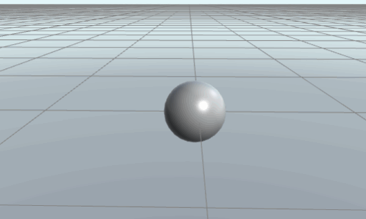
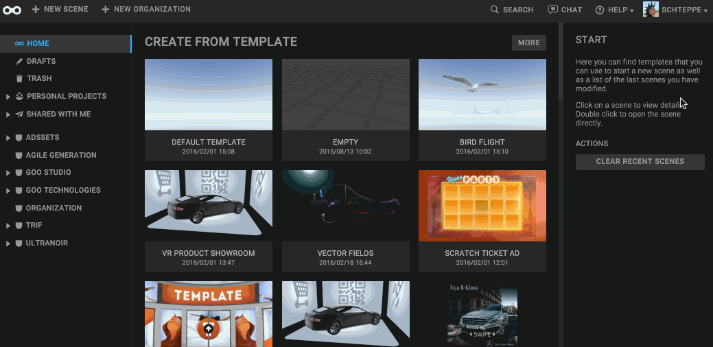
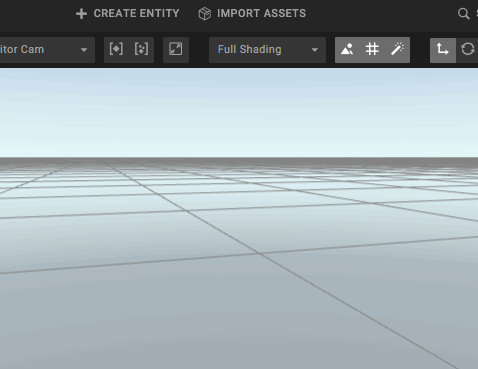
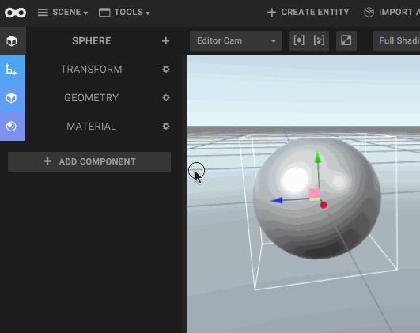
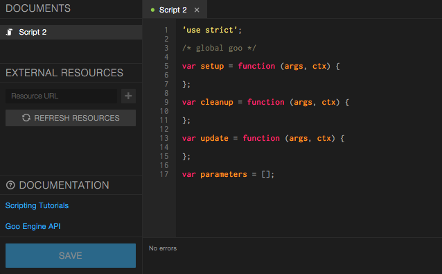
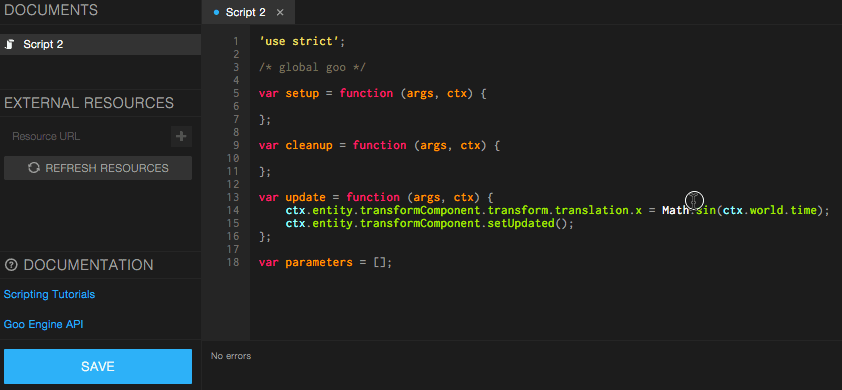

This tutorial will introduce you to scripting in Goo Create. We will make a script that moves a sphere back and forth. Prerequisities is basic knowledge of Goo Create and JavaScript.



*This is what we will make*

## Step 1: Create a new Scene

When you log into Create, you end up in the Dashboard. From here, choose the Default Template, and type a name for your scene. Click the blue *Create* button.




## Step 2: Create a Sphere

To add a Sphere to your scene, click the *Create Entity* button in the top bar of Create. Then click on the Sphere icon.




## Step 3: Add a Script Component and a Script to the Sphere

Click the *Add Component* button in the Inspector panel to the left, and choose *Script Component* to add a script component.

A Script component panel appears. To add a *Script* to the script component, click the + button. You will be presented with a number of preset scripts. For this tutorial we want to write our own script, so choose *Custom script*.



## Step 4: Open the Script Editor

Click the pencil symbol in the script that you just created. The Script editor will appear.



## Step 5: Add some code to the script

The script has three functions in it, *setup*, *update* and *cleanup*. For our simple script, we only need to worry about the *update* function. This function is called on every render frame, perfect if you want to make animation.

Copy the following code into the *update* function:

ctx.entity.transformComponent.transform.translation.x = Math.sin(ctx.world.time);
ctx.entity.transformComponent.setUpdated();

The first line of code will set the X-position of the sphere to the sine of the current time. This value will oscillate between -1 and 1 as time goes by, making the sphere entity move back and forth.

The second line of code will tell the ```TransformComponent``` that you updated a value in its transform. This is needed because you changed the translation property.

## Step 6: Save the Script

Click the big blue *Save* button in the script editor to save.



## Step 7: Click Play and enjoy

Close the Script editor and return to Create. Click the Play button and watch your sphere move back and forth.


## Done!

For more details on how Scripts work, see the [The anatomy of a script manual page]({{ "/manual/scripting/anatomy" | prepend:site.baseurl }})