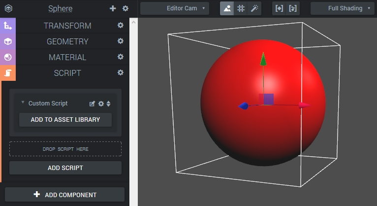
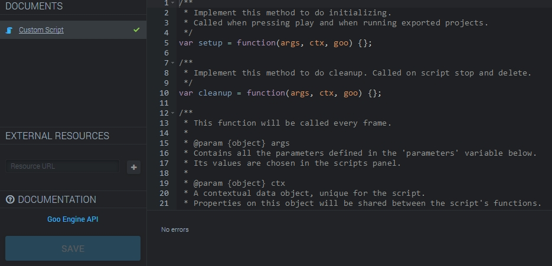
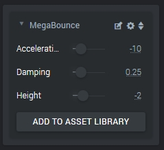

This tutorial will introduce some of the fundamental topics in Create's scripting capabilities. We will script a simple bouncing sphere. The implementation will of course be very basic, but it should familiarize the reader enough with the concepts!

For more details on the goo, ctx and args objects, see [The anatomy of a script]({{ "/manual/scripting/anatomy" | prepend:site.baseurl }})

As other functionality in Create (cameras, lights, transforms, meshes et cetera), scripting is handled in a specialized type of Component. Scripts can be added to any entity and enable them to do tons of cool stuff!

The Goo Engine is written in JavaScript to stay close and true to the web. Scripts are no exception to that of course. Everything we will write will be in pure JavaScript, so there is no need to learn any other scripting language.

## A sphere with a ScriptComponent

The scene for this scripting tutorial will be simple. All we need is a sphere! The first step is therefore to make one from the Create menu and pick a nice color for it. Step number two is almost as simple: Select the sphere entity and click **Add Component**  and add a **Script** component.

Next, inside the Script component press **Add Script** . You'll be presented with a list of pre-made scripts. try adding some of them and see what happens later too! But for this tutorial we want to write our own script, so add a **Custom script** .

## Anatomy of a Script

To access the script itself, click the little edit button next to the script name, it looks like a little sheet of paper with a pen on it. This opens up a new window with the scripting code.

We can ignore the left hand panel for now and take a look at the code itself. We'll glance over the main functions in the code before diving into code writing.


var setup = function(args, ctx, goo) {};
var cleanup = function(args, ctx, goo) {};


At the top are the **setup** and **cleanup**  functions. These will be called when starting and stopping scripts, respectively. Their arguments will make sense once we have talked about the main function, the update function.


var update = function(args, ctx, goo) {};


This is where most of the code usually goes. This function will run *every frame* and can therefore be used to continually update objects, react to input and changes et cetera. The function has three arguments:

**args** contains the custom parameters we can define for our script in the parameters array (see below).

**ctx** lets us access a number of things: The Entity onto which the script is attached, the World the entity lives in, the DOM element that is used for rendering, the active camera, the viewport size and custom data we define on the entity or the world.

**goo** provides access to all engine classes such as Vector3, Matrix3 and others.


var parameters = [];


Many scripts will want to use some easy to change script parameters. If we define these variables in the **parameters** array (on the given format), then they will be conveniently available from the Script Component panel. This enables the user to change them without having to re-visit the code.

## Let's Write Some Code!

With the brief scripting intro out of the way, let's make the sphere bounce. The (primitive) implementation will eventually use *acceleration*, *damping *and bounce height variables. Let's start with adding those to the parameters array to see what happens.

The comments just above the parameters array specify the format with which we define the parameters. It also lets us know that some of the properties are required. Adding the three variables with useful info looks like this:


var parameters = [
{
    key: 'acceleration',
    name: 'Acceleration',
    type: 'float',
    control: 'slider',
    default: -10,
    min: -20,
    max: 20
},
{
    key: 'damping',
    name: 'Damping',
    type: 'float',
    control: 'slider',
    default: 0.25,
    min: 0.01,
    max: 0.99,
},
{
    key: 'bounceHeight',
    name: 'Height',
    type: 'float',
    control: 'slider',
    min: -5,
    max: 5,
    default: -2
}
];


Clicking the big **Save**  button immediately updates the script component panel and you get nice controls for the variables!

With the parameters in place, let's move on to the code that will move the sphere. First thing we'll need is another variable, a velocity. Assuming we always want to start at standstill, the velocity is a prime candidate for defining in the **setup**  function.


var setup = function(args, ctx, goo) {
    ctx.velocity = 0;
};


By attaching it to the **ctx**  object, we can reach it from the update function as we'll see below.


var update = function(args, ctx, goo) {

    // Get the entity's translation
    var translation = ctx.entity.getTranslation();

    // Compare the height (Y axis value) with the bounce height parameter
    if (translation.y <= args.bounceHeight) {

        // Apply damping
        ctx.velocity *= args.damping - 1;

        // Adjust the position to avoid numerical problems (hacky!)
        translation.y = args.bounceHeight + 0.001;

    }

    // Update the velocity using the acceleration and time since last frame
    ctx.velocity += args.acceleration * ctx.world.tpf;

    // Update the position using the velocity and time since last frame
    translation.y += ctx.velocity * ctx.world.tpf;

    // Let the system know that the transform is updated
    ctx.entity.transformComponent.setUpdated();

};


This code should be pretty straight forward, but let's highlight a few important things.

We access the entity using the **ctx**  object.
The **ctx** object is also used to access the previously defined velocity variable.
Our parameters, like *bounceHeight* and *damping*, are properties on the **args** object.
The Goo world object (and then the time per frame tpf) is accessed using **ctx** again.

## Done!

This is all we need for the bounce to happen! Saving the code and pressing **Play** in Create should do the trick. The implementation is neither nice looking nor stable. See if you can improve it!

Good Luck with the scripting!
