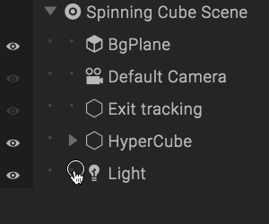
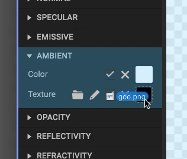
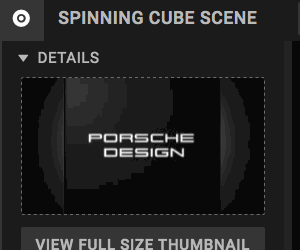
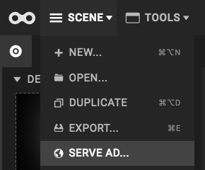
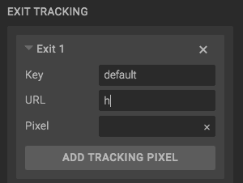
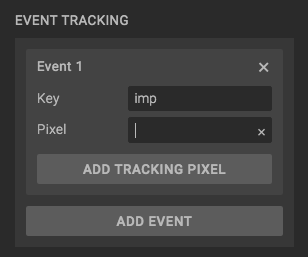
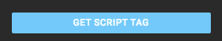
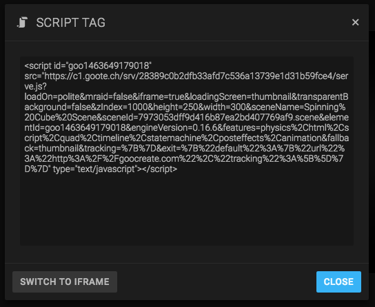

<b>Audience</b>: the tutorial is made for ad unit makers, who want to make their first 3D ad in Goo Create.

<b>Prerequisities</b>: It's assumed that you have a Pro or Enterprise Goo Create account. See <a href="http://goocreate.com/pricing/">pricing</a>.

<h2>Create the scene</h2>

<ol>
<li>Start Goo Create by opening <a href="https://create.goocreate.com</a> in your browser.</li>
<li>Click "New Scene"</li>
<li>Choose the "6-sided Spinning Cube Ad" template</li>
<li>Enter your ad name and click Create.</li>
</ol>

## Find a brand image

We will add our own brand on all six sides of the spinning cube.

We recommend that you use a square texture that is of size 128x128, 256x256 or 512x512 for this ad. Since we won't use alpha/transparency, we recommend the JPG file format. You can use one image for all sides, or separate images for each side. If you don't have any image, use the one below, for all sides (right click and click *Save Image As...*).

## Put the image(s) on the cube

Select one of the "CubeSide" entities, in the *Hierarchy* on the right side in Create. You may have to expand the "Hypercube" entity and its children in the list, by double-clicking on it, or clicking the small arrow.

When you've selected the "CubeSide" entity, open its *Material* panel to the left. Find the image file you want to use on your computer, and drag-and-drop it onto the *Ambient Texture* slot in the Material panel. Adjust the *Ambient Color* until the cube looks good. Do this for all of the cube sides.

The cube will look something like this when done, after adjusting the Ambient color:

Fantastic. Press play and see your ad in action.

## Add a thumbnail

We recommended to set a thumbnail for all scenes. For ad units, the thumbnail can be shown to the user while the ad is loading (or when WebGL is not supported).

Click on the top node in the hierarchy, which has the scene title. Open the scene panel to the left. Click "take screenshot".

You can also upload a custom image. The thumbnail image should be the same size as your ad unit size. In our case, 300x250.

## Open the tutorial in a new window

Note that this tutorial will close when you proceed with the following steps. We suggest that you <a href="#open-the-tutorial-in-a-new-window" target="_blank">open the tutorial in a separate window</a>. You can then proceed with the following steps.

## Open the Ad Publisher

Open the ad publisher by Clicking *Scene* and then *Serve Ad...*.

## Set ad dimensions and exit URL

While in the *Ad Publisher app*, enter the dimensions for the ad (Width = 300 and Height = 250). Choose *Cover image* as fallback and loading background.

To set the clickthrough/exit URL, enter the URL below *Exit Tracking* in the *Exit 1* section.

## Add tracking

(if you don't want to add tracking pixels, just skip this step)

If you want to add some tracking pixels to the ad, check the Event Tracking and Exit Tracking. To track impressions, add a tracking pixel to the "imp" event (which is added by default).

To add Exit (clickthrough) tracking, add a pixel URL to the "default" exit (which is also added by default).

## Get the script tag

When you're done with the settings, click *Get Script Tag* at the bottom.

A dialog will open with the script tag in it. You can use this tag for embedding in any HTML page.

## Embed the script tag

As an example we will embed the script tag in a simple HTML web page. See the full code and result below.


<html>
<body>
  <h1>This is my cool ad!</h1>
  
</body>
</html>


Congratulations! You just made an ad in Goo Create!