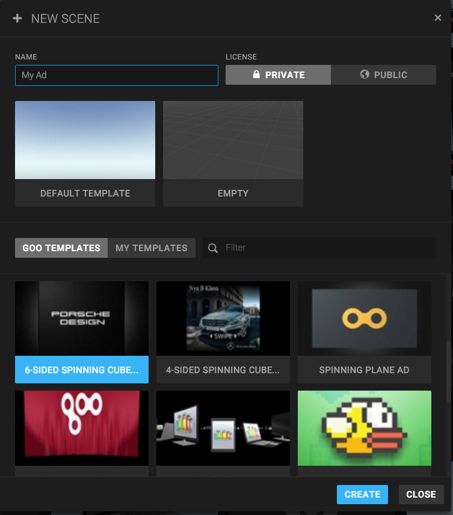
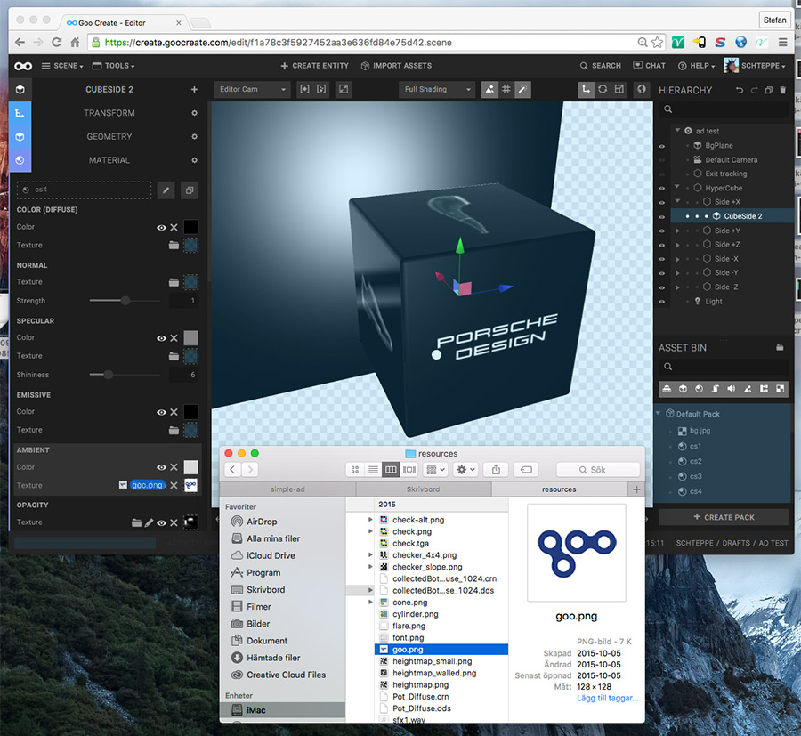
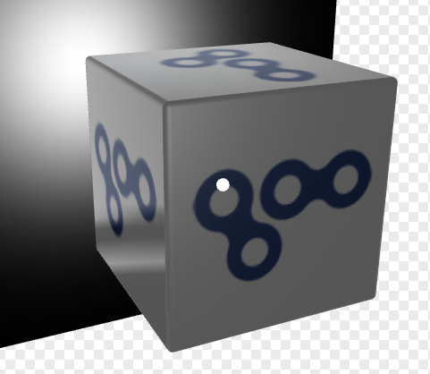
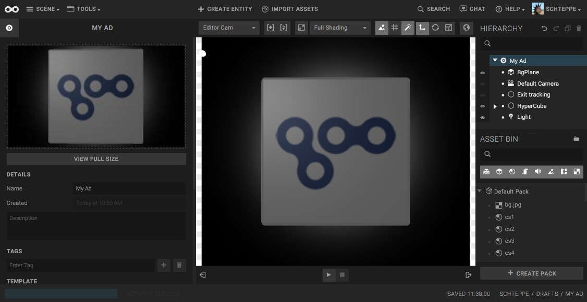
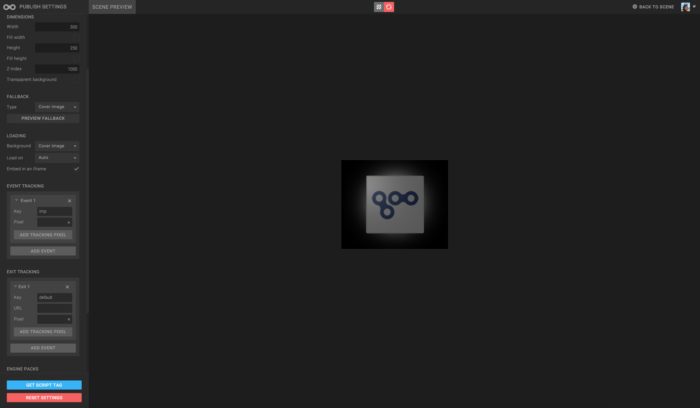
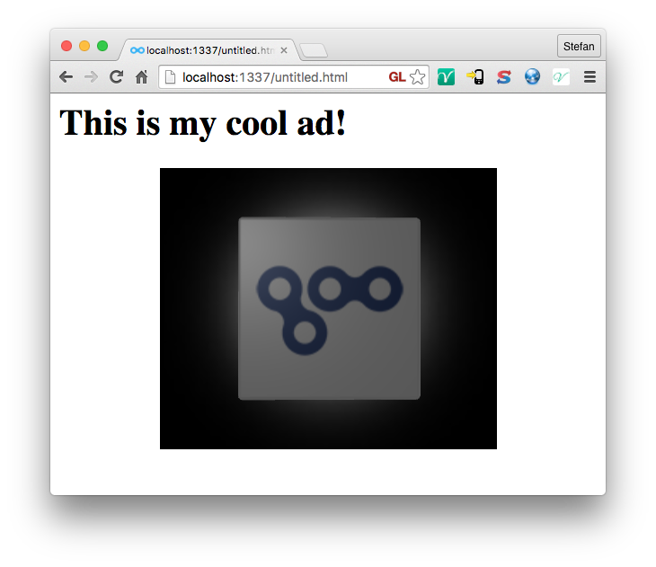

In this tutorial we will show how to make a customized 300x250 Spinning Cube ad in Goo Create, starting from a template.

**Audience**: the tutorial is made for ad unit makers, who want to make their first 3D ad in Goo Create.

**Prerequisities**: It's assumed that you have a PRO or Enterprise Goo Create account. See [pricing](http://goocreate.com/pricing/).

## Create the scene

1. Start Goo Create by opening [create.goocreate.com](https://create.goocreate.com) in your browser.
2. Click "New Scene"
3. Choose the "Spinning Cube Ad" template
4. Enter your ad name and click Create.

## Customize the ad

Now let's customize the ad. We will add our own brand on all sides of the spinning cube.

We recommend that you use a square texture that is of size 128x128, 256x256 or 512x512 for this ad. Since we won't use alpha/transparency, we recommend the JPG file format. If you don't have one, use the one below.

Select one of the CubeSide entities. Open its *Material* panel to the left. Find the image file on your computer, and drag-drop it onto the Material panel, in the *Ambient* slot. Adjust the *Ambient Color* until the ad looks good. Do this for all of the cube sides.

The cube will look something like this when done:

Fantastic. Press play and see your ad in action.

## Add a thumbnail

Before we make this into an ad, it is recommended to set a thumbnail for it, which will be shown to the user while the ad is loading.

Click on the top node in the hierarchy, which has the scene title. Open the scene panel to the left. Click "take screenshot" if you want to take a screenshot and set it as thumbnail. Or upload a custom image. The thumbnail should be the same size as your ad unit size. In our case, 300x250.

## Get the script tag for the ad: the Publisher App

Open the ad publisher by Clicking *Scene* and then *Serve Ad...*.

While in the Ad Publisher app, enter the dimensions for the ad (Width = 300 and Height = 250). Choose *Cover image* as fallback and loading background. This will view our thumbnail when there's no WebGL available, and when the ad is loading.

If you want to add some tracking to the ad, check the Event Tracking and Exit Tracking. To track impressions, add a tracking pixel to the "imp" event (which is added by default). To add Exit (clickthrough) tracking, add a pixel URL to the "default" exit (which is also added by default).

To set the clickthrough/exit URL, enter the URL below *Exit Tracking* in *Exit 1*.

When you're done with the settings, click *Get Script Tag*. A dialog will open with the script tag in it. You can use this tag for embedding in any HTML page.

## Embedding the script tag

As an example we will embed the script tag in a simple HTML web page. See the code and result below.


<html>
<body>
  <h1>This is my cool ad!</h1>
  
</body>
</html>


