In this tutorial, we will show you how you how to make a solar system by using the state machine.

<iframe width="800" height="450" src="https://c1.goote.ch/b19faaf0006c4244a178466491719a6c.scene" title="Solar system tutorial finished"></iframe>

Here are the steps we will take in this tutorial:

*   Start a new project in Goo Create
*   Add three spheres and the light of the sun
*   Add some materials
*   Add a rotation to let the earth rotate around the sun and the moon around the earth
*   Nest the spheres
*   Add a Bloom post effect and change the background color

## Start a new project in Goo Create

Open up Goo Create and click on the **EMPTY** template in the dashboard. Then give the project a nice name like _SolarSystem._

## Add three spheres and the light of the sun

We will add three spheres. They will represent the Sun, Earth and the Moon.

1. To add a sphere, click on **+ CREATE ENTITY** and then select the _sphere_ icon:
  
2. This will be our Sun, so let’s call the entity _Sun._
3. Open up the **Geometry** settings and increase the X and Y samples to 64 to make the shape edges smoother.
4. Now add the earth: Click on **+ CREATE ENTITY** again and add another sphere. Then increase the X and Y samples and give it the name _Earth_. After that, go to the **Transform** settings and set the X translation to 3 and scale X,Y,Z to 0.4:

[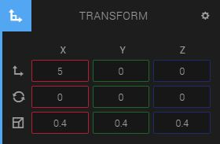](earthtransformvalues.jpp)

Next we will add the Moon.

Click on **+ CREATE ENTITY** again and add another sphere. Increase the X and Y samples and give it the name _Moon_. Then go to the **Transform** settings again and set the X translation to 3 and scale X,Y,Z to 0.1:

Please note: The moon will look to be very close to the sun, but don’t worry, once we nest the Moon as a child entity to the Earth entity it will look correct again. Nesting the entities will be done as one of the last steps in the tutorial.

Next, we will add a _point light_ to make the Sun appear to shine light on Earth and the Moon.

To add a point light click on **+ CREATE ENTITY** and click the **Point** button:

If you are wondering where the point light is: It is inside the sun and will shine through the Sun model onto Earth and the Moon

Change the intensity of the light to 3
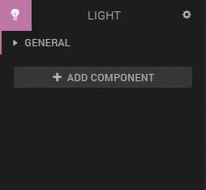

## Add some materials

To make the sun, the earth and the moon look realistic, we're going to use textures. You can download the textures by clicking right mouse button > 'Save as':

[sun.png](sun.png)

[earth.jpg](earth.jpg)

[moon.jpg](moon.jpg)

To assign the Sun texture in the material settings:
1. Click on the _Sun_ entity
2. Open up the **Material** settings, and then unfold the 'Color (diffuse)' item.
3. Then drag and drop the _sun.png_ file onto the color texture slot.
  [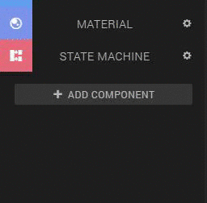](opendiffusecolordroptexture.gif)

Repeat this step for the _Earth_ and the _Moon_ entity.

If you have trouble selecting the Moon sphere, remember that you can always select an entity using the *Hierarchy* panel to the right.

You will notice that the sun looks pretty dark. Follow the steps below to make a more 'sunny' sun:
1. Unfold the 'Emissive' item in the material settings, and change the color to #fff966.
2. Now, unfold the 'Ambient' item and change the color to #f9ff21

The 'Emissive' and 'Ambient' values should now look like this:
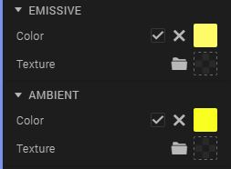

Also, the earth has a reflection from the light. Because this doesn't look very realistic, change the unfold the 'Specular' item in the material settings of the 'Earth' entity and change the color to black (#000000).

## Add a rotation to let the earth rotate around the sun and the moon around the earth

To rotate the sun and the earth, we are going to use the state machine. First we are going to add rotation to the sun:

1. Select the Sun in the Hierarchy panel or by clicking on it in the scene
2. Add a state machine by clicking on '+ add component' > 'state machine'.
3. Click on the '+' next to 'drop behavior' to create a new behavior
  [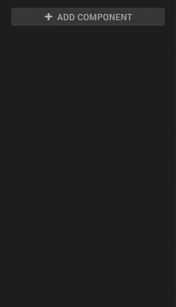](addstatemachine.gif)
4. Unfold 'selected state', change the name to 'Rotate' and click on 'add action'
  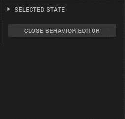
5. Now search for 'rotate' and double-click the rotate action
  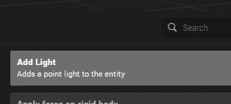
6. Change the 'Y' value to 20. This value is the amount of degrees the entity rotates per second in the Y direction.
  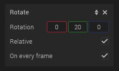

Press the play button at the bottom of the canvas to see what happens. if you zoom in on the sun you can see that it rotates.

Now we are going to add rotation to the earth by reusing the rotate behavior that we've made for the sun:

1. Select the 'Earth' entity in the Hierarchy panel or by clicking on it in the scene
2. 2. Add a state machine by clicking on '+ add component' > 'state machine'.
3. Instead of making a new behavior, we are going to drag and drop the behavior we've made for the sun from the Asset Bin to the 'Drop behavior' box
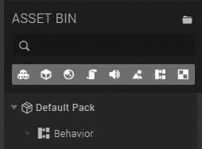
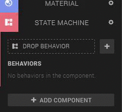

Now the earth should rotate as well.

## Nest the spheres

This step is very easy: Inside the _Hierarchy_ window, drag and drop the Earth entity onto the Sun entity. Then drag and drop the moon entity onto the Earth entity:

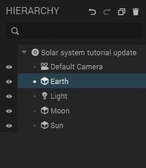

You can click on the little triangle in front of an entity to show its children.

Now click **play** again and you should see Earth rotating around the Sun and the Moon rotating around Earth.

Of course this simulation is not an accurate representation of our real solar system. It merely serves as a nice playground for our demo. :-)

#### Why does nesting entities have such an effect?

The reason is that nested entities have their parents transformation applied to them as well, but only after their own transformation is applied. So for example, Earth is first rotated around its center and then moved 4 units along the X axis. Then it is rotated around the suns center. This behavior of nested entities is a nice trick we can use to make our simple little solar system.

The same technique is also used to animate realistic hands for example. The fingers are nested under the palm entity and only moved relative to the palm. If the arm or palm is moved then the fingers move with it, but if only the fingers are moved then the palm is not affected.

## Add a Bloom post effect and change the background color

Ok, for the last step we will add a bit of eye candy: In your _Hierarchy_ window click on the first item entity that has the name of your scene. You should see a **Post Effect** settings panel on the left side of Goo Create.

Within **Post Effect**, Click on **Add Effect** and click on **Bloom**. You should immediately get a nice glow effect around your sun.

Finally, click on the 'Environment' item above the 'Post effect' item, and change the background color to '#000000', which is black.
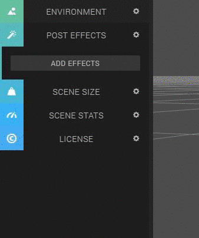

###That's it, you've made your own solarsystem!
