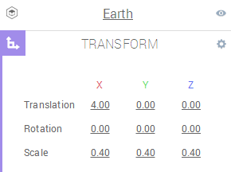
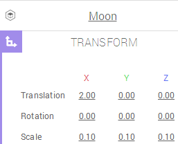
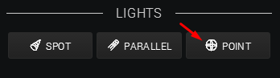
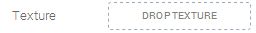
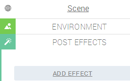

In this tutorial, we will show you how you can use the _ScriptComponent_ to make a solar system, just like in the [Hello World engine tutorial]({{ '/tutorials/engine/engine-intro' | prepend: site.baseurl }})  

  

The ScriptComponent is a component that you can add to an entity in [Goo Create](//app.goocreate.com). It allows you use the programming language JavaScript together with a subset of the Goo Engine API to control the behavior of your Goo entities in real time. In comparison to the State Machine the ScriptComponent is more powerful and provides a very high level of flexibility.  

Here are the steps we will take in this tutorial:  

*   Start a new project in Goo Create
*   Add 3 spheres and a PointLight
*   Add some materials
*   Add a ScriptComponent to the first two spheres
*   Nest the spheres
*   Add a Bloom post effect and a skybox

## Start a new project in Goo Create

Open up Goo Create and click on **+NEW PROJECT** in the dashboard. Then give the project a nice name like _SolarSystem._  

## Add three spheres and a PointLight

We will add three spheres. They will represent the Sun, Earth and the Moon.  

To add a sphere, click on **+CREATE** and then select the _sphere_ icon:  

  

This will be our Sun, so let’s call the entity _Sun._  

If you want to, open up the **Geometry** settings and increase the X and Y samples to 64 to make the shape edges smoother.  

Next, we will add earth: Click on **Create** again and add another sphere. Then increase the X and Y samples and give it the name _Earth_. After that, go to the **Transform** settings and set the X translation to 4 and scale X,Y,Z to 0.4:  

  

Next we will add the Moon.  

Click on +**CREATE** again and add another sphere. Increase the X and Y samples and give it the name _Moon_. Then go to the **Transform** settings again and set the X translation to 2 and scale X,Y,Z to 0.1:  

  

Please note: The moon will look to be very close to the sun, but don’t worry, once we nest the Moon as a child entity to the Earth entity it will look correct again. Nesting the entities will be done as one of the last steps in the tutorial.

Next, we will add a _point light_ to make the Sun appear to shine light on Earth and the Moon.  

To add a point light click on **Create** and click the **Point** button:  

  

If you are wondering where the point light is: It is inside the sun and will shine through the Sun model onto Earth and the Moon

## Add some Materials

We will use the same textures as in the Hello World tutorial. You can download the individual images here:  

[sun.png](sun.png)  

[earth.jpg](earth.jpg)  

[moon.jpg](moon.jpg)  

To assign the Sun texture in the material settings, click on the _Sun_ entity and open up the **Material** settings: Then drag and drop the _sun.png_ file onto the color texture slot:  

  

Next, go to the ambient settings and change the color to bright yellow. This will make the Sun appear bright even though the light is inside the model and is not lighting up the sun itself. Next, select the Earth sphere and open up the **Material** settings and drag and drop the Earth texture onto the color texture slot. You will notice that the earth appears to be turned to the side by 90 degrees. Don’t worry, we will fix this in a later step.  

Finally, repeat the process for the moon.  

If you have trouble selecting the Moon sphere, remember that you can always select an entity using the *Hierarchy* panel to the right.

## Add a ScriptComponent to the first two spheres

Okay, now we get to talk about the ScriptComponent. Select the sun again and click on **Add Component** and click on **Script**.  

  

Open up the new ScriptComponent's settings and select **Add Script** and click on **Custom**.  

Once you have added a script, you can click on the **Edit** symbol to open up a new window with the script editor.  

  

Please note: You can leave the script editor window open, it will automatically switch to new contents when you change entities.

You should see a big wall of JavaScript source code, but don’t get scared. Most of it is just documentation. Essentially, you have control over three functions and one array:

/* Implement this method to do initializing. */
var setup = function(args, ctx, goo) {};
/* Implement this method to do cleanup. Called on script stop and delete. */
var cleanup = function(args, ctx, goo) {};
/* This function will be called every frame. */
var update = function(args, ctx, goo) {};
/* Parameters defined here will be available on the 'args' object. */
var parameters = [];


The **setup** function can be used to initialize variables, state and anything else you want to initialize. It will be called every time you press the **play** button in Create or when running an exported project.  

  

The **cleanup** function can be used to clean up state and anything else you want to clean up. It will be called every time you press the _stop_ button in Create or delete a script. It usually is used to reset the entities position and rotation after you changed them in the update or setup function. It can also be used to removed anything you created using scripting, or to remove event listeners et cetera.  

The **update** function can be used to update state, your Goo entities or anything else you want to update. It will be called _every frame_ after you click the play button in Create or if you run an exported project. Every frame means approximately _60 times per second_. So usually you don’t want to unconditionally log something in this function or it will flood the console.  

For our Solar System we don’t need the _cleanup_ or _setup_ functions, but only the **update** function. For our use case we want to rotate the Sun and with it all nested entities. We will later attach the Earth entity to the Sun and thus the Earth will be rotated around the Sun.  

Select **all text** in the script code editor and replace it with this:

/* Implement this method to do initializing. */
var setup = function(args, ctx, goo) {};
/* Implement this method to do cleanup. Called on script stop and delete. */
var cleanup = function(args, ctx, goo) {};
/* This function will be called every frame. */
var update = function(args, ctx, goo) {
    ctx.entity.addRotation(0, 0.75 * ctx.world.tpf, 0);
};
/* Parameters defined here will be available on the 'args' object. */
var parameters = [];


As you can see we added a call to **addRotation** on the object **ctx.entity**.  

**addRotation** is a useful function of the Goo Engine injected into the entity by the [TransformComponent](//code.gooengine.com/latest/docs/index.html?c=TransformComponent).  

*ctx* stands for *context* and it hosts a couple of cool objects. Mainly the current entity to which this script belongs. If you create a new script you can read the comments for other objects it contains.

As a parameter to the rotation around the Y axis we give it **0.75 * ctx.world.tpf**.  

**ctx.world** represents the root of scene graph. You can use the [world object](//code.gooengine.com/latest/docs/index.html?c=World) to query for any entity. But the world also contains the time it took to render the last frame in a property called **tpf** (time per frame). A typical value is 1/60, or 0.01666…  

The reason we use the **tpf** as part of our parameter to addRotation is to make the code *frame rate independent*. If we always use tpf as part of our animation code it will run at the same speed regardless of how long it takes to render the scene. So this is a good practice to remember!  

Repeat the script process in exactly the same way for the Earth entity to finish this step, but use this slightly altered update function instead:

var update = function(args, ctx, goo) {
    ctx.entity.setRotation( -Math.PI/2, ctx.world.time, 0);
};

  
The difference between the Sun script and this script for Earth is because Earth appears to be turned to the side by 90 degrees. With the function setRotation we can fix this, by rotating the earth around the X axis by -90 degrees. Goo uses a 3D math library where every angle needs to be in [radians](http://en.wikipedia.org/wiki/Radian). As the second parameter we pass in the time property of the ctx.world object which is similar to the ctx.world.tpf property but instead of containing the time per frame it contains the time since the program started in floating point seconds.  

Ok, time to test: Click on the **play** button and look closely at the Sun and Earth and you should see them slowly rotating:

  

## Nest the spheres

This step is very easy: Inside the _Hierarchy_ window, drag and drop the Earth entity onto the Sun entity. Then drag and drop the moon entity onto the Earth entity:  

  

You can click on the little triangle in front of an entity to show its children.

Now click **play** again and you should see Earth rotating around the Sun and the Moon rotating around Earth.  

Of course this simulation is not an accurate representation of our real solar system. It merely serves as a nice playground for our ScriptComponent demo. :-)

#### Why does nesting entities have such an effect?

The reason is that nested entities have their parents transformation applied to them as well, but only after their own transformation is applied. So for example, Earth is first rotated around its center and then moved 4 units along the X axis. Then it is rotated around the suns center. This behavior of nested entities is a nice trick we can use to make our simple little solar system.  

The same technique is also used to animate realistic hands for example. The fingers are nested under the palm entity and only moved relative to the palm. If the arm or palm is moved then the fingers move with it, but if only the fingers are moved then the palm is not affected.

## Add a Bloom post effect and a Skybox

Ok, for the last step we will add a bit of eye candy: In your _Hierarchy_ window click on the entity called **Scene** and you should see a **Post Effect** settings panel on the left side of Goo Create.  

  

Click on **Add Effect** and click on **Bloom**. You should immediately get a nice glow effect around your sun.  

Finally click on **Import** and click on **Import From Asset Library** and then select one of the nice skyboxes. I used *Dark Sky*.  

And here, again, is the beautiful result:  

