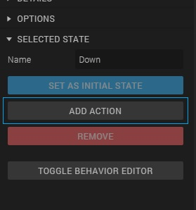
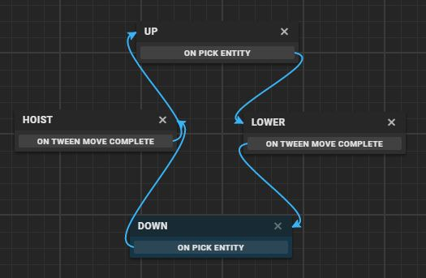

## What is a state machine?

An example of a state machine is the flag in the scene above. It has two states: *up* and *down*. A *state* is simply a behavior of an object at a certain point in time. Click the flag a couple of times to see the transition between the two states.

Between the states, the flag has two *events* that make the *transition* from one state to another: *hoisting* and *lowering*. When the flag is in the *up* state, it is possible to use the *lowering* event, and when in the *down* state, it is possible to use the *hoisting* event.

A state machine is a collection of *States*, connected by *Transitions*. In Goo Create, a state machine is called a *Behavior*, and the entity needs a *State Machine Component* to add Behaviors to it.

## Part 1: Open the scene

The first thing you'll have to do is to open the scene we will work in for this tutorial:

1. <a href="https://create.goocreate.com/edit/ac4d33d665714c0db17ed26e090b0f9b.scene" target="blank">Click here to open the scene</a>
2. If you're not logged in yet, log in with your Goo Create account
2. Click on 'Duplicate scene' in the top left corner
3. Select 'Drafts' and click on 'Duplicate'

You are now able to edit the scene.

## Part 2: Add a State Machine Component and behavior to the flag

1. Select the 'Flag' entity in the hierarchy and click on the Frame Selection button in the top left corner to center the flag.
   
2. Unfold the 'Flag entity' and select 'Flag'
   
3. In the panel on the left, click on 'Add component' > 'State machine'. When the State machine component is added, click on the '+' icon to create a new behavior.
   

Now we're ready to add the different states to the flag

## Part 4: Add States

In this part, we are going to add the states.

1. Rename the current state to 'Down'.
  

2. To create the 'Up' state, click on '+ Add state' and change the name of the state to 'Up'.
  

In the state graph (the window with the grid below the canvas) should now look like this:
  
The 'Down' state is blue because it is set as the initial state.

*__Hint:__ You can align the states by dragging and dropping them*

## Part 5: Add click actions

The transition from 'up' to 'down' or 'down' to 'up' will be triggered by clicking the flag. To add this, we need to add an action to the state. The action we need is the 'Pick' action. The pick action is a transition action that can trigger a transition when an entity is clicked. In this case, we add it to the state machine of the flag, so it will be triggered when you click the flag.

1. Select the 'Down' state in the state graph and click on 'Add action' in the panel on the left.
  
2. Type 'Pick' in the search bar and double-click the 'Pick' action or press 'Add'.
  
3. Repeat step 1 and 2 for the 'Up' state.

## Part 6: Add the transitions between the states

To create the transition from the 'down' to 'up' state, and the 'up' to 'down' state when clicking on the flag, we have to add transitions between the states. you can simply click on 'On pick entity' in the state graph, hold down your mouse button , and let it go on the state where you want to make the transition to when the entity (in this case the flag) is clicked.
  

Now when you click the 'play' button and click on the flag, you can see the transition between the states with each click.
  

Of course the flag doesn't go up or down, because we didn't add an action that makes that possible yet.

## Part 5: Hoist and lower the flag when it's clicked

Right now we have two states: 'Up' and 'Down'. On the moment we hoist or lower the flag, in which state will the flag be? In between those states, right?
To solve this problem, we are going to add two more states, namely 'Hoist' and 'Lower'.

1. To delete the current transitions (the arrows), click on them in the graph state
  
2. Create two new states and call them 'Hoist' and 'Lower'
  

To make the transition from 'Down' to 'Up' and 'Up' to 'Down' look smooth, we are going to use the 'Tween move' action in the 'Hoist' and 'Lower' states.

3. Select the 'Hoist' state in the state graph
4. Click on 'Add action'
5. Type in 'Tween move' and press Enter or click the 'Add button'
6. Change the values of the tween move action to the following:
  
  * The __translation__ values are for moving the entity
  * The __time__ is how long the animation is going to take
  * The __Easing type__ and __Direction__ defines *how* the entity moves. For instance, Quadratic InOut will make sure that the flag first moves slow, then fast and then slow again. This makes the transition very smooth.
7. Repeat step 3, 4, 5 and 6 for the 'Lower' state, but set the Y translation of the 'Tween move' action to -2 instead of 2, otherwise it doesn't lower but hoist the flag.
8. In the state graph, create the transitions between the states. At the end, it should look like this:

### You've made your first behavior in Goo Create!
Try it out by starting the scene and then clicking on the flag.
