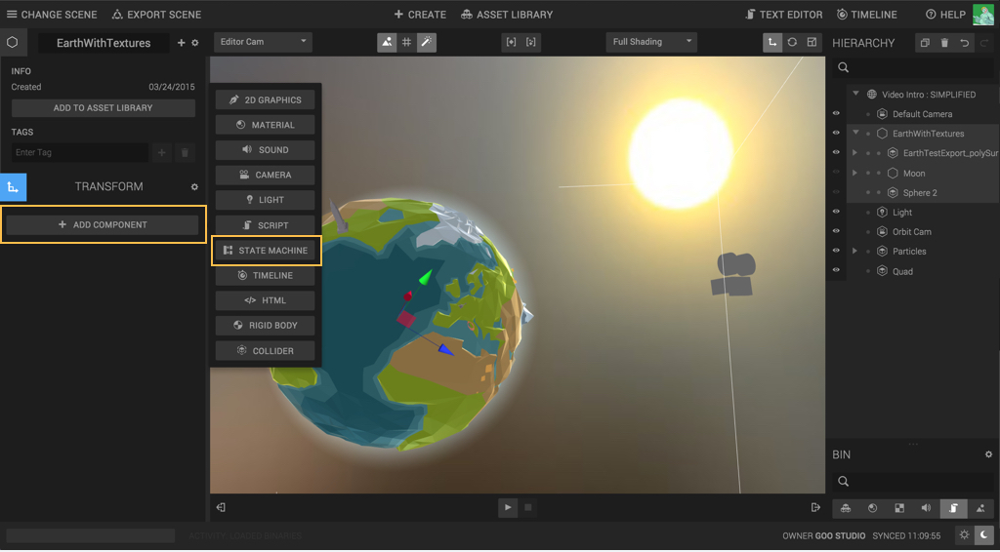
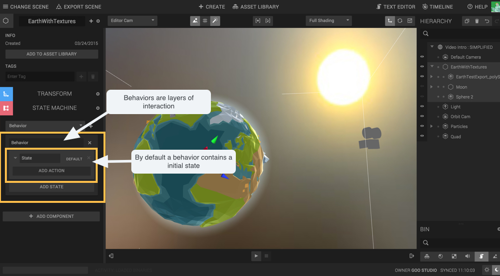
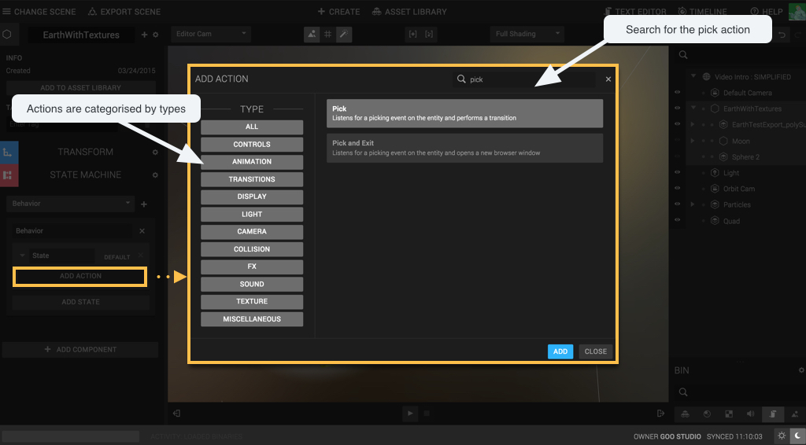
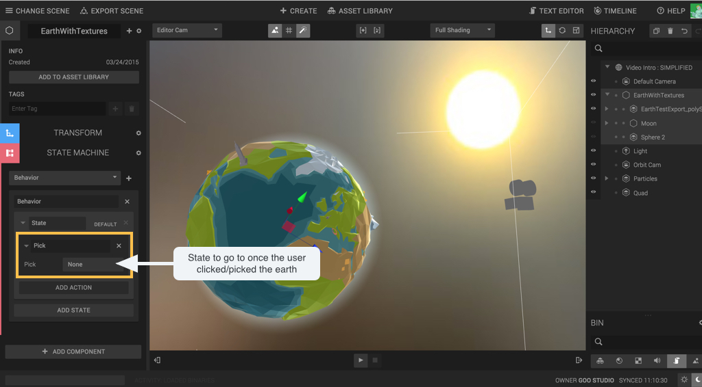
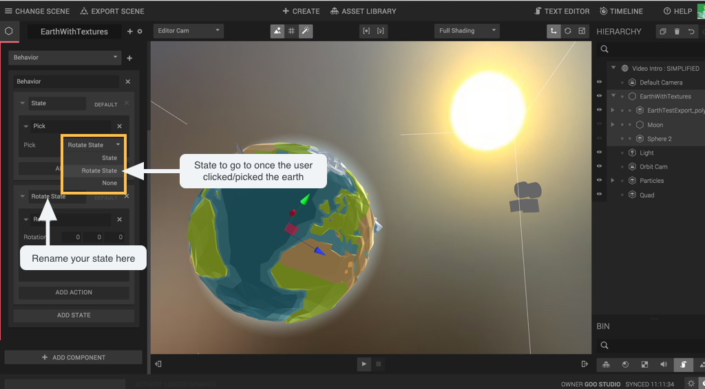
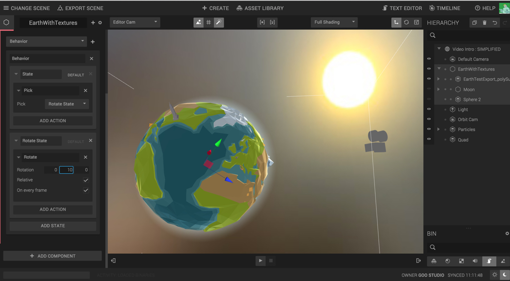
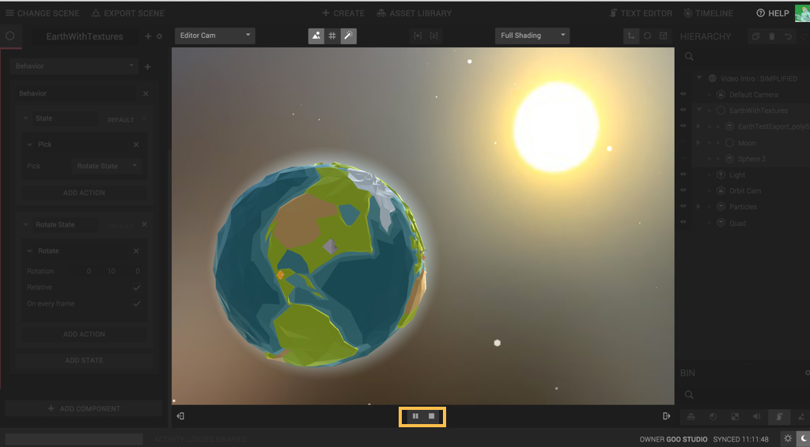

Note: This tutorial uses *Lights*, so you may be interested in reading the [Lights tutorial]({{ '/tutorials/create/lights' | prepend: site.baseurl }}) first.

The state machine is a visual programming tool that makes it really fast for you to prototype your project. I’ll start by adding a state machine component to the earth.

In a state machine we have Behaviours that contains States and States contains Actions.
Behaviours are layers of interaction being executed at the same time.
States are steps for those behaviours.

In the default state click the add action button.
The Add action pop ups gives you access to pre-made blocks that you can use. As the earth needs to spin I will add a rotate action.

When the user will click on the user the Pick action will be fired and connect to the next state.

Now add a new state to your behavior and a rotate action to it. You can now connect the Pick action to the new state that I called ‘Rotate State’.

Adjust the rotation parameters to make your earth spin.
Here the earth will rotate 10 degrees every frame on the Y axis.

You are done! Press play and click on the earth to make it spin.