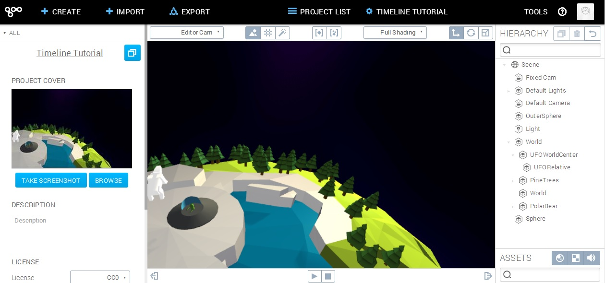
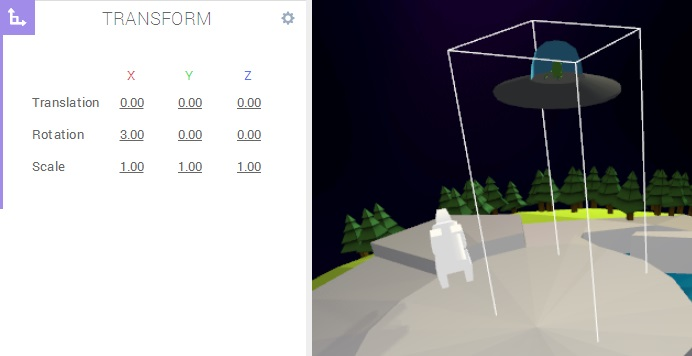
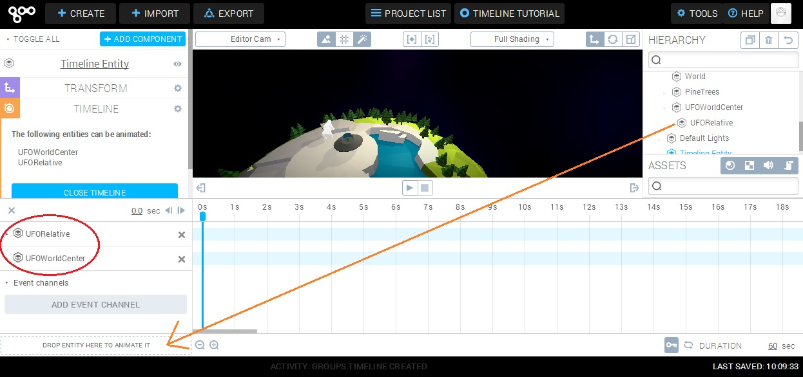
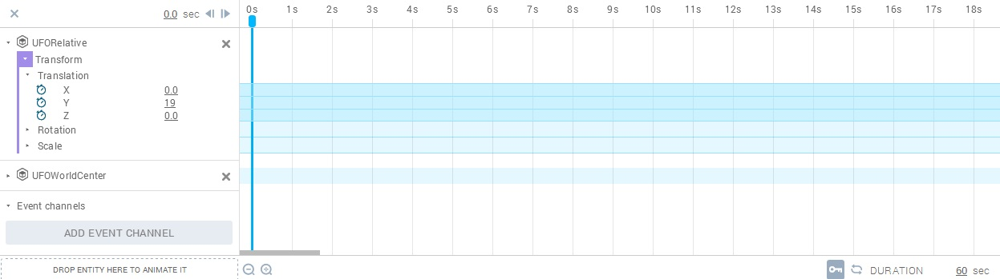
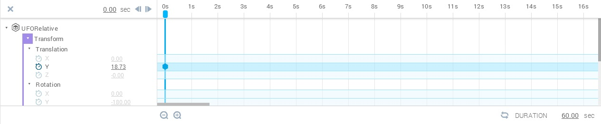
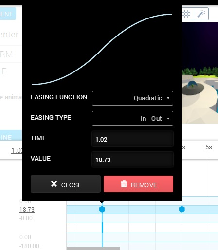

In this tutorial, we will go over the basics of the timeline, and see how keyframes can be used to control animations.

## Setting Up

We will be using a small scene with the Earth and an UFO. The easiest way to get a hold of the scene is logging in to Create, [opening this link](https://app.goocreate.com/4768/642b84f5a9944f12b5c3b84deb8ad7d3.scene) and duplicating the scene. That will copy the whole thing into a project of your own, so that you can edit it.

_The scene can be duplicated from [here](https://app.goocreate.com/4768/642b84f5a9944f12b5c3b84deb8ad7d3.scene)._

Now take a look at the hierarchy on the right side. There are two UFO entities, and both are children of the World. The idea is the following: The UFOWorldCenter entity is placed in the center of the World, so rotating it will do so relative to that center. Try it! The UFO will seem to orbit. The UFORelative entity has a transform relative to the center, so when changing it's Y axis translation, the height above the surface is affected. Rotating this entity will only rotate the UFO locally. These nested transforms make it very nice to work with the animations, as we will see soon. Feel free to move the transforms around to get a feel for how they work!

The parent UFO transform is anchored at the World's center

## Adding Two Timelines

There is a special kind of component for timeline functionality, aptly named timeline component. We can either create a pure timeline entity from the Create menu, or we can add a timeline component to an existing entity using the Add component menu when having an entity selected. Which way to use is a matter of taste. As each timeline runs independently of other timelines, a good idea is to use a timeline for each set of entities we want to move together. We will use a stand-alone timeline entity for the UFO animation here, so let's get ourselves one from the Create menu.

A new, fresh and empty timeline entity

We choose what entities we want to control by opening the timeline and then dragging and dropping them from the right-hand hierarchy menu to the drop area on the timeline. Note: This behavior is new as of June 2014\. Previously, timeline entities animated their child entities. Drag the entities UFOWorldCenter and UFORelative to the timeline.

After opening the timeline and dragging the two entities to it

## Using the Timelines

With the timeline open, click the UFORelative entity, and then click the Transform component to expand it, and then click on Translation to expand yet another step. Now we see the translation's X, Y, and Z channels which we can control.

Timeline open with the Transform->Translation channels expanded

### Keyframes

The core feature of timelines is keyframing. Keyframes are certain points in time that have values associated with them. When pressing Play, the system will interpolate between those values. We'll illustrate this with a basic example.

Press the little watch icon next to the Y channel of the Translation property. This turns on that particular channel and adds a keyframe at the position where the playhead is currently at (it should be at time 0s).

Enabled Y channel on the Translation property

Try pressing Play to see what happens. You'll see that the playhead moves, but the scene is not reacting. This is not strange, considering we just told the system to keep the default translation at time 0s. Let's add another keyframe, this time at 4s. To do this, drag the playhead to 4s and change the Y value to 21.00\. While we're at it, move the first keyframe to 1s to give us some breathing room before things start happening.

Second keyframe in place and the first one moved a little

You probably noticed that the UFO moved! What we have done now is set two points in time where the values of the variables are decided. Additionally, we will automatically get interpolation between the values between those time points. Try dragging the playhead back and forth, or pressing Play. The UFO is taking off!

### Easing

The UFO take-off animation seems a little abrupt. The vessel accelerates from zero instantaneously and the animation seems a little jerky. To smooth things out, we will add easing between the keyframes. Easing is basically mathematical functions that control the animation speed. Easing between to keyframes is added trough the first of them. Right-clicking the first keyframe brings up a menu. Select a Quadratic easing function and the In-Out easing type.

Easing

Try playing the animation again. You'll notice that the UFO starts taking off much more gently, and it also slows down before reaching its final position. This is what the In and Out parts of the easing mean. The animation will ease in to the full animation speed, and it will ease out of it before reaching the next keyframe. The different easing functions do this in different manners, and the result can be interpreted from the shape of the easing graphs.

## Making a Scene

The UFO lifts off, but does not go anywhere. Here are the final steps to make the scene a little more interesting. The final result can be seen is [this project](https://app.goocreate.com/4768/96036fd6aee3476eb974b3a965cdd702.scene), so feel free to check it out!

*   Add two more keyframes to the UFORelative entity:
    *   Rotation, Y channel, 1s, -180.00 (unchanged).
    *   Rotation, Y channel, 4s, 0.00.
*   Add a quadratic in-out easing between the two.
*   Add two keyframes to the UFOWorldCenter entity (reachable from the World entity timeline):
    *   Rotation, X channel, 3s, 2.88 (unchanged).
    *   Rotation, X channel, 7s, 100.
*   Add a cubic in-out easing function between the two.

Doing the above should make the UFO gently take off while turning around, and then accelerating into orbit. Again, the finished scene can be seen [here](https://app.goocreate.com/4768/96036fd6aee3476eb974b3a965cdd702.scene).
