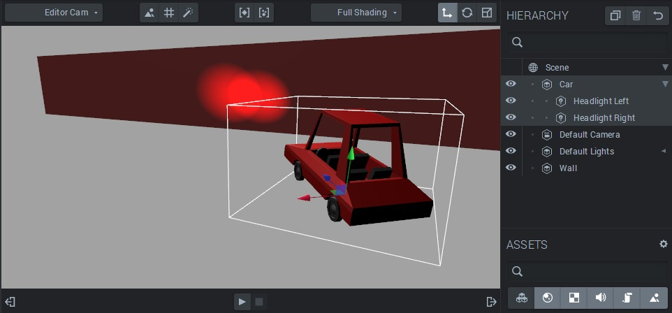
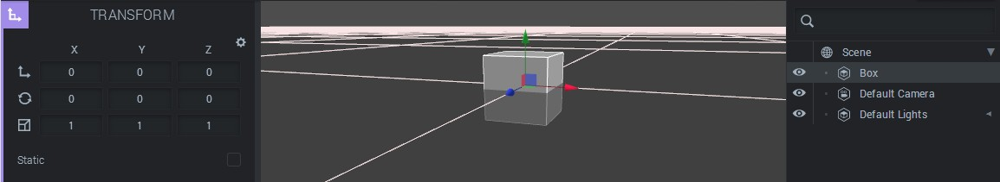
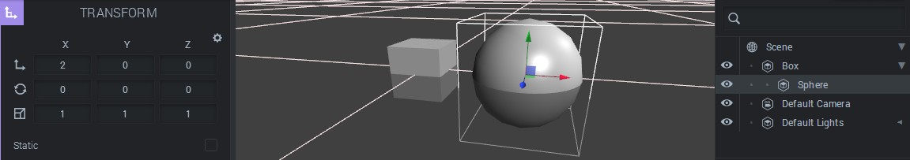
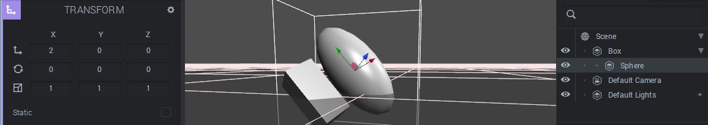

The hierarchy in Goo Create lets us build a *scene graph*. In short, the hierarchy makes it possible to make entities follow other entities when moved, by connecting their 3D transforms in a graph structure.

This tutorial uses *Lights*, so you may be interested in reading the [Lights tutorial]({{ '/tutorials/create/lights' | prepend: site.baseurl }}) first.

## A Simple Example

Consider this model of a car (which you can import it from the *Asset Library*). We are building a racing game and would like some headlights. Therefore, we've added two spotlights and carefully put them in the right spot and rotated them in the correct direction.

A car with two headlights, made from spotlights. Here the right one is selected  

What happens when we move the car? The car will move away, leaving the spotlights behind. This is obviously not what we'd like. We want to have the lights to stay in place relative to the car entity! Therefore, we need to make the lights *children* of the car entity. This is done by dragging the *Headlight Left* and *Headlight Right* entities into the *Car* entity in the *Hierarchy panel*. After doing that, we see that the hiearchy menu reflects the new graph structure. The lights are sitting one level below the car. When we move the car around in the scene, the lights will follow!

To the right, we see the new (expanded) hierarchy structure. To the left, we see that the lights follow if we move the Car entity.

## 3D Transforms

So, how does this work? We'll have to look into *transforms* to understand. All entities in the 3D world has a *transform*. The transform contains information about the entity's *translation* (position), *rotation* and *scale*. All these quantities are in the form of vectors with *x*, *y* and *z* components. For example, an entity might have the translation (5, 0, 0). That would mean that it's positioned five length units along the *x* axis away from its *origin*, which is  (0, 0, 0). Transforms in Goo Engine are handled by the *Transform Components*.

## Local and Global Coordinates

There are two types of transforms, or sets of coordinates, to keep track of. They're called the local and the global transforms. The *global transform* is how we have mapped the entire 3D world, and the global transform has its origin in the middle of the scene, at (0, 0, 0). The *local transform* is how each entity is transformed relative to its parent! If we take a look at the hierarchy we see that all entities need to be children of the Scene. That simply means that initially, all transforms are directly relative to the scene. If we add an entity it will have the local translation (0, 0, 0) and the global translation (0, 0, 0), for example.  

A new box, a child of the Scene, placed in the origin  

Now as we build deeper hierarchies, things change a little.  Let's add another entiity, say a sphere. Then we make it a child of the Box and after that move the Sphere two units along the x axis.  

A sphere made a child of the box, and then moved two units along the x axis  

Now what happens when we move the *box? *The sphere will follow, as we know by now. The box's coordinates will naturally change, but what happens with the sphere? If we take a look we se that _nothing has happened_, even though the sphere is clearly in a new position. This is because what we see as transforms values are the *local* coordinates. The sphere's local coordinates are relative to the box, and the box is all that the sphere is concerned with. The *global* transform is changed. It represents the actual position, relative to the scene's origin, that the sphere now has. It can be derived by combining the local transforms of the box and the sphere, but that's a more advanced topic.

Moving, rotating and scaling the box. The sphere's local transform remains unchanged!  

All transforms are calculated using matrix operations under the hood. The use of [transform matrices](//en.wikipedia.org/wiki/Transformation_matrix) are fundamental to the science of computer graphics.

## Hints and Tricks

### Local Transform Widgets

Sometimes, it is useful to move an entity along it's local axes. Press 'R' when an entity is selected to switch between local and global mode.  

Left is translation along the global axes and right is translation along the entity’s local axes  

### Center of Rotation

An empty parent entity is a good way to achieve an off-center center of rotation. Simply place the parent entity where the center should be and use it when rotating, and move the child relative to it.  

Off-center rotation using a parent entity  

## More Uses for Hierarchical Transforms

Hierarchical transforms are fundamental to computer graphics, and here are just some uses for it.

*   Compose objects out of several entities, as we have seen before.
*   Using a parent entity to move a group of entities together.
*   Import models from different sources and scale them relative to each other to fit together.
*   Use an empty entity as a parent and use it as a center of rotation.

## Further Reading

Interested in more advanced topics? Check out the Entities and Components tutorial to see how things are implemented in Goo Engine, or read about the [math of transformation matrices](//en.wikipedia.org/wiki/Transformation_matrix)!
