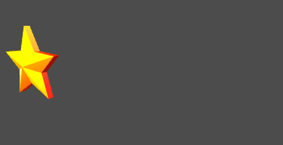
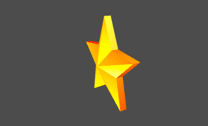
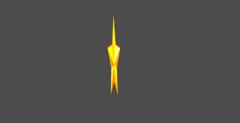

This tutorial will walk you through how to translate, rotate and scale objects via Scripting in Goo Create.

## Rotation, Translation and Scale

A *Transform* positions an entity and all of its vertices in space. A typical 3D transform consists of three parts: rotation, translation, and scale.

### Translation

The translation is simply a three-dimensional vector, describing an entity's position as 3D coordinates *(x, y, z)*. Its default value is the origin, *(0, 0, 0)*.

The following script moves the entity along the X axis.

var update = function(args, ctx) {
    ctx.entity.transformComponent.setTranslation(Math.sin(ctx.world.time), 0, 0);
};

To get the local translation vector, use `ctx.entity.transformComponent.getTranslation()`. To get the world translation vector, use `ctx.entity.transformComponent.getWorldTranslation()`. See the [TransformComponent API](http://code.gooengine.com/latest/docs/index.html?c=TransformComponent).

### Rotation

The rotation is used to specify an entity's rotation. It's represented by a *3x3 matrix*, also called a [rotation matrix](http://en.wikipedia.org/wiki/Rotation_matrix#In_three_dimensions). Luckily, you won't have to care too much about the mathy details if you don't want to.

The following sample script sets the entity rotation around the Y axis.

var update = function(args, ctx) {
    ctx.entity.transformComponent.setRotation(0, ctx.world.time, 0);
};

If you want to use rotation matrices instead, you can do something like this:

var setup = function(args, ctx) {
    ctx.matrix = new goo.Matrix3();
};

var update = function(args, ctx) {
    ctx.matrix.fromAngles(0, ctx.world.time, 0);
    ctx.entity.transformComponent.setRotationMatrix(ctx.matrix);
};

And quaternions:

var setup = function(args, ctx) {
    ctx.quaternion = new goo.Quaternion();
    ctx.matrix = new goo.Matrix3();
};

var update = function(args, ctx) {
    ctx.quaternion.fromAngleAxis(ctx.world.time, goo.Vector3.UNIT_Y);
    ctx.matrix.copyQuaternion(ctx.quaternion);
    ctx.entity.transformComponent.setRotationMatrix(ctx.matrix);
};

See the [Matrix3](http://code.gooengine.com/latest/docs/index.html?c=Matrix3) and [Quaternion](http://code.gooengine.com/latest/docs/index.html?c=Quaternion) APIs.

### Scale

The scale is, like the translation, a three-dimensional vector. Its default value is *(1, 1, 1)* meaning that the entity scale along each axis is one. If we would use the vector *(2, 2, 2)* instead, that would mean that the entity is *twice as big in each direction*.

The following script animates the scale of the entity along the X direction.

var update = function(args, ctx) {
    ctx.entity.transformComponent.setScale(2 * Math.abs(Math.sin(ctx.world.time), 1, 1);
};

### The Transform Matrix

Now when we have an understanding of the three parts above, we can grasp the full transform a little better. A transform is a combination of a translation, a rotation and a scale. These three quantities (two vectors and one matrix) are combined into a final *transform matrix*. This matrix represents the total, combined result of the three components. The transform matrix is of size 4x4.

### The Transform API

We have already seen that the matrix and vector classes already have some helper functions, and the [Transform class](http://code.gooengine.com/latest/docs/index.html?c=Transform) brings some more. It being essentialy a matrix (after combining) one can for example combine this matrix with other transform matrices, apply points or vectors to it, or invert it. There might be special cases where those kinds of operations are neccecary if you're writing an app using advanced transforms. There are other useful functions, but these functions will also be accessible from the *TransformComponent* directly, and we recommend to use them on that level.

## The Transform Component

Goo Engine implements transforms in the [TransformComponent](http://code.gooengine.com/latest/docs/index.html?c=TransformComponent). The component effectively takes care of all the details, and makes sure everything happens in the correct order. Moreover, the [TransformComponent API](http://code.gooengine.com/latest/docs/index.html?c=TransformComponent) adds a lot of useful methods.

### The TransformComponent API

The API has functions for *adding* or directly *setting* rotation, translation or scale. There are also *getters* for accessing these values. To build hierarchies and parent/children relationships between entities, one uses the *attachChild* or *detachChild* functions. The function lookAt can be used to orient an entity in a certain direction.

<iframe allowfullscreen src="//goote.ch/1107233399a27f819dd36d3e10abf2088e1717c8/"></iframe>


// Have the entity (Cone) look at the Sphere
// Sphere is moving with the super simple translation script above

var setup = function(args, ctx) {
    ctx.entityToFollow = ctx.world.by.name('Sphere').first();
};

var update = function(args, ctx) {
    ctx.entity.lookAt(ctx.entityToFollow.getTranslation());
    // Could also have used ctx.entity.transformComponent.lookAt(...
    // No need to call setUpdated() when we use the helper functions!
};


### Local and Global Coordinates and Hierarchies

The 3D world contains two different coordinate systems and corresponding transforms. The local transform orients an entity relative to its parent, and the global transform is the resulting transform relative to the root, or the world coordinate. The root is represented by the Scene in the Goo world. The TransformComponent has two transform members, the *transform* (local) as well as *worldTransform*!

In the examples above, we have called *setUpdated()* on the transform component after manually editing the individual parts. This tells the engine that the transforms need to be updated. This is done for efficiency reasons, the engine won't update unchanged values. For more control, one could manually call *updateTransform()* or *updateWorldTransform()* to trigger these recalculations. When we use the helper methods of the TransformComponent, *we don't have to call setUpdated()*! The engine does this for us automatically.

Refer to the [Hierarchy and Transforms tutorial]({{ '/tutorials/create/trasnform-hierarchy' | prepend: site.baseurl }}) for some examples on hierarchies in Create and more discussion about local/global transforms.
