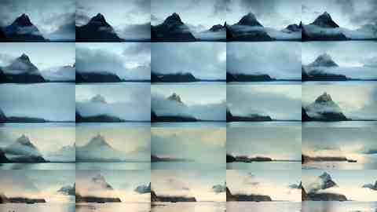
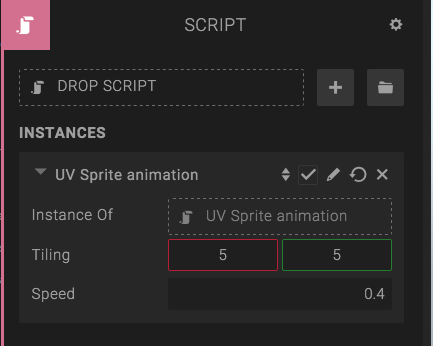

Say you want to make an old school pixel style game, where you have animations defined in sprite sheets, like in the following image (right-click and click "Save image as..." to save to disk):

Or, say that you want to create an animated video on a mesh (but you don't want to use a video texture for some reason). Convert the video into a spritesheet like the following (right-click and click "Save image as..." to save to disk):

I will not show you how to convert the video in this tutorial, but I can show you how to make the animation inside Create.

1. Put the spritesheet texture in the *Diffuse Texture* slot in the material panel on your entity.
2. Update the rest of the material settings, so the entity looks good. If you're using the explosion spritesheet and want a "sprite look", set all colors to black, except for the *Ambient color*, which you set to white. Set renderqueue to *Transparent* and blending to *TransparencyBlending*.
3. Put the script provided below in a *Script Component* on the same entity.
4. Enter the number of sprites in the sprite sheet in X and Y directions, in the "tiling" parameter field. 9x9 for the explosion and 5x5 for the mountain spritesheet.
5. Set the speed of the animation in the "animationTime" parameter. This number is the number of seconds it takes for the whole animation to loop once.
6. Press Play.

You can find the UV animation script below. The only thing it does is setting the *UV Repeat* and *UV Offset* of the texture each frame, depending on the current time. The resulting effect is a spritesheet animation on the mesh.

var setup = function (args, ctx) {
  if(!ctx.entity.meshRendererComponent) return;
  ctx.tex = ctx.entity.meshRendererComponent.materials[0].getTexture('DIFFUSE_MAP');
  if(!ctx.tex) return;
  ctx.tex.repeat.setDirect(1/args.tiling[0], 1/args.tiling[1]);
};

var update = function (args, ctx) {
  if(!ctx.tex) return;
  var t = ((1/args.animationTime) * ctx.world.time) % 1;
  var tileX = Math.floor(args.tiling[0] * args.tiling[1] * t % args.tiling[1]);
  var tileY = Math.floor((args.tiling[1] * t) % args.tiling[1]);
  ctx.tex.offset.setDirect(tileX, tileY).mul(ctx.tex.repeat);
  ctx.tex.offset.y = 1 - ctx.tex.offset.y;
};

var parameters = [{
  key: 'tiling',
  type: 'vec2',
  description: 'The number of sprites in X and Y directions.',
  'default': [1, 1]
}, {
  key: 'animationTime',
  type: 'float',
  description: 'The time it should take for the animation to cycle through all the frames once.',
  'default': 1
}];

## Resources

* [Live demo](https://c1.goote.ch/5a3c485848cf4289bed1af5213b70d41.scene)
* [Public Create scene](https://create.goocreate.com/edit/5a3c485848cf4289bed1af5213b70d41.scene)
