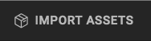
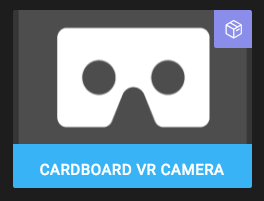
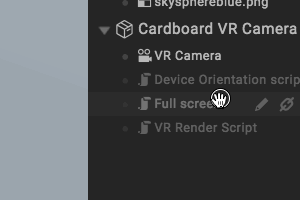
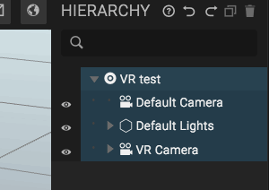
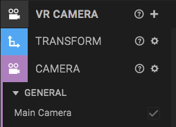
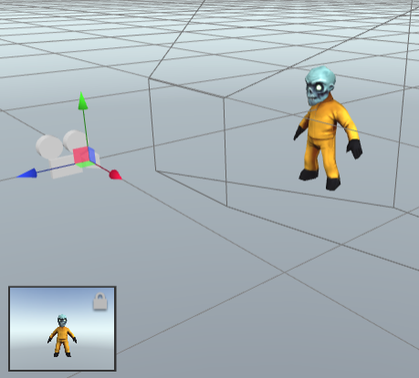
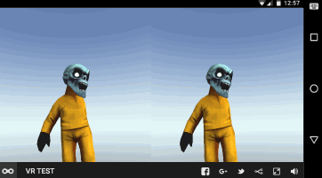

<h2>Create the scene</h2>

<ol>
<li>Start Goo Create by opening <a href="https://create.goocreate.com" target="_blank">Goo Create</a> in your browser.</li>
<li>Click "New Scene"</li>
<li>Choose <i>Default scene</i>.</li>
<li>Enter a scene name and click Create.</li>
</ol>

## Import the Cardboard VR Camera

Open the *Asset Library* by clicking *Import Assets* in the top menu.

Search for "Cardboard VR Camera" and double-click the script asset to add it to your scene.

Wait for the script to load, then drag the *VR Camera* entity from the Asset bin onto the viewport.

Note that you get a camera and a description text in the viewport. The description text can be removed. Open the *VR Camera* entity and remove the *VRDecription* entity.

Select the *VR Camera* entity, open the Camera component panel, and check the *Main Camera* checkbox. This make the engine render from this camera when the scene starts.

**Optional**: In the *Script* component panel on the camera, you find various settings for the VR. You can enable/disable scripts (fullscreen or stereoscopic rendering) or tweak parameters.

## Try it!

Press play. Notice that nothing happens. What?

Actually, the reason why is simple. The scene is empty and the skysphere is symmetric, so you can't see the stereoscopic rendering. (Also, you cannot look around, but let's worry about that later).

To notice the stereoscopic rendering, we need to add something to the scene.

## Add something to the scene

Click *Import Assets* again. Search for "zombie" and select the *Zombie Character*.

When the asset is loaded, drag and drop the *Zombie* entity from the Asset bin onto the viewport. Place it in front of the camera, for example at `(0, -1, -3)`.

## Try it on your phone

Now press play to preview the scene. You will notice that you see two zombies! Stereoscopic vision! But hey, you can't look around... That's because the desktop computer you're using doesn't have any orientation sensors. Let's try it on a smartphone instead!

Click *Scene > Publish* from the top meny and then the blue *Publish* button at the bottom of the dialog.

Open the scene on your smartphone browser. You now get stereoscopic rendering and lookaround!

## Done

You've now added a VR camera to your scene. Now you can make all sorts of cool VR experiments.