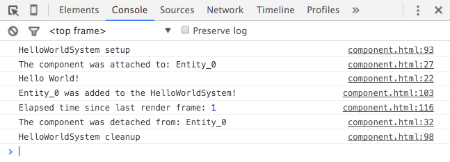

In this tutorial, we'll create our own *Component* and *System* using Goo Engine. In the end of the tutorial, you will have an own type of component and you can use it like the following.

entity.helloWorldComponent.talk(); // "Hello World!"


## World, Entities, Components and Systems

Goo Engine implements an Entity-Component-System (ECS) architecture. Briefly speaking, we have ```World``` containing ```Entity``` and ```System``` instances. The entities carry a number of ```Component``` instances. The systems operate on entities.


## Setting up

We will use the Goo Engine in a standalone HTML file. Create a new HTML file on your computer and serve it in a local web server.

You can find the initial HTML source below. The HTML file includes the Goo Engine (goo.js) and then runs an empty script. We will add more code to the script shortly.

<html>
<head>
    <script src="http://code.gooengine.com/0.15.30/lib/goo.js" type="text/javascript"></script>
</head>
<body>
    <script type="text/javascript">
        // We will define our classes here!
    </script>
</body>
</html>


## Defining the HelloWorldComponent

First we will add code to the script to define a ```HelloWorldComponent```. The only purpose of this component is to log a message to the console.

// Our custom component class
function HelloWorldComponent(message){
    goo.Component.apply(this, arguments);

    // Store some data on this component
    this.message = message;
}
HelloWorldComponent.prototype = Object.create(goo.Component.prototype);
HelloWorldComponent.prototype.constructor = HelloWorldComponent;

// Define the component name. Required!
HelloWorldComponent.prototype.type = 'HelloWorldComponent';

// A method
HelloWorldComponent.prototype.talk = function(){
    console.log(this.message);
};

// Optional
HelloWorldComponent.prototype.attached = function(entity){
    console.log('The component was attached to: ' + entity.name);
};

// Optional
HelloWorldComponent.prototype.detached = function(entity){
    console.log('The component was detached from: ' + entity.name);
};

We let our ```HelloWorldComponent``` inherit from the ```goo.Component``` class. In the constructor we store the string ```message``` on the component, which is the only data that the component will hold.

We also add a method called ```talk``` on the entity, that will log the ```message``` to the console.

The ```attached``` and ```detached``` methods are optional, and they can be used to detect when the component is added to an entity.


## Making a HelloWorldSystem

We will now create a ```HelloWorldSystem``` for the ```HelloWorldComponent```. The use of a System is not needed in this simple example, but it's good to know that they exist when you create more complex components.

// Our custom System
function HelloWorldSystem(){
    // The "interests" specifies which entities that should be added to this system.
    var interests = ['HelloWorldComponent'];
    goo.System.call(this, 'HelloWorldSystem', interests);

    // This system is currently active!
    this.passive = false;
}
HelloWorldSystem.prototype = Object.create(goo.System.prototype);
HelloWorldSystem.prototype.constructor = HelloWorldSystem;

// Called when the System is added to the World
HelloWorldSystem.prototype.setup = function(){
    console.log('HelloWorldSystem setup');
};

// Called when the System is removed from the World
HelloWorldSystem.prototype.cleanup = function(){
    console.log('HelloWorldSystem cleanup');
};

// Called when an entity is added to the system
HelloWorldSystem.prototype.inserted = function(entity){
    console.log(entity.name + ' was added to the HelloWorldSystem!');
};

// Called when an entity is removed from the system
HelloWorldSystem.prototype.deleted = function(entity){
    console.log(entity.name + ' was removed from the HelloWorldSystem');
};

// Called on every frame
HelloWorldSystem.prototype.process = function(entities, tpf){
    // Operate on entities here!
    // "entities" is an array of active entities in this System,
    // and tpf is the elapsed time since last frame.
    console.log('Elapsed time since last render frame:', tpf);
};

// Every System has a priority. The default priority is 0.
// The priority decides which order in which systems gets processed. Lower value is higher priority.
HelloWorldSystem.prototype.priority = 1000;

## Try it out

Now that you've defined your System and Component, you can running the following code.

// Create a world
var world = new goo.World();

// Create and add the system to the world
var system = new HelloWorldSystem();
world.setSystem(system);

// Create an entity
var entity = world.createEntity();
entity.addToWorld();

// Add our component to the entity
var component = new HelloWorldComponent('Hello World!');
entity.setComponent(component);

// Run our "talk" method
entity.helloWorldComponent.talk(); // "Hello World!"

// Process the world one "frame"
world.process();

// Remove the component after we're done.
entity.clearComponent('HelloWorldComponent');

// Remove the system from the world
world.clearSystem('HelloWorldSystem');

If you open the console, you'll see something similar to this. It means that everything worked properly.

