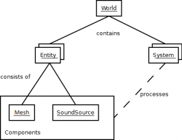

Hello and welcome, this tutorial will show you how to create a simple solar system using Goo Engine. Please note that it much easier to [create this scene in Goo Create](http://create.goocreate.com) and that it is recommended to use Goo Create for most use cases anyways. But if you really want to or must use the Goo Engine directly this tutorial will get you started.

## Introduction

Goo Engine is built using what many consider the holy grail of game engine design: The Entity-Component-System. The [Entity-Component-System](http://en.wikipedia.org/wiki/Entity_component_system) is a software design pattern that favors **composition over inheritance**. Users instantiate simple [entities](//code.gooengine.com/latest/docs/index.html?c=Entity) and then add powerful but focused [components](//code.gooengine.com/latest/docs/index.html?c=Component) to enable specific features. Finally, single purpose [systems](//code.gooengine.com/latest/docs/index.html?c=System) update all entities which have a matching **component**.

## Now contrast this with the traditional way of thinking:

_"The traditional way of thinking about games is fairly intuitive. You represent objects in the game as objects in code. If you have a player, you'll create a player class that contains all the player's attributes; things like position, health, ammo, etc. Then you create an update() method that calls other methods like shoot() or jump() that read and change those attributes. To avoid repeating yourself, you'll probably end up creating some base classes because entities in a game often have many different variations with small differences."_

## The problem

_"The problem with this, however, is that in order to actually reuse code as much as possible, you end up being forced into deep unnatural object hierarchies with lots of overridden methods. With thousands of entities in a game, you lose all sense of where things are defined, how they're changed deeper in the hierarchy, and where the best place to add something really is. This approach also means new combinations of functionality have to be written by programmers, forcing game designers to ask for different variations."_ (Quoted from the excellent article [anatomy-of-a-knockout](http://www.chris-granger.com/2012/12/11/anatomy-of-a-knockout/) by Chris Granger)

## The solution

An Entity-Component-System provides the ultimate flexibility in game design: Mix and match the pre-built functionality (components) to suit your needs. Want an object that emits sound? Add a SoundComponent. Want the same object to be acting as a light source? Simply add a LightComponent.

## Let's get started

In this tutorial we will create a little solar system with a sun, a world and a moon. Here is a preview:

<iframe src="//jsfiddle.net/5mLc3sn5/embedded/result,js,html,css"></iframe>

You should see a yellow sun orbited by a world looking like earth which in turn is orbited by a little moon. If you don't see this, check if you have a WebGL compatible browser: <a href="http://get.webgl.org">http://get.webgl.org</a>

To the left you should see the code for the demo in an online code editor.

If you change something in the code, the demo above should update after half a second. If you break something and can't fix it, don't worry, just reload this tutorial to reset the code. Feel free to experiment!

#### Code explanation

"use strict";

This line tells the JavaScript parser in the browser to be less forgiving of programming mistakes. This helps us to avoid hard-to-find bugs and is recommended for any JavaScript program. You can read more about it <a href="https://developer.mozilla.org/en-US/docs/Web/JavaScript/Reference/Functions_and_function_scope/Strict_mode">here</a>.

var gooRunner = new goo.GooRunner(), world = gooRunner.world;


This line instantiates <a href="http://code.gooengine.com/latest/docs/index.html?c=GooRunner">GooRunner</a> - a class that holds the main game loop. This loop will try to render our 3D scene at a silky smooth 60 frames per second. It also creates a reference to the <a href="http://code.gooengine.com/latest/docs/index.html?c=World">world</a> instance which contains the list of all entities in a scene.

document.body.appendChild(gooRunner.renderer.domElement);


The GooRunner internally creates a new <a href="http://code.gooengine.com/latest/docs/index.html?c=Renderer">Renderer</a> instance, the renderer in turn creates a new <a href="https://developer.mozilla.org/en-US/docs/Web/API/HTMLCanvasElement">HTMLCanvasElement</a> and creates the <a href="http://www.khronos.org/registry/webgl/specs/latest/1.0/#5.14">WebGLRenderingContext</a> for us. In our case we just append it to the body element of our document, but if you want to use CSS to style it, it is better to give it an ID and then append it:

goo.renderer.domElement.id = 'goo';


Alternatively you can also pass in a canvas you created like this:

var gooRunner = new GooRunner({canvas: myCanvas});


Also, if you want the scene background to be a different color, you can call setClearColor on the renderer like this:

gooRunner.renderer.setClearColor(0, 0, 0, 1); // parameters are RGBA, this would be black.


<h2>Textures part 1</h2>
Next we load 3 textures:

var tc = new TextureCreator()
var sunTex = tc.loadTexture2D('sun.png');
var earthTex = tc.loadTexture2D('earth.jpg');
var moonTex = tc.loadTexture2D('moon.jpg');


<strong>Textures</strong> are usually images that will be wrapped around our 3D models and usually define the color. Technically, textures used for colors are called <a href="http://en.wikipedia.org/wiki/Diffuse_reflection">diffuse maps</a>.

function createAstronomicalEntity(radius, texture, color) {
    var meshData = new goo.Sphere(24, 24, radius);
    var material = new goo.Material(goo.ShaderLib.uber);
    material.uniforms.materialAmbient = color;
    material.setTexture('DIFFUSE_MAP', texture);
    return world.createEntity(meshData, material, function (entity, tpf) {
       entity.addRotation(0, 0.5*tpf, 0);
    }).addToWorld();
}


We want to create three spheres for our scene. So in order to not repeat code we collect the code that can be shared for all three spheres in a utility function called <strong>createAstronomicalEntity</strong>. It takes three parameters: the sphere radius, the texture that shall be used for the sphere and the ambient color. Let's go over it line by line:

var meshData = new goo.Sphere(24, 24, radius);

This line creates new [MeshData](http://code.gooengine.com/latest/docs/index.html?c=MeshData) in the form of a [sphere](http://code.gooengine.com/latest/docs/index.html?c=Sphere). You can also create [boxes](http://code.gooengine.com/latest/docs/index.html?c=Box), [tori](http://code.gooengine.com/latest/docs/index.html?c=Torus), [cylinders](http://code.gooengine.com/latest/docs/index.html?c=Cylinder) and [quads](http://code.gooengine.com/latest/docs/index.html?c=Quad) among others. **Sphere** takes four parameters: zSamples, radialSamples, radius and texture mode. The first two parameters basically tell how many triangles the sphere should be created from. High values look better but cost a bit more performance. Try setting the values to 4 or 3 and see what happens.

## MeshData

**new goo.Sphere** returns an object of type [MeshData](http://code.gooengine.com/latest/docs/index.html?c=MeshData) which contains an **attributeMap** and the actual **vertexData.** MeshData is a real powerhouse and contains some cool code to make rendering complex 3D objects fast by interleaving all vertex data. But what is **vertex data**? Vertex data is at the **heart** of rendering objects, it is the reason why Mozilla invented the [Float32Array](https://developer.mozilla.org/en-US/docs/Web/API/Float32Array) and all the other [typed arrays](https://developer.mozilla.org/en-US/docs/Web/JavaScript/Typed_arrays). The **most important** things vertex data contain are the **x, y and z** **coordinates of the vertex.** Three vertex positions form a **triangle** and triangles are what all models are made of in WebGL. But there is more, next to the position of the vertex you can define the **color** and multiple [texture coordinates](http://en.wikipedia.org/wiki/UV_Mapping) and the [normal vector](http://en.wikipedia.org/wiki/Normal_(geometry)) (which is really useful for lighting models realistically). What is the **attributeMap?** The attributeMap contains name mappings from the names for the different vertex data types in the shader code  to the JavaScript names for them in MeshData. If you use shaders from the Goo [ShaderLibrary](http://code.gooengine.com/latest/docs/index.html?c=ShaderLib) **you don't need to worry about this,** but sometimes you want to use a shader you found online or wrote in the past and with setting the attributeMap you can use them with the Goo Engine. Just map the names that are used in the shader to the fields in MeshData. ([Example](http://jsfiddle.net/WL8rH/6/))

## Material

var material = new goo.Material(goo.ShaderLib.uber);

This line creates a new [Material](http://code.gooengine.com/latest/docs/index.html?c=Material) instance using the awesome **uber shader** provided by the Goo shader library. A **Material** instance primarily contains the used [WebGL Shader](http://en.wikipedia.org/wiki/OpenGL_Shading_Language) code, **uniforms** and a **map of textures**.

## Shader

_Uber_ is a reference to the German word [über](http://en.wikipedia.org/wiki/%C3%9Cber) which means above and is a [common name](https://www.google.de/search?q=ubershader) for shaders that supports many features. You can also think of it as a super shader :-) Our **uber** shader contains beautiful light and shadow calculations recognizing different light types (point, directional or spot), material features like ambient colors, specular colors or shininess, powerful texture maps for **diffuse**, **normal**, **specular** and **depth** calculations and many more features.

## Uniforms

**Uniforms** are variables that are used in the shader that can be set from JavaScript. Some uniform variables we use are **viewMatrix, projectionMatrix, worldMatrix, cameraPosition, lightPosition, materialAmbient, materialDiffuse and materialSpecular**.

## Textures part 2

Next you can see how you can set an ambient color and add a texture to the **map of textures** in the Material.


material.uniforms.materialAmbient = color; material.setTexture('DIFFUSE_MAP', texture);


The second line tells the material instance to use the provided **texture** as it's diffuse map. Remember that diffuse simply stands for the **basic colors** an object has for each surface pixel. If we wanted some cool bump mapping effects we could similarly set a different texture as a depth or normal map. Other texture map names in uberShader are: NORMAL_MAP, SPECULAR_MAP, LIGHT_MAP, EMISSIVE_MAP, DEPTH_MAP

## Entities

return world.createEntity(meshData, material, function (entity) {
    entity.addRotation(0, 0.5*tpf, 0);
}).addToWorld();


This piece of code creates our first [Entity](http://code.gooengine.com/latest/docs/index.html?c=Entity) by calling **createEntity** on the [world](http://code.gooengine.com/latest/docs/index.html?c=World) object. As we read above in an **ECS** an entity is very **simple**. In Goo it only contains an **ID**, a **name** and a **collection** of assigned **components.** **createEntity** hides all of the boilerplate code that is needed to be able to render an entity. The minimum components needed to render an entity are: [TransformComponent](http://code.gooengine.com/latest/docs/index.html?c=TransformComponent), [MeshDataComponent](http://code.gooengine.com/latest/docs/index.html?c=MeshDataComponent) and [MeshRendererComponent](http://code.gooengine.com/latest/docs/index.html?c=MeshRendererComponent). So the way we call it world.createEntity basically does this for us:

var entity = new goo.Entity(world);
entity.setComponent(new goo.TransformComponent());
entity.setComponent(new goo.MeshDataComponent(meshData));
entity.setComponent(new goo.MeshRendererComponent(material));
entity.setComponent(new goo.ScriptComponent(script));


So you can see using createEntity saves us from typing a lot of lines, **but what are all these components?** Let's take a look!

## TransformComponent

The [TransformComponent](http://code.gooengine.com/latest/docs/index.html?c=TransformComponent) contains the information where an entity is located (**translation**), if and how it is re-sized (**scale**) and where it is looking at (**rotation**). Together these three properties form what is called a **transform** in the math world. You can access these properties like this:

entity.transformComponent.transform.translation.set(x, y, z);
entity.transformComponent.transform.scale.set(xs, ys, zs);
entity.transformComponent.transform.rotation.fromAngles(yaw, roll, pitch)


after changing these properties you will need to inform the engine about changes by calling

entity.transformComponent.setUpdated();


And last but not least <strong>TransformComponent</strong> is the component you will use to <strong>link entities together</strong> to form a <strong>scene graph:</strong>

entity.transformComponent.attachChild(entity2.transformComponent);


When you do this, every change to the entity1 transform will be applied to the entity2 transform **before** applying it's own transformation. This is incredibly useful for our example, because now we can simply attach the **earth** entity to the **sun** entity and if we now rotate the sun around it's center the earth will appear to fly around the sun. Of course we use the same trick with the **moon**. All these functions can look a bit scary but **fear not**, the TransformComponent injects many **helper functions** into the entity it is assigned to for the most common use cases, so you don't have to type so much:

entity.setTranslation(x, y, z);
entity.addTranslation(x, y, z);
entity.getTranslation();
entity.setScale(xs, ys, zs);
entity.getScale();
entity.setRotation(yaw, roll, pitch);
entity.addRotation(yaw, roll, pitch);
entity.getRotation();
entity.lookAt(position, up);
entity.attachChild(entity2);


These helper functions also call <strong>setUpdated</strong> for you when needed and best of all <strong>you can chain them</strong>:

entity.setTranslation(0, 0, -10).setScale(2,2,2).setRotation(Math.PI, 0,0);


## MeshDataComponent

Next a [MeshDataComponent](http://code.gooengine.com/latest/docs/index.html?c=MeshDataComponent) is added. This component simply contains the **MeshData** instance we created above using the **Sphere** class.

## MeshRendererComponent

Now a [MeshRendererComponent](http://code.gooengine.com/latest/docs/index.html?c=MeshRendererComponent) is added. This component is a bit more interesting - not only does it contain the **Material** instance we created above using the **Material** class but also a couple of very useful settings. They are **cullMode** ('Dynamic' or 'Never') and the boolean settings **castShadows**, **receiveShadows**, **isPickable**, **isReflectable** and **hidden**. (boolean settings can only take the value **true** or **false**). Also keep in mind that a MeshRendererComponent can contain more than one material. That is why **entity.meshRendererComponent.materials** is an array. Finally, the MeshRendererComponent contains the field **worldBound** which is an instance of the class **BoundingVolume** that can be used for [collision detection](http://en.wikipedia.org/wiki/Collision_detection).

## ScriptComponent

function (entity, tpf) {
    entity.addRotation(0, 0.5*tpf, 0);
}

The last component that is added to our astronomical entity is a [ScriptComponent](http://code.gooengine.com/latest/docs/index.html?c=ScriptComponent). These components can store one or more objects which contain a **run** method that take two parameters: The entity to which the script is connected to and the time it took to render the last frame (**tpf** for short). The script is called every frame and can be used for an infinite amount of things. In our case we use it to rotate the entity around it's local **Y** axis. Incorporating the **tpf** value in movement and rotation calculations is a good idea for all things **animation** because then you are frame rate independent, i.e. it doesn't matter how long it took to render the last frame because the **tpf** will reflect it and your animation moves at the same speed even on lower performing computers. (At 60 FPS the value for **tpf** will be around 0.016 in seconds) Finally, we add the entity to the world with the call: **addToWorld().**

_It might be interesting to know, that this line does **not** add the entity right away but rather it **schedules** it for addition on the next render call. You can force this by calling:_

world.process(); // don't call this in Goo Create scripts however or you get an endless loop.


You can get all entities by calling

world.getEntities();


<h4>Checkpoint, great job!!</h4>
We covered a lot of ground but we are not done yet, luckily with all that you learned the rest of this tutorial is a piece of cake!

<h2>Sun</h2>

var sun = createAstronomicalEntity(1, sunTex, [1,1,0.3,1]);


So with our awesome helper function <strong>createAstronomicalEntity</strong>, it's easy to create our sun entity. We pass in 1 as the radius and sunTex as the texture. The texture is a bit too white for my taste so I adjusted the final appearance using the <strong>materialAmbient</strong> uniform. It expects an array with 4 values in RGBA (red, green, blue, alpha) order and I set it to a bright yellow. Keep in mind that in WebGL colors range from 0.0 to 1.0 and not from 0 to 255!

<h2>Earth</h2>

var earth = createAstronomicalEntity(0.5, earthTex, [1,1,1,1]);
earth.setTranslation(5, 0, 0);
sun.attachChild(earth);


Here we create earth, at half the size of the sun. Yes, I know this is slightly inaccurate :-). We also pass in the earth texture we loaded before. Then we translate the entity 5 units to the right - along the X axis. Goo by default uses a <em>right hand</em> coordinate system:

The earth texture was fine, but because we only have one light in the scene, earth was a bit dark, so I set the ambient color to white. Finally, we attach the earth entity to the sun. So if we rotate or move the sun, earth will be rotated and moved as well. In our case it will be rotated.

<h2>Moon</h2>

var moon = createAstronomicalEntity(0.15, moonTex, [1,1,1,1]);
moon.setTranslation(1.4, 0, 0);
earth.attachChild(moon);


For the moon we do almost the same steps as with the earth. We just make it smaller yet again and give it the moon texture. And of course we attach it to the earth.

<h2>Let's get some sunlight!</h2>

var light = new goo.PointLight();
light.color.set(1,1,0);
world.createEntity(light).addToWorld();


Here you see how light is added to the world. There are 3 different types of light built into Goo: [PointLight](http://code.gooengine.com/latest/docs/index.html?c=PointLight), [DirectionalLight](http://code.gooengine.com/latest/docs/index.html?c=DirectionalLight) and [SpotLight](http://code.gooengine.com/latest/docs/index.html?c=SpotLight). The light position together with the normal vectors of a model's surface are used in the uber shader to calculate the brightness of the surface. Roughly speaking, the more a surface is turned towards the light, the brighter it will be. A **SpotLight** is a cone of light, where the apex is the light's position. You can think of it like a flashlight. Some of it's properties are **range**, **angle** and **exponent**. The angle sets the angle of the cone's apex. Exponent sets the angle of an inner cone called the **hotspot**. Entities in the hotspot get the full light, the light then falls off linearly to the outer angle. PointLight and SpotLight both have a **range** field that is used to limit the area of effect, both defaulting to 1000 units. A **PointLight** acts like a light bulb. It shines light in all directions starting from the light position. A **DirectionalLight** acts like the sun. It is meant to imitate parallel light rays. It only has one property: **direction**. Example:

var light = new goo.DirectionalLight();
light.direction.set(-1,-1,-1); // shines a bit down, to the left and to the front.
world.createEntity( light).addToWorld();


All lights share a couple of properties: **color (r,g,b), intensity** (0..1), **specularIntensity** (0..1), **shadowCaster** (true or false), **shadowSettings** and **lightCookie**. Because we simulate a solar system, at this scale, our sun acts like a light bulb, shining lights in all directions. For that, we use a **PointLight**. We should set the **color** to white to be more realistic, but it looks more interesting to set it to yellow. Also the default is white, so this gives me a chance to show you how the color is set. Try setting it to red like this:
light.color.set(1,0,0);


Then we use our friendly little helper <strong>createEntity</strong> again. In this case, this happens under the hood:

var entity = new goo.Entity(world);
entity.setComponent(new goo.TransformComponent());
entity.setComponent(new goo.LightComponent(light));


A <a href="http://code.gooengine.com/latest/docs/index.html?c=LightComponent">LightComponent</a> is very simple and only contains a reference to the used light.

<h2>And finally we add the camera</h2>


var camera = new goo.Camera(45, 1, 0.1, 1000);
var orbitScript = goo.Scripts.create(goo.OrbitCamControlScript, {lookAtDistance:15});
world.createEntity(camera, orbitScript, [0,0,15]).addToWorld();


The [camera](http://code.gooengine.com/latest/docs/index.html?c=Camera) is arguably the most important part of a scene. Without it you can't see anything. The scene will be rendered from the perspective of the camera. The parameters for the Camera constructor are **fov, aspect, near** and **far**. **Fov** stands for [field-of-view](http://en.wikipedia.org/wiki/Field_of_view) and is the extent of the observable world that is seen at any given moment. Here it is set in degrees. Try setting it to 90! **Aspect** stands for [Aspect-Ratio](http://en.wikipedia.org/wiki/Aspect_ratio) and this parameter reflects the ratio of the width of the WebGL canvas to its height. It used to be an important parameter, but now the system automatically checks and sets it, so we and you can just pass 1\. **near** and **far** determine the distances at which entities will still be rendered. Usually 0.1 and 1000 are good values. After we have our **camera** instance we pass it over to our trusty helper **createEntity** of course. But we also give it two more parameters, namely an** OrbitCamControlScript** and the array **[0, 0, 15]**. This is what happens under the covers:


var entity = new goo.Entity(world);
entity.setComponent(new TransformComponent());
entity.setComponent(new CameraComponent(camera));
entity.setComponent(new ScriptComponent(orbitScript));
entity.setTranslation([0,0,15]);


The **TransformComponent** is useful, of course, to position the camera in and make it look at our scene. The [CameraComponent](http://code.gooengine.com/latest/docs/index.html?c=CameraComponent) is very simple again and (almost) only contains the reference to our camera. Next, we set a **ScriptComponent** with an instance of an **OrbitCamControlScript** created by the Goo Scripts class. The **OrbitCamControlScript** allows you to **orbit** the camera **around a point** in space if you drag the mouse or to **zoom** in and out using the mouse wheel. Try removing the script, like this and see what happens:


world.createEntity( camera, [0,0,15]).addToWorld();


The last line shows you what happens when you pass an array with 3 elements to **createEntity**: It will be used to call **setTranslation**. It is a nice little trick to set the initial position of an entity.

Finally we **add** the cameraEntity to the **world** and we are...

<h4>Done!</h4>
