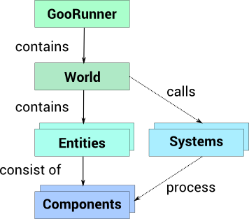

This is an article providing a high-level view of Goo Engine. The article will describe the Entity-Component-System architecture, how the Goo World is updated and how it all fits together.

## Entity-Component-System

Goo Engine is built using the Entity-Component-System philosophy. It is a software pattern that strongly encourages composition over inheritance, as we will see soon.

## Entities

An Entity can be thought of as a container. An Entity is a basic object in the World, but does not contain any functionality on it's own! This is a very important point. An empty Entity does not have any functionality at all. On the other hand, an Entity can be given any set of functionality and features by using Components.

## Components

A Component is made for a specific purpose. There are many types of Components, and each type gives an Entity its functionality. The easiest way to see this is trough some examples:

*   A **TransformComponent** places an Entity in 3D space, giving it a translation and rotation. Since this is such a basic functionality for a 3D engine, Entities created in Goo Engine will automatically have a TransformComponent.
*   A **CameraComponent** makes the entity function as a camera.
*   A **MeshRendererComponent** makes it possible for the Entity to have a mesh, and for the engine to render it.
*   A **LightComponent** adds a light to the Entity.
*   A **ScriptComponent** makes it possible to add custom code to an Entity.
*   ...and so on.

Each type of Component is meant to be simple in isolation, but Entities can of course have several components attached to it. A camera entity would need a TransformComponent and a CameraComponent, for example.

A light Entity typically consists of a TransformComponent and a LightComponent  

## Systems

Systems keep track of the components. Since each type of Component takes care of one specific thing, it makes sense to also have a System for each component type. When adding new Components to Entities, the Components get registered with the corresponding System. The Systems run continuously and make sure to update the Components when needed. As you might have guessed, isolating functionality in this manner provides excellent encapsulation between different kinds of features. Each System type can also be optimized to solve its specific tasks fast and efficient. Remember when you were told that each System has one matching Component? That was a simplification. In reality, one System can be interested in multiple Component types. The image below shows a very simple scene; a sphere and a camera. Both these objects are represented with Entities, and their features are represented with Components. The following happens: A TransformSystem keeps track of all transforms, a CameraSystem handles the single camera and a RenderSystem takes take of both the vertex data (MeshDataComponent) and the material (MeshRendererComponent) of the sphere.

A simple scene with two entities, their components and the needed systems

## The World and the Runner

### The World

The World harbors all Entities and provides a 3D world coordinate system for everything to lived in. This means that the World is the access point for all Entities when we want to modify them.

### The Runner

The Runner (or GooRunner) is responsible for running the game loop, making sure the Systems run, calling the renderers and that everything happens in the correct order. The Runner pulls the threads to make things happen, basically. The World is a member of the GooRunner (created automatically). Accessing the World (and from there everything in it) is typically done through the runner:


var gooRunner = new GooRunner();
var allEntities = gooRunner.world.getEntities();


## How it all fits together

This image below illustrated how the main parts fit together. GooRunner holds the world, which in turn contains the Entities. Entities in turn consist of different Components. To make everything run, GooRunner updates the World and its Systems, and each type of System takes care of the corresponding type of Component.

A schematic overview of the main parts in Goo Engine

## Details and Disclaimers

This article is a high-level description of what's going on, and intentionally leaves a lot of details out. For example, the components in Create look a little different than in engine code. The MeshDataComponent is represented by Geometry, and the MeshRendererComponent functionality is reached via Materials. These are just some simplifications that makes Create easier to work with, but it is useful to know what goes on behind the scenes. Another example of something that the article leaves out is Managers, who is the actual link for selecting Entities in the World.