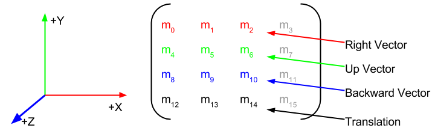

This article will go over the different ways you can define and set rotations on Goo Engine entities.

Accompanying this article is also a live [demo scene](https://goote.ch/bdfac8ffdb4644f689ec583e9d3fb7a1.scene/):

Rotation is one of the three basic transformations you can apply to an object in 3D space. Rotation in Goo Engine is expressed as a [Matrix3](http://code.gooengine.com/latest/docs/index.html?c=Matrix3) object. The default values are:


[1, 0, 0,
 0, 1, 0,
 0, 0, 1]


If you look closely at the rows you can see that the default matrix uses (1,0,0) at row 1, (0,1,0) at row 2 and (0,0,1) at row 3.

Now the cool thing is that row 1 contains the values for the right vector, row 2 the values for the up vector and row 3 the values for the back vector.
  
  

Goo Rotation Matrix Layout  

It is important that these three vectors are and stay one unit in length and that they are orthogonal to each other. This property of rotation matrices is called [Orthonormality](http://en.wikipedia.org/wiki/Orthonormality).  

Rest assured that if you use the built-in functions orthonormality will be preserved.  

If an entity uses the default rotation matrix it will "look" along the **negative z axis** and the "top of the head" will be pointed at the **positive y axis**.  

If you would want to look a little bit down you could use this rotation matrix:


[1, 0.0,  0.0,
 0, 0.8, -0.6,
 0, 0.6,  0.8]


If you look at the rows again you can see that the right vector still points along the positive x axis. The up vector is still pointing upwards but now it is leaning a bit along the negative z axis. The back vector is still pointing along the positive z axis but now it also leans a bit along the positive y axis. Taken together you can imagine we tilted our virtual head a bit down.

	Here is a <a href="https://goote.ch/0e7df388f6ca4787be8884a87504955e.scene/">demo scene</a> using different rotation methods including <a href="https://goote.ch/bdfac8ffdb4644f689ec583e9d3fb7a1.scene/">setting the rotation matrix</a> that makes the head look a bit down.

### Why is the third vector backwards and not forward?

Goo is based on WebGL which adopted the so called [right handed](http://en.wikipedia.org/wiki/Right-hand_rule) [coordinate system](http://en.wikipedia.org/wiki/Cartesian_coordinate_system). [DirectX](http://programmers.stackexchange.com/questions/17519/why-does-directx-use-a-left-handed-coordinate-system) in comparison adopted the left hand coordinate system, but the standard seems to be right handedness.  

Here is a picture showing the difference:  

  

**It is important to understand that both "hands" in the picture above are "looking" forward.** So in a **left** handed coordinate system forward is along the **positive z** axis, up is positive Y and right is positive X.  

In the picture above, the **middle finger** of the left hand points forward.  

In a right handed coordinate system forward is along the **negative z** axis, up is positive Y and right is positive X. In the picture above, the **back** of the right hand points forward.
  
So up and right stay the same, just forward changes.  

### Which class in the Goo Engine is responsible for managing the transform matrix?

Fittingly the class is called [Transform](http://code.gooengine.com/latest/docs/index.html?c=Transform). It contains the Vector3 **translation** and **scale**, the Matrix3 **rotation** and the combined Matrix4x4 **transform** matrix. 

The code for this combination is very simple:


/**
 * Updates the transform according to set scaling, rotation and translation. This is done automatically by the engine
 */
Transform.prototype.update = function () {
	var target = this.matrix.data;
	var rotation = this.rotation.data;
	var scale = this.scale.data;
	var translation = this.translation.data;

	target[0] = scale[0] * rotation[0];
	target[1] = scale[0] * rotation[1];
	target[2] = scale[0] * rotation[2];
	target[3] = 0.0;
	target[4] = scale[1] * rotation[3];
	target[5] = scale[1] * rotation[4];
	target[6] = scale[1] * rotation[5];
	target[7] = 0.0;
	target[8] = scale[2] * rotation[6];
	target[9] = scale[2] * rotation[7];
	target[10] = scale[2] * rotation[8];
	target[11] = 0.0;
	target[12] = translation[0];
	target[13] = translation[1];
	target[14] = translation[2];
	target[15] = 1.0;
};


	As you can see, the scale is encoded into the 3 direction vectors making them non unit length if the scale is not (1,1,1). m3, m7 and m11 are always 0. m15 is always 1. Also a transform matrix does not need to be orthonormal.

The layout of the transform matrix looks like this:

 Goo Transform Matrix Layout

### Ok, now that we got the basics covered let's see what we can do with a Matrix3 in regards to manipulating rotation.

Let's use the head from the demo scene:


var head = ctx.world.by.name('Head').first();


	Please note that the head is a nested entity. The child entity was rotated manually until it looked along the negative z axis. If you use an imported model it might look in the wrong direction too, you can easily solve that by giving it an empty parent entity and then rotating the model to face the negative z direction like in the demo. We will not touch the rotation of the child entity from this point onward, we will only change the rotation on the parent entity.

Let's say we want the head to look a bit to the left or, in other words, rotate the head **45** degrees counterclockwise around the y axis. The classic way to do this would be to call the **fromAngles** method on the rotation object and pass in [Math.PI/4](http://en.wikipedia.org/wiki/Radian) for the Y parameter.

	As a <strong>Mnemonic device to remember the rotation direction</strong> you can use this trick: Imagine that you wrap your right hand  around the axis you want to rotate around with your thumb pointing into the positive direction of that axis. Then your index finger will point into the direction of rotation. Here is a picture showing the idea:

  
  

Right hand rule  

So in our case where we pass in Math.PI/4 the result will be a counterclockwise rotation.  

Let's look at some example code:


head.transformComponent.transform.rotation.fromAngles(0,Math.PI/4,0);
head.transformComponent.setUpdated();

  
Here you can see a very important part of the overall picture: The Goo Engine uses an entity-component-system, meaning entities are pretty much only slim collections of components.  

One of the most important components is the [TransformComponent](http://code.gooengine.com/latest/docs/index.html?c=TransformComponent). It wraps the Transform object we talked about above and makes it usable as a component.  

The Transform object of course contains the **rotation** Matrix3 object and since we learned that it is unpractical to modify the 9 values of that matrix directly we call a function called **fromAngles** that takes [Euler angles](https://en.wikipedia.org/wiki/Euler_angles) and converts them into the corresponding rotation matrix values.  

Finally we call **setUpdated** to let the TransformComponent know we modified one of the basic transformations, in our case the rotation, so it will recalculate and update the transform matrix on the next frame.  

**If this seems like a lot to type, don't worry:** We provide many [helper functions](http://code.gooengine.com/latest/docs/index.html?c=TransformComponent) for your convenience, the same result as above can be achieved using this function call:


head.setRotation(0,Math.PI/8,0);   // all helper functions call setUpdated for you.


[entity.setRotation](https://goote.ch/bdfac8ffdb4644f689ec583e9d3fb7a1.scene/) and **rotation.fromAngles** will always set the rotation matrix to fixed values, if you want to rotate relative to the current existing rotation you can call a helper function [addRotation](https://goote.ch/bdfac8ffdb4644f689ec583e9d3fb7a1.scene/).

	Euler angles are a very intuitive way of setting rotations but unfortunately using them can result in an effect called <a href="https://en.wikipedia.org/wiki/Gimbal_lock">gimbal lock</a>. Wikipedia describes it as the loss of one degree of freedom in a three-dimensional, three-gimbal mechanism that occurs when the axes of two of the three gimbals are driven into a parallel configuration, "locking" the system into rotation in a degenerate two-dimensional space. If you want to see a Gimbal Lock in action click 4 times on the first addRotation button <strong>and then</strong> 5 times on the second one in our <a href="https://goote.ch/0e7df388f6ca4787be8884a87504955e.scene" target="_blank">demo scene</a>. So you have to click <strong>9 times</strong> in total to see the effect.

  

### As we have seen Euler angles are prone to an effect called Gimbal Lock, so what other functions can we call on the rotation object ?

Other than setting Euler angles we have:  

*   LookAt
*   Matrix multiplication
*   fromAngleNormalAxis
*   Quaternions
*   Spherical

Let's go over them in detail.  

## LookAt

This is my personal favorite. The function name pretty much says it all: [lookAt](https://goote.ch/bdfac8ffdb4644f689ec583e9d3fb7a1.scene/) is a function that creates a rotation matrix that points an entity towards a certain direction or point in space.  

Because of the clearly defined result **lookAt** is a very opinionated function. It can easily happen that you call **lookAt** on an entity just to find it looking into the seemingly wrong direction.

The lookAt function assumes that an entity is looking along the negative z axis by default with the positive y axis pointing upwards. If your model happens to "face" the negative x axis for example a call to lookAt will only make it's right "ear" point towards the target. There are two ways to fix this, either you can change the model in your favorite 3D program to make it face the negative z axis or you can create an empty entity and nest the model entity under the empty entity. If you then rotate the model entity to "look" along the negative z axis you should then be able to call lookAt on the parent entity with the correct results.

Let's see some example code:


var translation = ctx.world.by.name('TestSphere').first().getTranslation();
head.lookAt( translation, goo.Vector3.UNIT_Y);


So as you can see the function takes 2 parameter. The first one is the target position the entity shall look at. The second parameter is the up vector the lookAt function shall use. It is optional and defaults to UNIT_Y.

Keep in mind that entity.lookAt() is a helper function calling the [Transform.looAt](http://code.gooengine.com/latest/docs/index.html?c=Transform) function, there is also a lookAt function inside the [Matrix3](http://code.gooengine.com/latest/docs/index.html?c=Matrix3) class but since it doesn't know anything about translations it expects a (back) direction vector as it's first parameter instead of a target position and the up parameter is **not optional**.

	The following paragraph will explain how the lookAt function works internally, feel free to skip it, as it is <strong>not</strong> important to understand how it works internally to use it just fine.

The way the function works is that it takes the entity and target position and subtracts them to get a back vector. Then it calculates the cross product between the up vector and the back vector to get the right vector. Then it calculates the cross product between the right vector and the back vector to get an up vector that is orthogonal to both the direction and the right vector and finally stores all three vectors normalized inside our rotation Matrix3 in their respective rows.

## Matrix multiplication

Another way of changing rotation in a relative way is to use matrix multiplication. To see this in action click on the [multiply](https://goote.ch/bdfac8ffdb4644f689ec583e9d3fb7a1.scene/) button in the [demo](https://goote.ch/0e7df388f6ca4787be8884a87504955e.scene).

And here is the code:


var aBitDown = [1, 0.0, 0.0, 0, 0.8, -0.6, 0, 0.6, 0.8];
var mat = new goo.Matrix3().set(aBitDown); // new goo.Matrix3(aBitDown) is buggy at the moment;
head.transformComponent.transform.rotation.combine(mat);
head.transformComponent.setUpdated();


The demo uses the same "looking a bit down" values as before. Clicking on multiply repeatedly will look further and further down regardless of where the head is currently looking, so it is relative to the existing rotation with the added benefit of not being prone to Gimbal lock. The minor problem with this approach that you have to create and potentially create over and over again new matrices with the appropriate values, for example relative to time or mouse movement,

But of course Goo provides helper functions to make this task easy, they are called [rotateX, rotateY and rotateZ](https://goote.ch/bdfac8ffdb4644f689ec583e9d3fb7a1.scene/) take one scalar argument in radian. They basically create rotation matrix values on the fly (without creating an object in memory) and multiply the result.

The demo contains example buttons for  these as well.

And here is the code for rotateX:


head.transformComponent.transform.rotation.rotateX(0.1); // relative rotation using the local x axis (not the world x axis)
head.transformComponent.setUpdated();

## fromAngleNormalAxis

Both the Matrix3 and the Quaternion class contain the function [fromAngleNormalAxis](https://goote.ch/bdfac8ffdb4644f689ec583e9d3fb7a1.scene/), while the Quaternion class additionally contains the reverse: **toAngleAxis**.

The purpose of this function is to set a **fixed** rotation based on an axis and a rotation around the axis. The way to visualize the behavior is to imagine that a stake representing the axis is thrust into an entity at identity rotation. Then the stake is twisted according to the angle value. So if you do not twist, that is if you do not give the function a rotation angle the rotation of the entity will stay at identity (looking along -z) no matter what axis you will give it. So if you would want to look a bit up, you would thrust the stake into one of the ears, for example the right ear (1,0,0), and give it a slightly positive angle.


head.transformComponent.transform.rotation.fromAngleNormalAxis(0.1,1,0,0); // fixed rotation using a local x axis (not the world x axis) and an angle
head.transformComponent.setUpdated();


	I personally find it hard to visualize the needed angle and axis to get to a certain rotation other than a rotation around a basic axis, but your mileage may vary.

## Quaternions
  
Quaternions are a great way to work with rotations. The main benefit of using quaternions is the ability to smoothly interpolate between two different rotations using [slerp](https://goote.ch/bdfac8ffdb4644f689ec583e9d3fb7a1.scene/) which is short for [spherical linear interpolation](https://en.wikipedia.org/wiki/Slerp).  

Here is the code for the slerp button in the [demo scene](https://goote.ch/0e7df388f6ca4787be8884a87504955e.scene/):


var rot = head.transformComponent.transform.rotation;
var start = new goo.Quaternion().fromRotationMatrix(rot);
var end = new goo.Quaternion();
var work = new goo.Quaternion();

if( start.equals(end)) {
 end.fromAngleNormalAxis(Math.PI/2,new goo.Vector3(0.8,0.6,0));
}

var tween = new TWEEN.Tween({x:0}).to({x:1}, 3000)
.easing( TWEEN.Easing.Quadratic.InOut )
.onUpdate(function(){
 goo.Quaternion.slerp(start, end, this.x, work);
 work.toRotationMatrix(rot);
 head.transformComponent.setUpdated();
}).start(ctx.world.time *1000);


Let's go over it line by line.

First we store a reference to the entities rotation matrix in a variable called **rot**. Then we create a new quaternion and initialize it with the rotation from our reference using a conversion function called **fromRotationMatrix.** Next we create two quaternions: end will contain the target quaternion rotation for our slerp and work will contain the interpolated steps of our slerp. The normal behavior of the slerp button is to smoothly return the head to the default rotation, but in the case that the head already looks along the default rotation the code sets the end rotation quaternion to an arbitrary demo rotation copied using fromAngleNormalAxis.

Finally we create a [Tween](https://github.com/sole/tween.js/) animation that steadily increases a value x from 0 to 1 over 3000 seconds. Goo Create takes care of the Tween.update call so the code can focus on the **onUpdate**  implementation. In our case the onUpdate function uses the tweened x value to call the static **goo.Quaternion.slerp** function passing in the **start, end, x** and **work** references. This results in a work quaternion that gradually interpolates from the start the end quaternion rotation. So all that is left to do is to get the quaternion rotation converted back into our rotation matrix using **toRotationMatrix** and calling **setUpdated** to let the system know we changed a basic transform object.

### Et voilà, now you know everything that you always wanted to know about rotation :-)

## FAQ

### What are the basic transformations you can apply to an object in 3D space ?

They are: translation, scale and rotation. In the Goo Engine a translation is usually expressed in a [Vector3](http://code.gooengine.com/latest/docs/index.html?c=Vector3) object. It contains the translation in x, y and z axis directions. The default values are (0,0,0). Similarly the scale is also expressed in a Vector3 object which contains the multiplication factors for the volume's positions. The default values are (1,1,1). Rotation in contrast is expressed as a [Matrix3](http://code.gooengine.com/latest/docs/index.html?c=Matrix3) object.

### What would happen if the rotation matrix would contain non unit length and non orthogonal vector values?

Your application wouldn't crash, but it would basically display distorted and weirdly scaled 3D objects in your scene. Especially if you would use such a broken rotation matrix on the camera. If this is overwhelming, don't worry, you practically never have to touch the rotation matrix values directly. There are plenty of helper functions to make setting rotations easy and this tutorial will go over them all.

### Is it really a smart choice to express rotations using an object containing as many as 9 floating point values?

Well, good question, let's look at the alternatives: One option could have been the 3 values needed to express a rotation using [Euler angles](https://en.wikipedia.org/wiki/Euler_angles), but the problem with Euler angles are that they are prone to [Gimbal Lock](https://en.wikipedia.org/wiki/Gimbal_lock "Gimbal_lock").

### Well, what about the 4 values needed to express a rotation using a [Quaternion](http://code.gooengine.com/latest/docs/index.html?c=Quaternion)?

Quaternions are great and Goo Engine has support for them in the sense that you can convert a rotation matrix to a quaternion and vice versa, but WebGL shader support is lacking. In contrast WebGL shaders have built-in support for matrices and matrix multiplication, that means that if you pass in a matrix to a shader you can simply use the star (*) symbol to use it in multiplications, the same is not true for Quaternions. Even better we can and do combine the three basic transformations into a single transform [Matrx4x4](http://code.gooengine.com/latest/docs/index.html?c=Matrix4x4) and use it in our shader and can then apply all the basic transformations in one multiplication.

### So, why not combine a quaternion rotation into a transform matrix?

Combining a translation, a scale and a **quaternion** **rotation** into a transform matrix is a bit **slower **than combining a translation, a scale and a **Matrix3** **rotation** into a transform matrix.