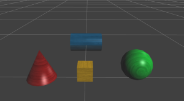

There may be times when you will want to click something in the scene, and have it affect the HTML Entity. This example will show how to click different things in the scene, and have it tell us the name of the entity we clicked.

This is the third tutorial of a four part tutorial series.
1. <a href="http://goolabs.wpengine.com/learn/?p=986">Placing HTML Entities Along the Borders of the Screen</a>
2. <a href="http://goolabs.wpengine.com/learn/?p=1025">Using HTML Buttons to Affect the Scene</a>
3. Using Entities to Interact With an HTML Entity
4. <a href="http://goolabs.wpengine.com/learn/?p=1030">Using Images with HTML Entities</a>

The first thing we will do, is add another element to our existing HTML Entity. We will also modify the Style CSS, to add styling for the element. To do this, open the code editor for the HTML Entity, and change the code to this:



<button id='button1'>Test Button 1</button>
<button id='button2'>Test Button 2</button>
<button id='button3'>Test Button 3</button>
<button id='button4'>Test Button 4</button>

	
You have selected:

	
Nothing



Notice the CSS section we added for 'div1', as well as the 'div1', 'text1' and 'selected' elements. This will create a small white rectangle with rounded corners at the bottom-left of the screen, with the words 'You Have Selected:' in it.

Next, we will need to add some entities to click on. I added a sphere, a box, a cone, and a cylinder.  I also swapped out the default material for the Polished Wood material from the Goo Library, and added some color:

There are several ways to implement this next part. The main two differences would be to use either Hardware picking or PrimitivePickLogic. We are using a camera, and don't need any fancy raycasting, so lets go with the Hardware picking.

The other consideration is where to put the code for the picking. Do we put it on each individual entity, add it to an existing script, create a new script on an existing entity, or create an entirely new entity with a new script component just to handle the picking.

For our example, we will choose to create a new script, but attach it to the existing HTML Entity ScriptComponent.

To do so, select the HTML Entity in the Assets list, and expand the Script category on the left panel if it isn't already expanded.

At the bottom of the ScriptComponent, click the 'Add Script' button, and choose 'Custom' in the list of choices.

Open the script for editing, clear out the current code, and paste this code in its place:

<pre><code>var setup = function(args, ctx, goo){
	ctx.infoBox = document.getElementById('selected');
	ctx.handleClick = function(e){
		var hit = null;
		var x = e.offsetX;
		var y = e.offsetY;
		var cam = ctx.activeCameraEntity;
		ctx.world.gooRunner.pick(x, y, function(index, depth){
			if(index !== -1){
				var pos = new goo.Vector3();
				hit = {entity:ctx.world.entityManager.getEntityByIndex(index)};
				var pixelRatio = window.devicePixelRatio;
				hit.point = cam.cameraComponent.camera.getWorldPosition(
					x * pixelRatio, y * pixelRatio,
					ctx.viewportWidth, ctx.viewportHeight, depth);
				goo.Vector3.subv(cam.transformComponent.transform.translation, hit.point, pos);
				hit.distance = pos.length();

				// handle the hit here...
				ctx.infoBox.innerHTML = hit.entity.name;
			}
			else{
				// there was no hit...
				ctx.infoBox.innerHTML = 'Nothing';
			}
		});
	};
	ctx.domElement.addEventListener('click', ctx.handleClick);
}

var cleanup = function(args, ctx, goo){
	ctx.domElement.removeEventListener('click', ctx.handleClick);
}</code></pre>

In the setup function, we first store a reference to the element with the id 'selected'. This is to use later, as we click around the scene.

Next, we create our click handler, much like we did for the sound button in the previous example. We use the ctx scope, so we are able to remove the callback in the cleanup.

Inside the click handler, there is a lot going on:
<ol>
	<li>First, we create some references to variables.  This is so we don't need to travel up the various 'scope chains' later, since this causes a small amount of overhead in speed.</li>
	<li>Next we call the ctx.world.gooRunner.pick function (the actual hardware picking function), passing in the mouse position, as well as a callback function.</li>
	<li>Inside this callback function, we determine if there was a hit or not.  If there was a hit, we create an Object to store a reference to the entity hit, the point in space the hit happened, as well as the distance from the camera the hit occurred.</li>
	<li>If there was a hit, we change the innerHTML for the 'selected' element to the name of the entity we clicked.  If there is no hit, we change it to 'Nothing'.</li>
</ol>

As always, anything we create in the setup, we destroy in the cleanup, so we remove the callback for clicking.

Now when you click one of the shapes in the scene, the window will tell you which entity you clicked. If you click an empty part of the scene, the window will say you clicked 'Nothing'.