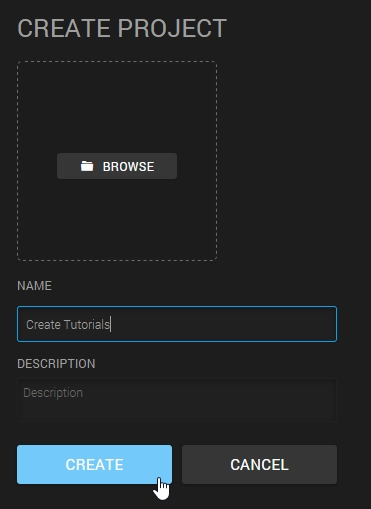
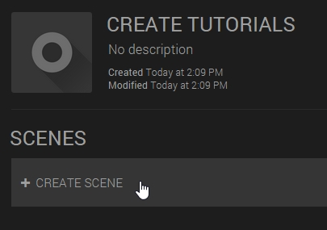
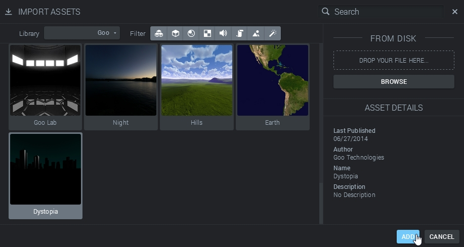
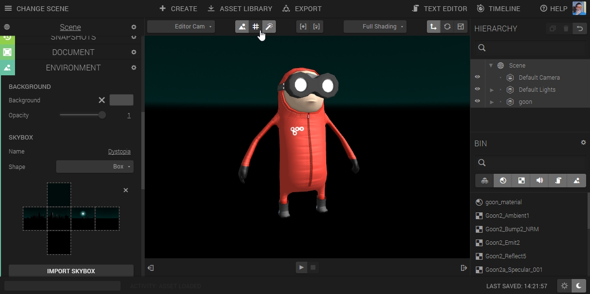
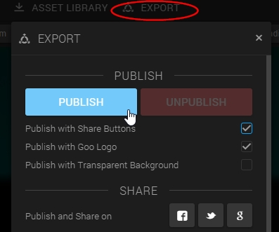
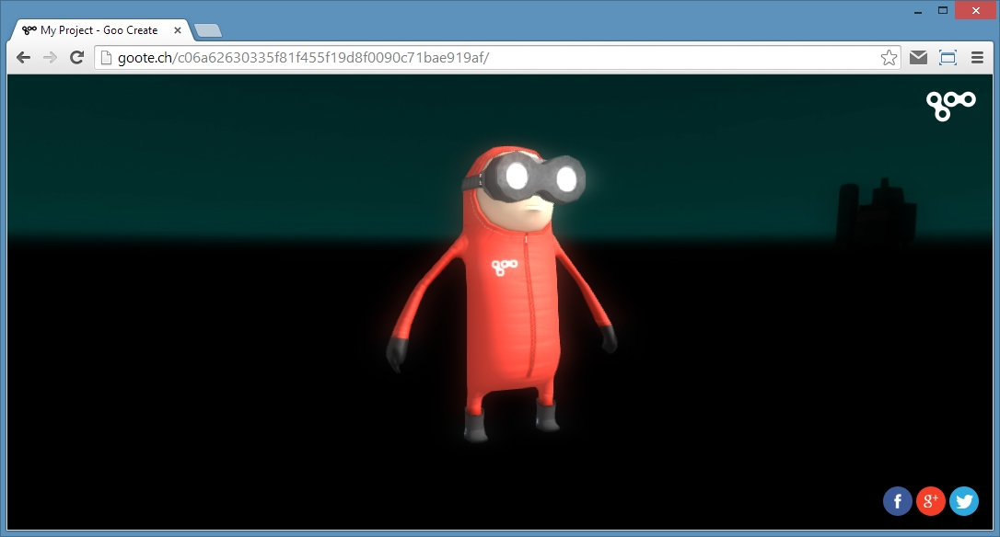

Welcome! This is a short tutorial which will take you all the way from scratch to a published Create project in just a few minutes. Jump in!  

## 1\. Start a Project and a Scene

If you don't have a Create account, start by going [here](https://app.goocreate.com/user/register) and registering. If you have an account, just go ahead and [log in](https://app.goocreate.com/user/login). After logging in, you will be taken to the **dashboard**. The dashboard gives you an overview of your **scenes**, which are ordered into **projects**. Click the _create project_ button at the top of the screen, and give your project a name. Then, create a scene. This will take you into the main interface of Create.  

Creating a project

Creating a scene

## 2\. Import a Model

There are several ways to get models, textures and assets into Create. We'll use the very simple drag-and-drop functionality. For this, we need a 3D model. Start by downloading this .fbx file:  

[Download the Model](goon2.zip)

Unzip it, open its folder and _drag and drop_ the file straight onto the **canvas** of Create!

Drag and drop a 3D model onto the canvas  

_Et voilá! _The 3D model has been imported into Create, and there is an entity named _goon_ in the editor. It can be selected by clicking directly on it in the canvas, or clicking on the corresponding item in the right-hand **hierarchy** menu.  

The imported model  

## 3\. Pimp the Scene

### Choose a Skybox

Another way of getting assets into the scene is using the **asset library. **To import an asset from the library, click the _asset library _button at the top of the interface.  

  

This brings up the asset library, letting you import from various different sources. In the library drop-down, select _Goo. _Then find a _skybox_. For example, the Dystopia skybox. Click **add**, close the asset library and check out the scene!  

Adding a skybox from the asset library  

The previously grey background has now been replaced by an image. Try looking around in the scene by clicking the right mouse button and dragging. If you still see the **grid**, you might want to hide it. The grid is toggled on and off with the little grid icon at the top. If you don't see the skybox, make sure that the **skybox toggle** (to the left of the grid toggle) is turned on!  

The scene with a skybox. Grid toggle switched off.  

### Add some Post Effects

Click the **Scene** in the right-hand menu and open the **post effects** panel to the left. From here, it's easy to add awesome effects to the scene. Feel free to experiment! For example, add a _Bloom_ and an _Antialiasing_ effect.  

Showing some fancy post effects. Make sure the post effects toggle is switched on!  

## 4\. Publish

Once you're happy with the way the scene looks, click _Export_ in the top menu and then click _Publish_.  

Publish the scene  

This will bundle the web-ready sceneand upload it to a server, ready to share with anyone. Wait for the confirmation dialog to appear and click _view_ to get to your brand new creation.

The published scene, interactive and shareable!

Adding an animation state to the Goon.